# Collect-MemoryDump:为 DFIR 自动创建 Windows 内存快照

> 原文：<https://kalilinuxtutorials.com/collect-memorydump/>

[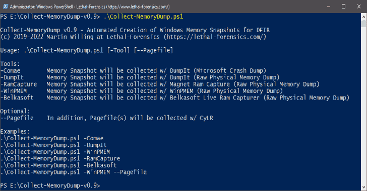](https://blogger.googleusercontent.com/img/b/R29vZ2xl/AVvXsEipvqO5Dtm5LdRHTLqK-Ni90fg8uXfdEp29GRIrv7V7Vt0kWTC1cvY8DP5He7ZPb4N26UIMnd9VUuSLXqda9Hwfbd4N8f69xmoLgMwjVjiVkLIB2Nm_OnMmFoD9jba-1z20gCqjk5pLAwNC-cJ7XQEca1r5TkmzNc-IdQRuC-V2_hrHC1Vd7PUQMVlA/s728/Collect-MemoryDump1.png)

**Collect-MemoryDump** 是为 DFIR 自动创建 Windows 内存快照。Collect-MemoryDump.ps1 是 PowerShell 脚本，用于从活动的 Windows 系统中收集内存快照(以可靠的取证方式)。

## 特征

*   在开始获取内存之前，检查主机名和物理内存大小
*   检查您是否有足够的可用磁盘空间来保存内存转储文件
*   收集带有 DumpIt、Magnet Ram Capture、Belkasoft Live RAM Capturer 和 WinPMEM 的原始物理内存转储
*   从 Magnet Idea Lab 收集 Microsoft 崩溃转储 w/ DumpIt for Comae Beta
*   带有 CyLR 的页面文件收集–Alan Orlikoski 和 Jason Yegge 的实时响应收集工具
*   使用 Magnet Forensics 加密磁盘检测器检查加密卷
*   收集 BitLocker 恢复密钥
*   检查已安装的端点安全工具(防病毒和 EDR)
*   列举来自目标主机的所有必要信息，以丰富您的 DFIR 工作流
*   创建受密码保护的安全归档容器(PW: IncidentResponse)

## 首次公开发布

MAGNET Talks——德国法兰克福(2022 年 7 月 27 日)
演讲标题:现代数字取证和事件响应技术
https://www.magnetforensics.com/ T2

## 下载

从[发布](https://github.com/evild3ad/Collect-MemoryDump/releases/latest)部分下载 **Collect-MemoryDump** 的最新版本。

**注意:** Collect-MemoryDump 默认不包含所有外部工具。

您必须下载以下依赖项:

*   [Belkasoft Live RAM 捕获器](https://belkasoft.com/ram-capturer)
*   comae 工具箱
*   [磁铁加密磁盘探测器](https://www.magnetforensics.com/resources/encrypted-disk-detector/)
*   [磁体 Ram 捕获](https://www.magnetforensics.com/resources/magnet-ram-capture/)

将所需文件复制到以下文件位置:

## **Belkasoft Live RAM 捕获器**

```
$SCRIPT_DIR\Tools\RamCapturer\x64\msvcp110.dll
$SCRIPT_DIR\Tools\RamCapturer\x64\msvcr110.dll
$SCRIPT_DIR\Tools\RamCapturer\x64\RamCapture64.exe
$SCRIPT_DIR\Tools\RamCapturer\x64\RamCaptureDriver64.sys
$SCRIPT_DIR\Tools\RamCapturer\x86\msvcp110.dll
$SCRIPT_DIR\Tools\RamCapturer\x86\msvcr110.dll
$SCRIPT_DIR\Tools\RamCapturer\x86\RamCapture.exe
$SCRIPT_DIR\Tools\RamCapturer\x86\RamCaptureDriver.sys
```

## comae 工具箱

`$SCRIPT_DIR\Tools\DumpIt\ARM64\DumpIt.exe`
`$SCRIPT_DIR\Tools\DumpIt\x64\DumpIt.exe`


## **磁铁加密磁盘探测器**

`$SCRIPT_DIR\Tools\EDD\EDDv310.exe`

## **磁体 Ram 捕获**

`$SCRIPT_DIR\Tools\MRC\MRCv120.exe`

## 用法

。\ Collect-memory dump . PS1[-Tool][–Pagefile]

**示例 1–原始物理内存快照**
。\Collect-MemoryDump.ps1 -DumpIt

**示例 2–微软故障转储(。zdmp) →优化上传到 [Comae 调查平台](https://www.comae.com/)**
。\Collect-MemoryDump.ps1 -Comae

注意:您可以解压缩*。由 DumpIt w/ Z2Dmp (Comae-Toolkit)生成的 zdmp 文件。

**示例 3–原始物理内存快照和页面文件收集→ [MemProcFS](https://github.com/ufrisk/MemProcFS)**
。\ Collect-memory dump . PS1-WinPMEM–页面文件

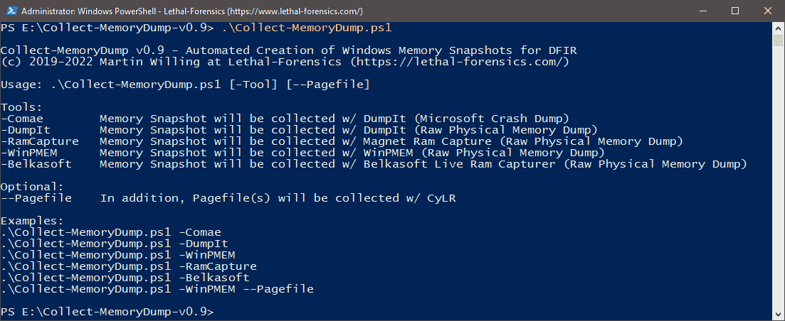

**图 1:** 帮助信息

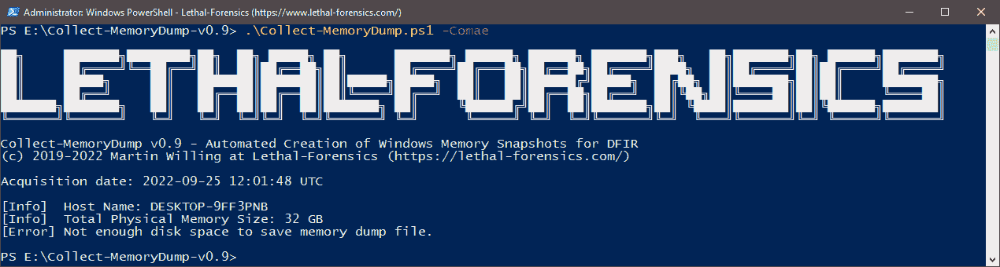

**图 2:** 检查可用空间

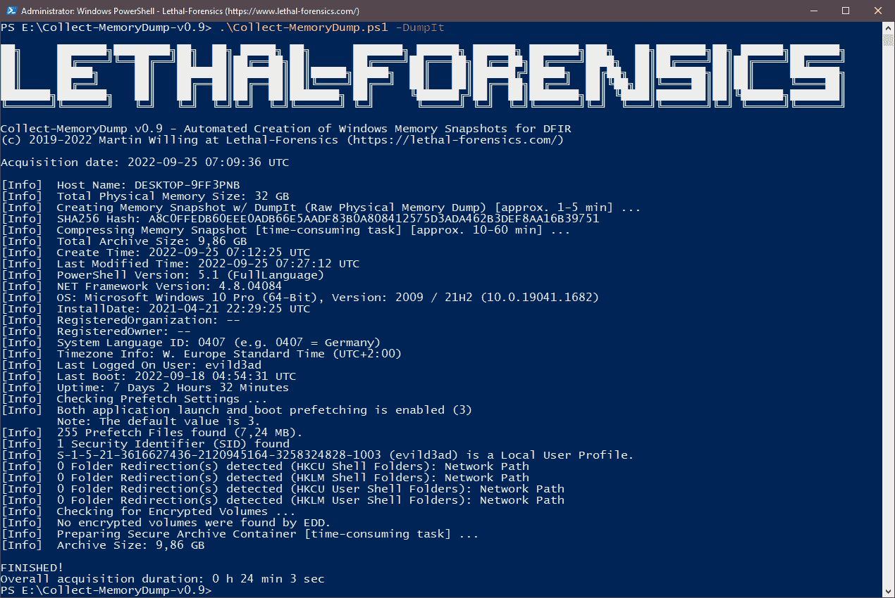

**图 3:** 使用 DumpIt 自动创建 Windows 内存快照

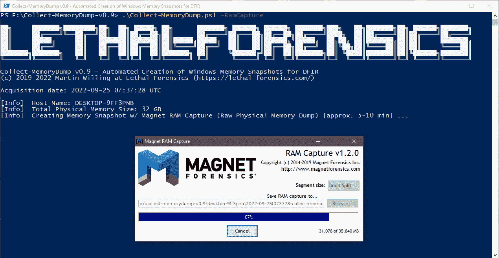

**图 4:** 通过磁体 RAM 捕获自动创建 Windows 内存快照

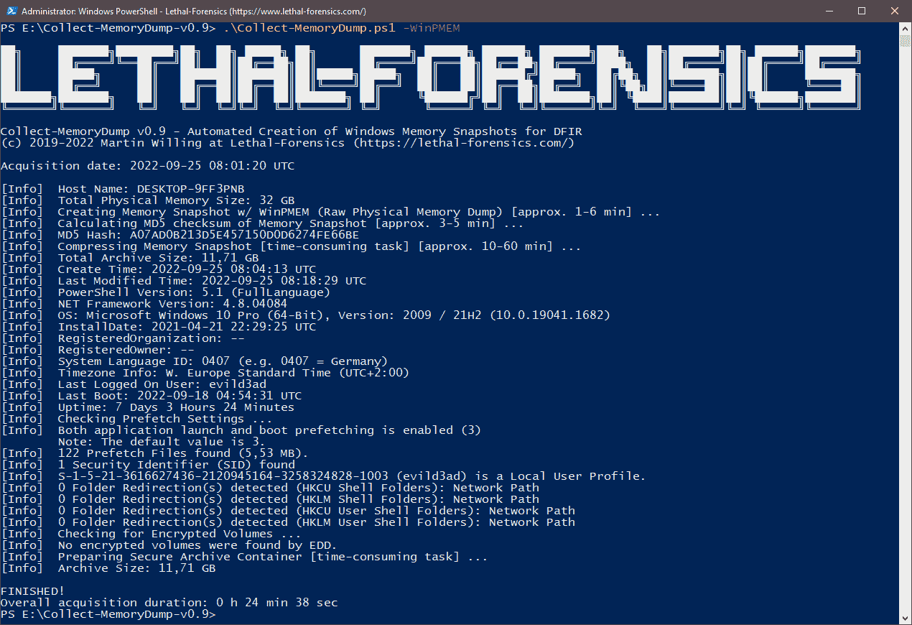

**图 5:** 使用 WinPMEM 自动创建 Windows 内存快照

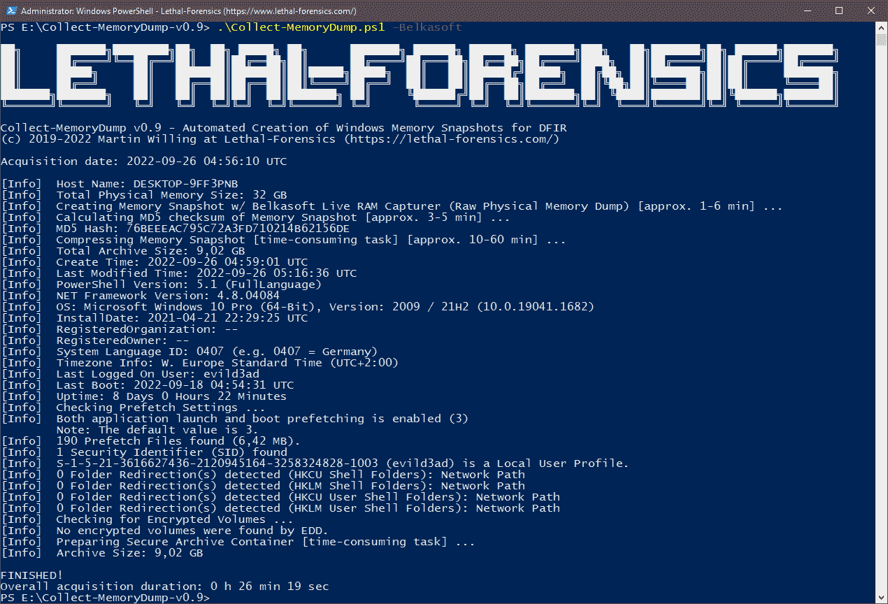

**图 6:** 使用 Belkasoft Live RAM Capturer 自动创建 Windows 内存快照


**图 7:** 使用 DumpIt(微软崩溃转储)自动创建 Windows 内存快照

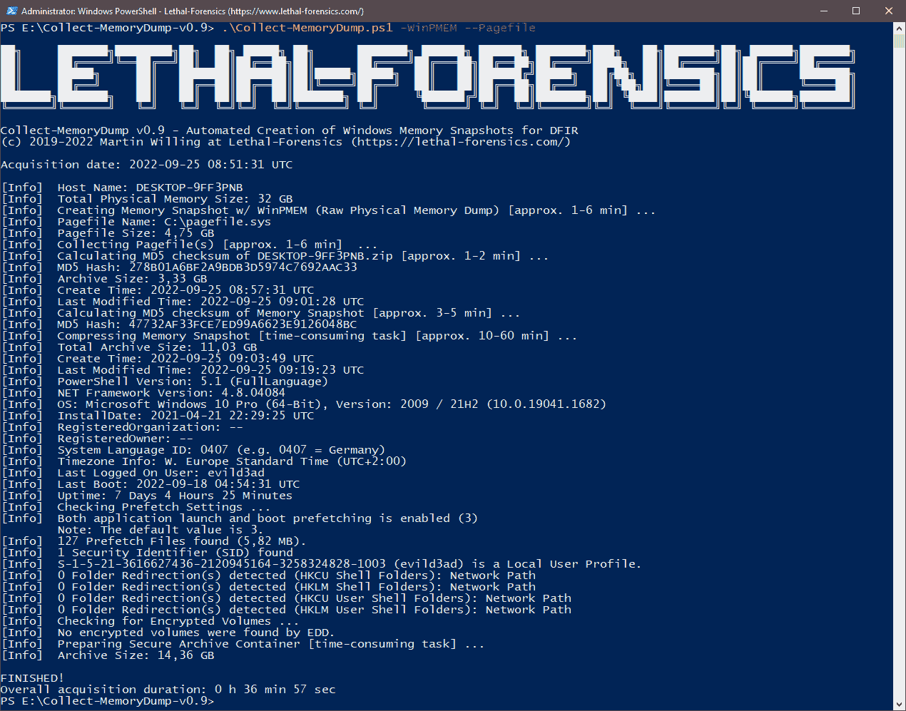

**图 8:** 使用 WinPMEM 自动创建 Windows 内存快照，使用 CyLR 自动创建页面文件集合

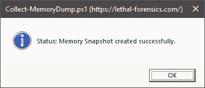

**图 9:** 消息框


**图 10:** 安全归档容器(PW: IncidentResponse)和 Logfile.txt

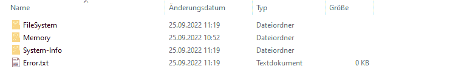

**图 11:** 输出目录

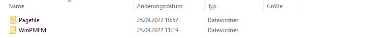

**图 12:** 内存目录(WinPMEM 和 Pagefile)

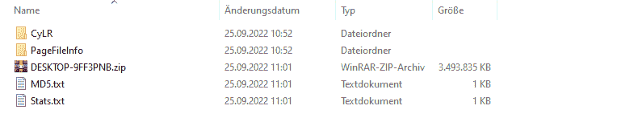

**图 13:** 记忆快照(以法医鉴定的方式)


**图 14:** 页面文件收集

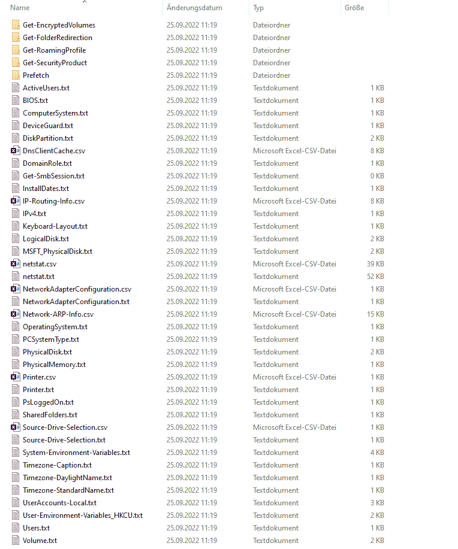

**图 15:** 收集的系统信息

[Click Here To Download](https://github.com/evild3ad/Collect-MemoryDump)