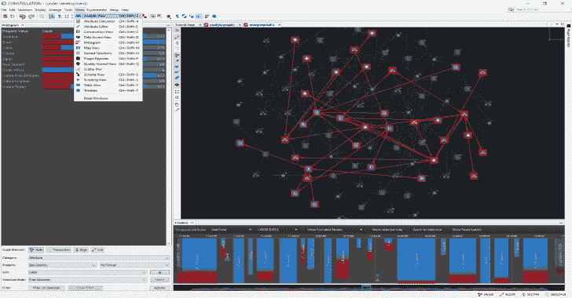

# Constellation:一个以图形为中心的数据可视化和交互式分析应用

> 原文：<https://kalilinuxtutorials.com/constellation-graph-focused-data-visualisation-interactive-analysis/>

**Constellation** 是一个以图形为中心的数据可视化和交互式分析应用程序，支持跨大型复杂数据集的数据访问、联合和操作功能。

**愿景声明**

Constellation 是一个一流的、领域不可知的数据可视化和分析应用程序，使用户能够以简单直观的方式解决大型和复杂的数据问题。

*   ***用户*** :数据分析师、数据科学家，以及所有对图形数据分析感兴趣的人。
*   ***数据分析领域*** :具有丰富特征数据的图形数据集，如社交网络、网络基础设施、化学成分等。

**也可以理解为-[Sudomy:使用 Bash 脚本](https://kalilinuxtutorials.com/sudomy-subdomain-enumeration-tool/)创建的子域枚举工具**

**先决条件**

*   Constellation 至少需要安装开放的 JDK 8 和 JFX 8 支持版本，并且已知可以在 Windows 64 位和 Linux 64 位上工作。
*   OpenGL 图形显示适用于支持 OpenGL 3.3 或更高版本的 NVIDIA 和 ATI 显卡。众所周知，它无法与英特尔板载显卡配合使用。

**运行星座**

解压 constellation.zip 包，双击 Windows 的`**bin/constellation64.exe**`或者运行 Linux 的`**bin\constellation**` shell 脚本。

目前不支持 Mac，功能请求由[问题#21](https://github.com/constellation-app/constellation/issues/21) 跟踪。

**打造星座**

要从源代码构建星座，请执行以下操作:

*   下载 **NetBeans 8.2**
*   从 **Azul** 网站为 [Windows 64 位版本](https://cdn.azul.com/zulu/bin/zulu8.38.0.13-ca-fx-jdk8.0.212-win_x64.zip)或 [Linux 64 位版本](https://cdn.azul.com/zulu/bin/zulu8.38.0.13-ca-fx-jdk8.0.212-linux_x64.tar.gz)下载开放的 **JDK 8** 与 **JFX 8**
*   克隆此存储库
*   更新 netbeans.conf 文件的 netbeans_jdkhome 条目(**该文件可以在<C:\ Program Files \ NetBeans 8.2 \ etc>文件夹**下找到
*   从 NetBeans 打开 Constellation_Core 模块套件
*   **重要文件- > build.xml - >右键- >更新依赖项并清理构建**
*   **右键- >运行**

**包星座**

要将 Constellation 打包成 zip 包，请执行以下操作:

*   在 NetBeans 中，**展开星座 _ 核心- >重要文件**
*   右键单击构建脚本并运行构建-zip 目标

这将创建一个 dist/constellation.zip 文件。它不包含 JRE，因为这取决于您希望运行它的平台。

星座寻找的 JRE 位置在`**etc/constellation.conf**`中定义。例如，如果您想在 zip 包中打包一个 jre，将 JRE 复制到与 bin 相同的文件夹级别，并将`jdkhome`变量更新为 JRE 文件夹的名称。

**常见故障排除检查**

*   您可以通过以下步骤检查您的显卡是否受支持:
    *   点击`**File**` **>** `**New Graph**`创建一个图形
    *   点击`**Experimental**`**>**`**Build Graph**`**>**`**Sphere Graph**`创建一个随机图形。
    *   如果你能看到一个图表，试着用鼠标和它互动。
    *   如果图形视图保持空白，您可能没有支持的图形卡。
*   点击`**Help**` **>** `**JOGL Version**`查看您机器的显卡性能。
*   点击`**Help**` **>** `**Show Logs**`查看星座日志信息。

[**Download**](https://github.com/constellation-app/constellation)