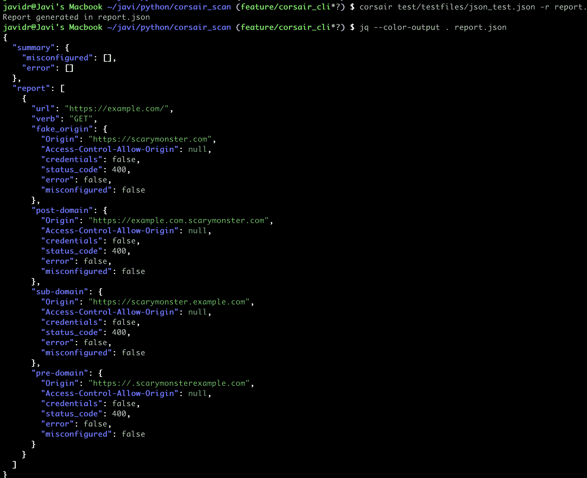

# Corsair_Scan:测试跨源资源共享的安全工具(CORS)

> 原文：<https://kalilinuxtutorials.com/corsair_scan/>

[")](https://1.bp.blogspot.com/-xaHBXMenIVE/YK5yGV1WMzI/AAAAAAAAJPQ/6-qK9VvvwFc225fy3IrKdkJx6efGO21kACLcBGAsYHQ/s728/corsair_scan%2B%25281%2529.png)

Corsair_scan 是一款安全工具，用于测试跨来源资源共享(CORS)错误配置。CORS 是一种机制，允许从提供第一资源的域之外的另一个域请求网页上的受限资源。如果没有正确配置，未经授权的域可以访问这些资源。

什么是 CORS？

CORS 是一种基于 HTTP 报头的机制，它允许服务器指示除其自身以外的任何其他来源(域、方案或端口),浏览器应该允许从这些来源加载资源。它的工作原理是添加新的 HTTP 头，让服务器描述哪些来源被允许从网络浏览器读取信息。

CORS 还依赖于一种机制，通过这种机制，浏览器向托管跨源资源的服务器发出“预检”请求，以检查服务器是否允许实际的请求。在该预检中，浏览器发送指示 HTTP 方法的标题和将在实际请求中使用的标题。

实施 CORS 时，最常见和最棘手的安全问题是无法验证请求者/将请求者列入白名单。我们经常看到 Access-Control-Allow-Origin 的值被设置为' * '。

不幸的是，这是默认设置，因此允许网络上的任何域访问该站点的资源。

根据 OWASP 应用安全验证标准(ASVS)，要求 [14.5.3](https://github.com/OWASP/ASVS/blob/6454d64fb1d23c1609050df0a017e7ae2fd6beb1/4.0/en/0x22-V14-Config.md) 规定

**验证跨来源资源共享(CORS)访问控制允许来源报头使用可信域和子域的严格允许列表进行匹配，并且不支持“空”来源。**

【corsair _ scan 是如何工作的？

Corsair_scan 的工作方式是重新发送作为参数接收的请求(或请求列表),然后在 Origin 头中注入一个值。根据对该请求的响应中的 Access-Control-Allow-Origin 报头的内容，我们可以断言 CORS 配置是否正确。有三种情况表明 CORS 配置错误:

*   请求中发送的假来源反映在访问控制允许来源中
*   Access-Control-Allow-Origin 的值是*
*   访问控制允许来源的值为空

如果发现 CORS 配置错误，我们将检查响应是否包含头 Access-Control-Allow-Credentials，这意味着服务器允许在跨源请求中包含凭证。

通常，CORS 配置使用通配符，例如接受* example.com *下的任何内容。这意味着原始 domain.com.evil.com 将被接受，因为它匹配给定的正则表达式。为了解决这个问题，corsair_scan 测试了四种情况:

*   伪域注入:我们将 origin 头设置为[https://scarymonster.com](https://scarymonster.com/)，即使原始请求没有 origin 头
*   如果原始请求有一个 origin 头(为了清楚起见，假设它是[https://example.com](https://example.com/)):
    *   预域注入:我们将假域连接到左边的原域。在我们的例子中，原点将被设置为[https://scarymonsterexample.com](https://scarymonsterexample.com/)
    *   域后注入:与域前相反，只是右边的串联。原点将是[https://example.com.scarymonster.com](https://example.com.scarymonster.com/)
    *   子域注入:有时 CORS 配置会将给定域下的所有子域列入白名单。虽然这本身不是问题，但是如果其中一个域容易受到 XSS 攻击，那么问题就很严重了。在这种情况下，起点将是[https://scarymonster.example.com](https://scarymonster.example.com/)

如何安装它？

这个项目是用 Python 3.9 开发的，但是应该可以在任何 Python 3.x 版本上工作。最好的安装方法是使用 pip。

**pip3 安装海盗船 _ 扫描–用户**

我如何使用它？

Corsair 既可以用作 python 模块，也可以用作 CLI。

### **Python 模块**

执行 CORS 扫描的方法是 corsair_scan。下面是它的定义:

#### 海盗船 _ 扫描

接收请求列表和参数，以在请求中启用/禁用证书检查

**输入**:

*   数据[列表]:请求列表。每个请求都是一个字典，包含请求的相关数据:
    *   url_data [Dict]:这是一个字典，包含请求的所有相关数据:
        *   url [String]:这是发送请求的 url
        *   动词[String]:请求的动词(get、post、patch、delete、options…)
        *   params [String]:请求中发送的正文(如果有)
        *   headers [Dict]:这是一个请求中包含所有标题的 Dict
*   verify [Boolean] [Default: True]:针对每个请求将此值发送到 corsair_scan_single_url

**输出**:

*   final_report [List]:包含所执行测试的完整报告。如果 filter 设置为 true，它还会将测试摘要添加到报告中。
    *   报告[列表]:已执行测试的详细单个报告的列表
    *   summary [Dict]:扫描中检测到的问题的摘要

**例子**

**import corsair _ scan . corsair _ scan as corsair
URL _ data = { }
data =[]
verb = ' GET '
URL = ' https://example . com/'
params = ' user = user 1&password = 1234 '
headers = { ' Accept ':' text/html，application/xhtml+xml，application/XML；q=0.9，image/webp，*/*；q=0.8 '，
'接受-语言':' en-GB，en；q=0.5 '，' Connection': 'keep-alive '，' Upgrade-unsecured-Requests ':' 1 '，
' Origin ':' https://example . com '，
' Host ':' example . com ' }
URL _ data[' verb ']= verb
URL _ data[' URL ']= URL
URL _ data[' params ']= params
URL _ data[' headers ']= headers
data . append(URL _ data)【T17**

回应:

**{ ' report ':[{ ' fake _ Origin ':{ ' Access-Control-Allow-Origin ':' https://scarymonster . com '，
' Origin ':' https://scarymonster . com '，
'credentials': True，
'error': False，
'配置错误':True，【T5]' status _ code ':200 }，
' post-domain ':{ ' Access-Control-Allow-Origin ':' https://example . com . scarymonster
' URL ':' https://example . com/'，
'verb': 'GET'}]，
'summary': {'error': []，' misconfigured ':[{ ' credentials ':True，
' misconfigured _ test ':[' fake _ origin '，
'sub-domain '，
'pre-domain '，
'post-domain']，
'status_code': 200，
' URL ':' http**

CLI

作为 pip 包安装的一部分，安装了一个 CLI。要执行的语法如下:

**海盗船文件[-NV/–no verify][-r/–report]**

CLI 需要一个 json 文件，其中包含执行扫描的请求列表。作为测试的一部分，提供了一个示例文件[:](https://github.com/Santandersecurityresearch/corsair_scan/blob/main/test/testfiles/json_test.json)

**[{
"动词":" GET "，
"url": "https://example.com/"，
" params ":" user = user 1&password = 1234 "，
" headers ":{
" Accept ":" text/html，application/xhtml+xml，application/XML；q=0.9，image/webp，*/*；q = 0.8”,
《接受-语言》:“en-GB，en；q=0.5 "，
"Connection": "keep-alive "，
" Upgrade-unsecurity-Requests ":" 1 "，
" Origin ":" https://example . com "，
" Host ":" example . com "
}
}]**

还有两个可选参数:

*   -NV/–no verify:如果您使用自签名证书对站点进行测试，则跳过证书验证
*   -r/–report:将报告保存为 JSON 文件

**例子**

**路线图**

*   发布海盗船 _ 扫描作为一个 CLI 工具✅
*   从文本文件中读取 url 数据✅
*   改进报告格式

[**Download**](https://github.com/Santandersecurityresearch/corsair_scan)