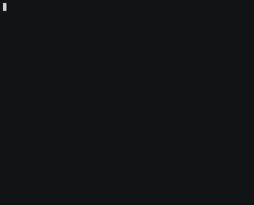
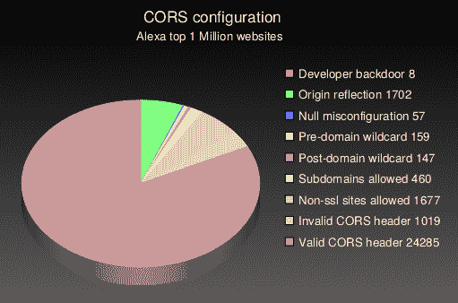

# 一个简单的 CORS 错误配置扫描器

> 原文：<https://kalilinuxtutorials.com/corstest-cors-misconfiguration-scanner/>

CORStest 是一个*快速&肮脏* Python 2 工具，用于查找跨来源资源共享( [CORS](https://www.w3.org/TR/cors/) )错误配置。它接受一个文本文件作为输入，其中可能包含一个域名或 URL 列表。

目前，通过发送某个 **`Origin`** 请求报头并检查`**Access-Control-Allow-Origin**`响应报头来检测以下潜在漏洞:

*   **开发者后门:**不安全的开发者源，如 JSFiddle 或 CodePen，被允许访问该资源
*   **原点反射:**原点只是简单的回显在 ACAO 头中，任何站点都可以访问这个资源
*   **空错误配置:**通过沙盒 iframe 强制`null`源，任何站点都被允许访问
*   **预域名通配符:** *而非*domain.com 被允许访问，攻击者只需注册即可
*   **域后通配符:**domain.com。*evil.com*被允许访问，可以被攻击者注册
*   **允许的子域:** *sub* .domain.com 允许访问，如果攻击者在任何子域中找到 XSS，就可以利用
*   **允许非 ssl 站点:**允许 http 源访问 https 资源，允许 MitM 破解加密
*   **无效的 CORS 标头:**通配符或多个来源的错误使用，不是安全问题，但应该得到解决

请注意，这些漏洞/错误配置取决于环境。在大多数情况下，只有当`**Access-Control-Allow-Credentials header**`出现时，它们才能被攻击者利用(见`**-q**`标志)。

**也可以理解为-[burp suite:Secret Finder 扩展，用于从 HTTP 响应](https://kalilinuxtutorials.com/burpsuite-secret-finder/)中发现 API keys/token**

**用途**

**用法:corstest . py[arguments]infile**

**位置参数:**
infile 带有域或 URL 列表的文件

**可选参数:**
-h，–help 显示此帮助消息并退出
-c name=value 发送带有所有请求的 cookie
-p 进程多处理(默认值:32)
-s 始终强制 ssl/tls 请求
-q 安静，仅允许-凭证

**黑客的 CORS**

网站通过发送以下 HTTP 响应标头来启用 CORS:`**[Access-Control-Allow-Origin](https://portswigger.net/web-security/cors/access-control-allow-origin): https://example.com**`

这允许列出的来源(域)使访问者的网络浏览器向服务器发出跨域请求并读取响应——这是[同源策略](https://developer.mozilla.org/en-US/docs/Web/Security/Same-origin_policy)通常会阻止的。

默认情况下，该请求将在没有 cookies 或其他凭证的情况下发出，因此它不能用于窃取敏感的用户特定信息，如 [CSRF 令牌](https://portswigger.net/web-security/csrf/tokens)。服务器可以使用以下报头来启用凭证传输:`**Access-Control-Allow-Credentials: true**`

这就建立了一种信任关系——example.com 的 XSS 漏洞对这个网站来说是个坏消息。

**例子**

使用 CORStest 检测 Alexa top 750 网站的错误配置(带`**Access-Control-Allow-Credentials**`):

**评估**

在 Alexa [排名前 100 万的](http://s3.amazonaws.com/alexa-static/top-1m.csv.zip)网站上运行这个 CORStest，结果如下:

请注意，绝对数字非常低，因为在 1，000，000 个被测试的网站中，只有 3%的网站在其主页上启用了 CORS，并且可以对其进行错误配置分析。这个测试在一条像样的线路(DSL)上花了大约 14 个小时。如果你有一个快速的互联网连接，试着增加并行进程的数量到`-p50`或者更多。

[**Download**](https://github.com/RUB-NDS/CORStest)