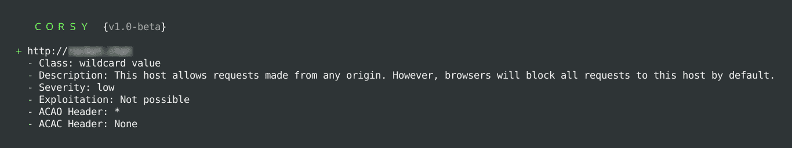

# 科尔西:CORS 错误配置扫描仪

> 原文：<https://kalilinuxtutorials.com/corsy/>

Corsy 是一个轻量级程序，它扫描 CORS 实现中所有已知的错误配置。

**要求**

它仅适用于 Python 3，并具有以下依赖关系:

*   tld
*   要求

要安装这些依赖项，请导航到工具目录并执行 pip3 install -r requirements.txt

**用途**

使用它非常简单

**python 3 corsy . py-u https://example.com**

**扫描文件中的 URLs】**

**python 3 corsy . py-I/path/URLs . txt**

**线程数量**

**python 3 corsy . py-u https://example.com-t 20**

**也读作-[anticate:测试任何反欺骗的框架](https://kalilinuxtutorials.com/anticheat/)**

**请求之间的延迟**

**python 3 corsy . py-u https://example.com-D2**

**将结果导出到 JSON**

**python 3 corsy . py-I/path/URLs . txt-o/path/output . JSON**

**自定义 HTTP 头**

**python 3 corsy . py-u https://example.com–headers " User-Agent:Google bot \ ncoookie:SESSION = Hacked "**

**跳过打印提示**

-q 可用于跳过输出中描述、严重性和漏洞字段的打印。

**实施的测试**

*   预域旁路
*   域后旁路
*   反滴漏旁路
*   零原点旁路
*   非转义点旁路
*   无效值
*   通配符值
*   原点反射测试
*   第三方津贴测试
*   HTTP 允许测试

[**Download**](https://github.com/s0md3v/Corsy)