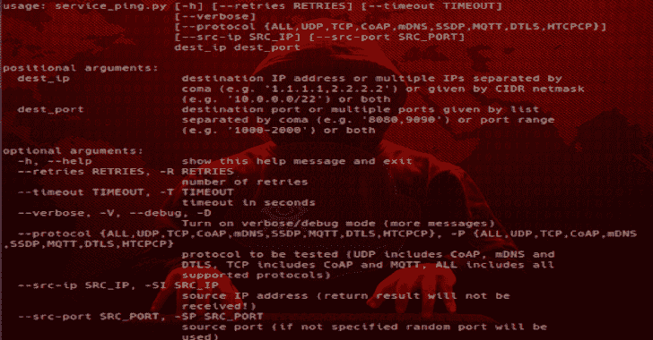

# Cotopaxi:使用特定网络物联网协议对物联网设备进行安全测试的工具集

> 原文：<https://kalilinuxtutorials.com/cotopaxi/>

**Cotopaxi** 使用 CoAP、DTLS、HTCPCP、mDNS、MQTT、SSDP 等协议对物联网设备进行安全测试的工具集。

**要求**

目前 Cotopaxi 只适用于 Python 2.7.x，但是未来的版本也适用于 Python 3。

如果您以前安装的 scapy 没有 scapy-ssl_tls，请删除它或使用 venv。

**主库安装:**

*   scapy-ssl_tls(这也将在 2.4.2 中安装 scapy)

**pip 安装 git+https://github . com/tintin web/scapy-SSL _ TLS @ EC 5714d 560 c 63 ea 2e 0 CCE 713 CEC 54 ed C2 BFA 0833**

**常见问题:**

*   如果您遇到错误:`**error: [Errno 2] No such file or directory: 'LICENSE'**`，尝试重复命令-令人惊讶的是它的工作。
*   如果遇到错误:`**NameError: name 'os' is not defined**`–将缺失的`**import os**`添加到`**scapy/layers/ssl_tls.py**`中。

**也可阅读-[Unicorn-Bios:Unicorn 引擎的基本 Bios 仿真器](https://kalilinuxtutorials.com/unicorn-bios/)**

所有其他必需的软件包都可以使用 requirements.txt 文件安装:

**pip install-r coto paxi/requirements . txt**

手动安装其他必需的软件包:

**pip 安装 dnslib ipy hex dump pyyaml PSU enum 34 config parser**

**免责声明**

Cotopaxi 工具包仅用于授权的安全测试！

一些工具(尤其是漏洞测试器和协议模糊器)可能会导致一些设备或服务器停止按预期方式运行，例如导致受测实体崩溃或挂起，或者网络流量淹没其他实体。

在运行这些工具之前，请确保您获得了被测试设备或服务器所有者的许可！

在运行这些工具之前，请务必检查您当地的法律！

**这个包里的工具**

*   服务 _ping
*   服务器 _ 指纹打印机
*   资源列表
*   服务器 _ 指纹打印机
*   protocol_fuzzer(用于模糊服务器)
*   client_proto_fuzzer(用于模糊客户端)
*   漏洞测试器(用于测试服务器)
*   客户端测试器(用于测试客户端)
*   放大器 _ 检测器

不同工具支持的协议:

| 工具 | CoAP | dtls(dtls) | HTCPCP | mDNS | MQTT | SSDP |
| --- | --- | --- | --- | --- | --- | --- |
| 服务 _ping | ☑ | ☑ | ☑ | ☑ | ☑ | ☑ |
| 服务器 _ 指纹打印机 | ☑ | ☑ |  |  |  |  |
| 资源列表 | ☑ |  |  | ☑ |  | ☑ |
| 协议 _ 模糊器 | ☑ | ☑ | ☑ | ☑ | ☑ | ☑ |
| 客户端 _ 原型 _ 模糊器 | ☑ | ☑ | ☑ | ☑ | ☑ | ☑ |
| 漏洞测试器 | ☑ | ☑ | ☑ | ☑ | ☑ | ☑ |
| 客户端测试器 | ☑ | ☑ | ☑ | ☑ | ☑ | ☑ |
| 放大器 _ 检测器 | ☑ | ☑ |  | ☑ |  | ☑ |

**cotopaxi.service_ping**

用于检查给定 IP 和端口范围内网络服务可用性的工具

用法:sudo python-m coto paxi . service _ ping[-h][-v][–protocol { UDP，TCP，CoAP，MQTT，DTLS，ALL }]
[–SRC-PORT SRC _ PORT]
dest _ ip dest _ PORT
位置参数:
dest_ip 目的 ip 地址或由
coma 分隔的多个 IP(如' 1 . 1 . 1 . 1 . 1，2.2.2 ')或由 CIDR 网络掩码
给定(如' 13 -R RETRIES
重试次数
–超时 timeout，-T TIMEOUT
超时秒数
–verbose，-V，–debug，-D
打开 verbose/debug 模式(更多消息)
–协议{UDP，TCP，CoAP，mDNS，SSDP，MQTT，DTLS，ALL，HTCPCP}，-P {UDP，TCP，CoAP，mDNS，SSDP，MQTT，DTLS，ALL，HTCPCP}
要测试的协议(UDP 包括 CoAP

**coto paxi . server _ finger printer**

在给定 IP 和端口范围内对网络服务器进行软件指纹识别的工具

当前支持的服务器:

*   **CoAP** :
    *   aiocoap，
    *   coapython，
    *   FreeCoAP，
    *   libcoap，
    *   微盖，
    *   猫鼬
    *   Wakaama(以前的 liblwm2m)
*   dtls:
    *   gnutes(gnutes)的缩写形式，
    *   高迪，
    *   LibreSSL，
    *   MatrixSSL，
    *   mbed TLS，
    *   OpenSSL，
    *   TinyDTLS

用法:sudo python-m coto paxi . server _ finger printer[-h][–RETRIES RETRIES][–time out time out]
[–verbose]
[–protocol { CoAP，DTLS }]
[–SRC-PORT SRC _ PORT]
dest _ ip dest _ PORT
位置参数:
dest_ip 目的 ip 地址或由
coma 分隔的多个 IP(如' 1 . 1 . 1 . 1 . 1，2.2.2 ')或由 CIDR 网络掩码
(如 –help 显示此帮助消息并退出
–RETRIES RETRIES，-R RETRIES
重试次数
–time out 超时，-T TIMEOUT
超时秒数
–verbose，-V，–debug，-D
打开详细/调试模式(更多消息)
–protocol { CoAP，DTLS}，-P {CoAP，DTLS}
要测试的协议
–SRC-PORT SRC _ PORT，-SP SRC_PORT
源端口(如果未指定随机端口

**coto paxi . resource _ listing**

用于检查在给定 IP 和端口范围内服务器上名为 url 的资源的可用性的工具。示例 URL 列表可在*URL*目录中找到

用法:sudo python-m coto paxi . resource _ listing[-h][-v][–protocol { CoAP，所有}]
[–method { GET，POST，PUT，DELETE，所有}]
[–SRC-PORT SRC _ PORT]
dest _ ip dest _ PORT URL _ file path
位置参数:
dest_ip 目的 ip 地址或由
coma 分隔的多个 IP(如' 1 . 1 . 1 . 1 . 1，2.2.2 ')或由 CIDR 网给出 或者两者都有
url_filepath 包含要测试的 url 列表的文件的路径(每个 URL
在单独的行中)
可选参数:
-h，–帮助显示此帮助消息并退出
–重试次数重试次数，-R 重试次数
重试次数
–超时超时，-T 超时
超时秒数
–详细，-V，–调试，-D
打开详细/调试模式(更多消息)
–协议{CoAP、mDNS -M {GET，POST，PUT，DELETE，ALL}
要测试的方法(ALL 包括所有支持的
方法)
–SRC-PORT SRC _ PORT，-SP SRC_PORT
源端口(如果未指定，将使用随机端口
)
–ignore-ping-check，-Pn
忽略 ping 检查(将所有端口视为活动端口)

**cotopaxi.protocol_fuzzer**

用于测试协议服务器的黑盒模糊器

用法:sudo python-m coto paxi . protocol _ fuzzer
[-h][–RETRIES RETRIES][–time out 超时]
[–verbose][–protocol { CoAP，mDNS，MQTT，DTLS }]
[–SRC-ip SRC _ IP][–SRC-PORT SRC _ PORT]
[–ignore-ping-check][–CORPUS-DIR CORPUS _ DIR]
dest _ IP dest _ PORT
位置参数:
dest_ip 目的 IP 目的 IP IP 地址或多个 IP 或者两者都有
可选参数:
-h，–帮助显示此帮助消息并退出
–重试次数，-R 重试次数
重试次数
–超时超时超时，-T 超时
超时秒数
–详细，-V，–调试，-D
打开详细/调试模式(更多消息)
–协议{CoAP，mDNS，MQTT，DTLS，SSDP，HTCPCP}，-P {CoAP，mDNS，MQTT，DTLS，SSDP，HTCPCP )
–SRC-PORT SRC _ PORT、-SP SRC_PORT
源端口(如果未指定，将使用随机端口
)
–ignore-ping-check、-Pn
ignore ping check(将所有端口视为活动端口)
–corpus-DIR CORPUS _ DIR、-C CORPUS_DIR
到具有模糊有效负载(CORPUS)的目录的路径(每个
有效负载在单独的文件中)
–DELAY-AFTER-CRASH DELAY _ AFTER _ CRASH，-DAC DELAY_AFTER

**coto paxi . client _ proto _ fuzzer**

用于测试协议客户端的黑盒模糊器

用法:sudo client _ proto _ fuzzer . py[-h][–SERVER-IP SERVER _ IP]
[–SERVER-PORT SERVER _ PORT]
[–protocol { CoAP、mDNS、MQTT、DTLS、SSDP、HTCPCP }]
[–verbose][–CORPUS-DIR CORPUS _ DIR]
可选参数:
-h，–help 显示此帮助消息并退出
–SERVER-IP SERVER _ IP，-SI SERVER_IP
IP 地址，将用于设置测试服务器 -D
打开详细/调试模式(更多消息)
–corpus-DIR CORPUS _ DIR，-C CORPUS_DIR
具有模糊有效负载(CORPUS)的目录的路径(每个
有效负载在单独的文件中)

**coto paxi . vulnerability _ tester**

用于检查给定 IP 和端口范围内网络服务漏洞的工具

用法:sudo python-m coto paxi . vulnerability _ tester[-h][-v]
[–CVE { ALL，CVE-2018-19417，…}]
[–LIST LIST][–SRC-PORT SRC _ PORT]
dest _ ip dest _ PORT
位置参数:
dest_ip 目的 ip 地址或由
coma 分隔的多个 IP(如' 1 . 1 . 1 . 1 . 1，2.2.2 ')或由 CIDR 网给出 –help 显示此帮助消息并退出
–RETRIES RETRIES，-R RETRIES
重试次数
–time out 超时，-T TIMEOUT
超时秒数
–protocol { UDP，TCP，CoAP，mDNS，MQTT，DTLS，ALL}，-P {UDP，TCP，CoAP，mDNS，MQTT，DTLS，ALL}
要测试的协议(UDP 包括 CoAP，mDNS 和
DTLS，TCP 包括 CoAP 和 MQTT，ALL 包括 ALL【所有 -D
开启详细/调试模式(更多消息)
–CVE { ALL，CVE-2018-19417，…}
待测试漏洞列表(按 CVE id)
–vuln { ALL，BOTAN_000，COAPTHON3_000，…}
待测试漏洞列表(按 SOFT _ NUM id)
–list，-L 显示此
工具支持的所有漏洞列表，并附有详细说明【T30

**coto paxi . client _ vuln _ tester**

该工具提供的用于检查连接到服务器的网络客户端漏洞的工具

用法:sudo client _ vuln _ tester . py[-h][–SERVER-IP SERVER _ IP]
[–SERVER-PORT SERVER _ PORT]
[–protocol { CoAP，mDNS，MQTT，DTLS，SSDP，HTCPCP }]
[–verbose]
[–vuln { ALL，BOTAN_000，COAPTHON3_000，…} [{ALL，BOTAN_000，COAPTHON3_000，…}…]
[–CVE -P {CoAP、mDNS、MQTT、DTLS、SSDP、HTCPCP}
待测协议
–verbose、-V、–debug、-D
打开 verbose/debug 模式(更多消息)
–vuln { ALL，BOTAN_000，COAPTHON3_000，…)}[{ ALL，BOTAN_000，COAPTHON3_000，…} …]
待测漏洞列表(按 SOFT _ NUM id)
–在

**光电放大器 _ 检测器**

通过观察传入和传出数据包的大小来检测放大反射流量的网络设备的工具

用法:sudo python-m coto paxi . amplifier _ detector[-h][–PORT PORT][–NR NR]verbose]dest _ ip
位置参数:
dest_ip 目的 IP 地址
可选参数:
-h，–help 显示此帮助消息并退出
–INTERVAL INTERVAL，-I INTERVAL
显示状态
消息之间的最小间隔(秒)(默认值:1 秒)
–PORT PORT，–dest _ PORT PORT，-P PORT
目的端口
–NR

**已知问题/限制**

将 scapy 用作网络库会导致一些已知的问题或限制:

*   测试在同一台机器上运行的服务可能会导致一些问题，
*   针对同一目标运行的多个工具可能会导致它们之间的干扰(数据包可能被指示为对另一个请求的响应)。

**单元测试**

要运行所有单元测试，请使用(来自 cotopaxi 目录以上的目录):

sudo python -m 单元测试发现

大多数测试是针对远程测试服务器执行的，需要准备测试环境，在 tests/test_config.ini 和 tests/test_servers.yaml 中提供设置。

[**Download**](https://github.com/Samsung/cotopaxi)