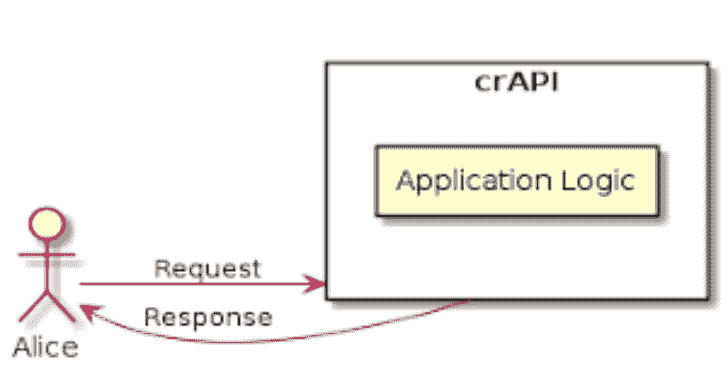

# crAPI:完全荒谬的 API

> 原文：<https://kalilinuxtutorials.com/crapi/>

.png)

**crAPI**(**c**completely**r**idiculidous**API**)将帮助你了解十大最关键的 API 安全风险。crAPI 在设计上是易受攻击的，但是你可以安全地运行它来教育/训练你自己。

crAPI 是现代的，建立在微服务架构之上。当你第一次买车的时候，注册一个账户，开始你的旅程。要了解更多关于 crAPI 的信息，请查看 crAPI 的概述。

## 快速入门指南

### 码头工人

您需要在您的主机系统上安装并运行 Docker。

#### 使用预构建的图像

您可以使用由我们的 CI 工作流生成的预构建映像。

*   使用最新的稳定版本。
    *   Linux 机器

**curl-o docker-compose . yml https://raw . githubusercontent . com/owasp/crapi/main/deploy/docker/docker-compose . yml
docker-compose pull
docker-compose-f docker-compose . yml–compatibility up-d**

*   Windows 机器

**curl . exe-o docker-compose . yml https://raw . githubuser content . com/owasp/crapi/main/deploy/docker/docker-compose . yml
docker-compose pull
docker-compose-f docker-compose . yml–compatibility up-d**

使用最新的开发版本

*   Linux 机器

**curl-o docker-compose . yml https://raw . githubusercontent . com/owasp/crapi/develop/deploy/docker/docker-compose . yml
version = develop docker-compose pull
version = develop docker-compose-f docker-compose . yml–compatibility up-d**

*   Windows 机器

**curl . exe-o docker-compose . yml https://raw . githubuser content . com/owasp/crapi/develop/deploy/docker/docker-compose . yml
set " version = develop "
docker-compose pull
docker-compose-f docker-compose . yml–compatibility up-d**

[**Download**](https://github.com/OWASP/crAPI)