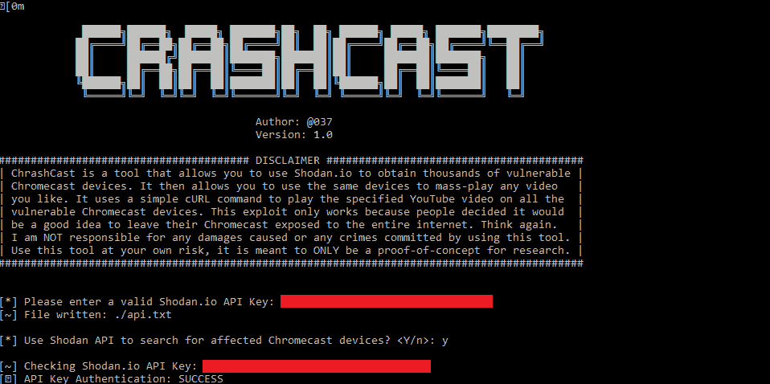
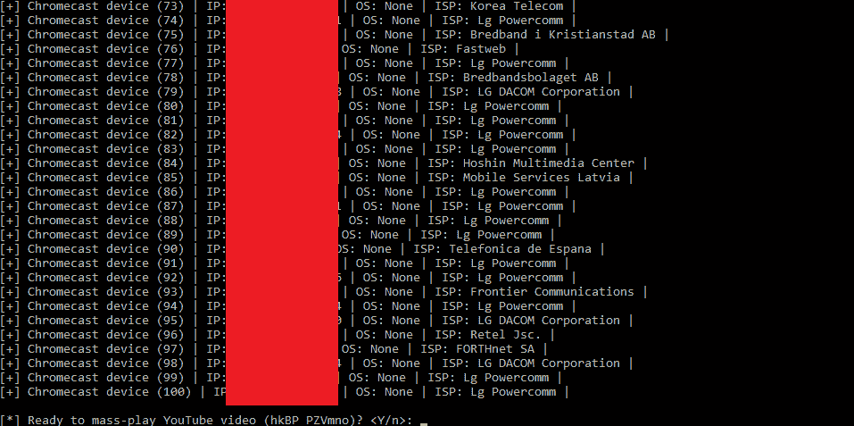
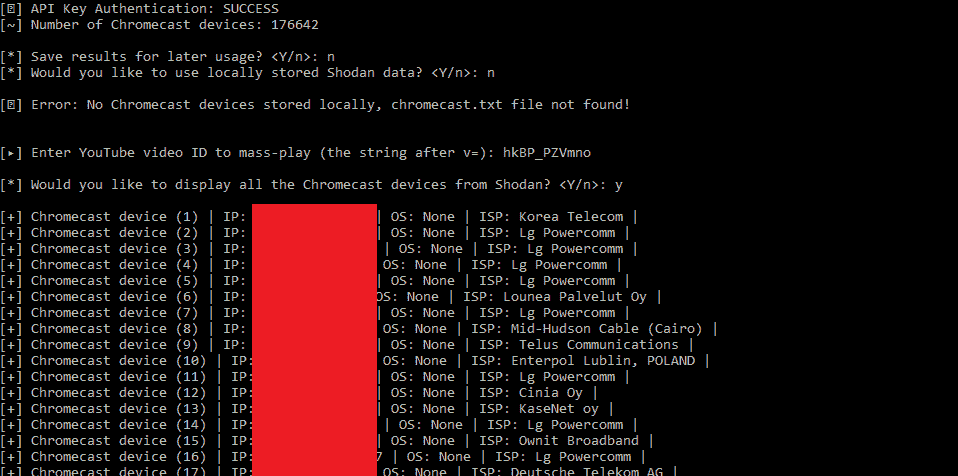
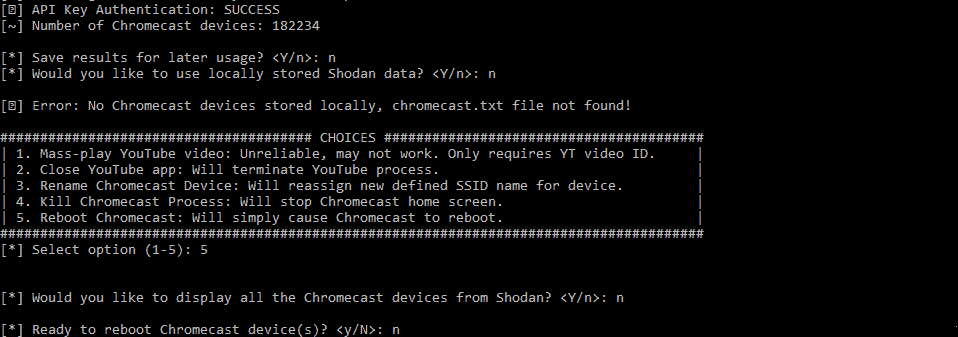

# Crashcast-Exploit:大量播放 YouTube 视频、终止应用程序和重命名 Chromecast 设备的工具

> 原文：<https://kalilinuxtutorials.com/crashcast-exploit/>

CRASHCAST mass-exploit 工具允许您批量播放任何 YouTube 视频，远程终止应用程序，并重命名从 Shodan.io 获得的 Chromecast 设备。

**先决条件**

您唯一需要安装的是 Python 3.x

sudo apt-get 安装 python3

您还需要安装 cURL

sudo apt-get 安装卷曲

您还需要 Shodan python 模块

**pip 安装 shodan**

**也读作: [SSRFmap:自动 SSRF 模糊器和开发工具](https://kalilinuxtutorials.com/ssrfmap-ssrf-fuzzer-exploitation/)**

**使用 Shodan API**

此工具要求您拥有升级的 Shodan API

如果你用 edu 的邮箱注册，你可以在 Shodan 免费得到一个

[**Download**](https://github.com/649/Crashcast-Exploit)