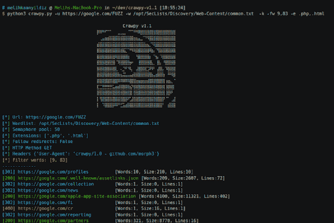

# Crawpy:又一个内容发现工具

> 原文：<https://kalilinuxtutorials.com/crawpy/>

Crawpy 是另一个用 python 编写的内容发现工具。

该工具与其他工具的不同之处在于:

*   它被编写为异步工作，这允许达到最大限度。所以它非常快。
*   校准模式，自行应用过滤器
*   有一堆标志可以帮助你模糊细节
*   给定状态代码和深度的递归扫描模式
*   报告生成后，您可以稍后去检查您的结果
*   多次 url 扫描

**示例报告**

示例报告可在此处找到

**https://morph3sec.com/crawpy/example.html
https://morph3sec.com/crawpy/example.txt**

**安装**

**git 克隆 https://github.com/morph3/crawpy
pip 3 install-r requirements . txt
或
python 3-m pip install-r requirements . txt**

**用途**

**morph3➜crawpy/【main✗】λpython 3 crawpy . py–help
用法:crawpy . py[-h][-u URL][-w wordlist][-t threads][-RC recursive _ codes][-RP recursive _ paths][-rd recursive _ depth][-e extensions][-to time out][-follow][-AC][-fc filter _ code][-fs filter _ size][-fw filter _ word][-fl filter _ line][-k] –word list word list
word list
-t THREADS，–THREADS THREADS
信号量池的大小
-rc RECURSIVE_CODES，–RECURSIVE-CODES RECURSIVE _ CODES
要递归扫描的递归代码示例:301，302，307
-rp RECURSIVE_PATHS，–RECURSIVE-PATHS RECURSIVE _ PATHS
要递归扫描的递归路径，请注意，最初只会扫描给定的递归路径示例:admin、support、js、backup
-rd RECURSIVE_DEPTH 用 comas 例子把它们分开。html，。txt
-to TIMEOUT，–time out time out
time out，我建议你不要使用这个选项，因为它现在会出现很多错误，我无法解决为什么
-follow，–Follow-redirects
Follow redirects
-AC，–auto-calibre
Automatically FILTER stuff
-fc FILTER _ CODE，–FILTER-CODE FILTER _ CODE
FILTER status CODE
-fs FILTER _ SIZE，–FILTER-SIZE FILTER _ SIZE
–Ignore-ssl 忽略不可信的 SSL 证书
-m MAX_RETRY，–MAX-RETRY MAX _ RETRY
MAX RETRY
-H HEADERS，–HEADERS HEADERS
HEADERS，可以多次设置标志。 比如:-H "X-Forwarded-For: 127.0.0.1 "，-H " Host:foobar "
-o OUTPUT _ FILE，–OUTPUT OUTPUT _ FILE
输出文件夹
-gr，–generate-report
如果想让 crawpy 生成报告，默认路径是 crawpy/reports/。txt
-l URL_LIST，–LIST URL _ LIST
将 URL 列表作为输入并通过多重处理运行 crawpy-l ./URLs . txt
-lt LIST _ THREADS，–LIST-THREADS LIST _ THREADS
在运行 URL 列表时并行运行 crawpy 的线程数
-s，–silent Make crawpy 不产生输出
-X HTTP_METHOD，–HTTP-METHOD HTTP _ METHOD
HTTP 请求**

**例题**

**python 3 crawpy . py-u https://Facebook . com/fuzz-w。/common . txt-k-AC-e . PHP。html
python 3 crawpy . py-u https://Google . com/fuzz-w。/common . txt-k-fw 9.83-rc301，302-rd 2-AC
python 3 crawpy . py-u https://morph 3 sec . com/fuzz-w ./common . txt-e . PHP。html-t20-AC-k
python 3 crawpy . py-u https://Google . com/fuzz-w ./common . txt-AC-gr
python 3 crawpy . py-u https://Google . com/fuzz-w ./common . txt-AC-gr-o/tmp/test . txt
sudo python 3 crawpy . py-l URL . txt-lt 20-gr-w。/common . txt-t20-o**

[**Download**](https://github.com/morph3/crawpy#installation)