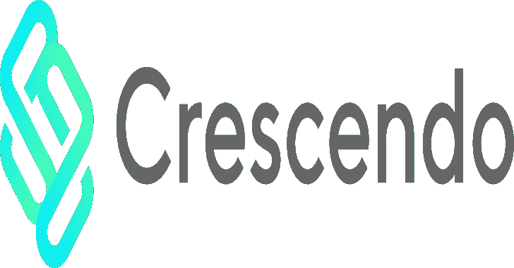
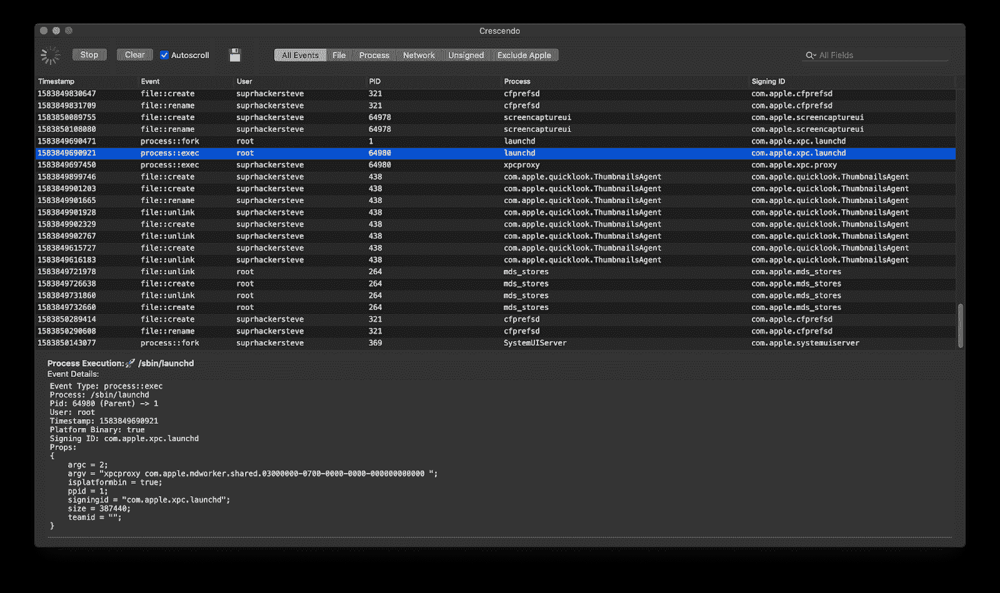
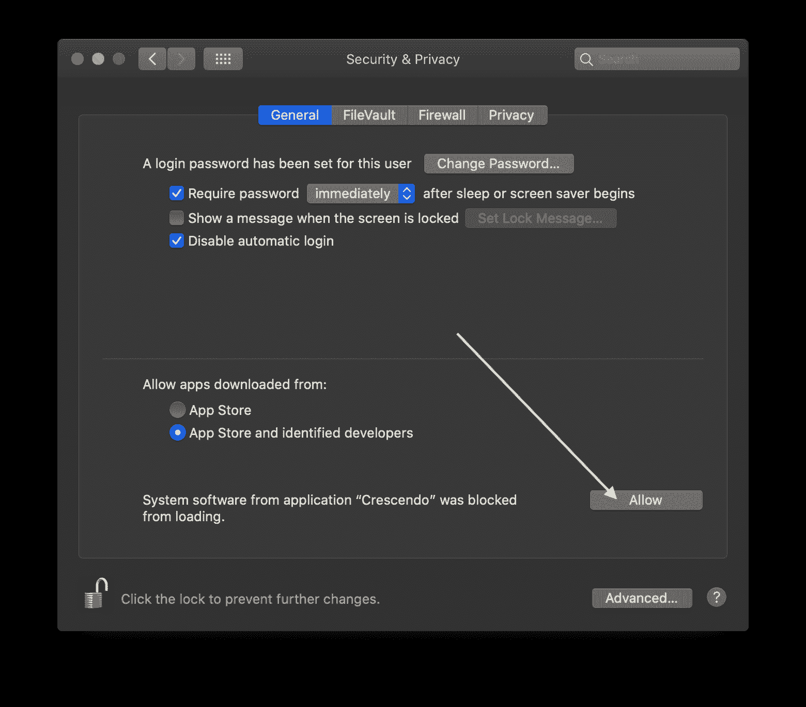
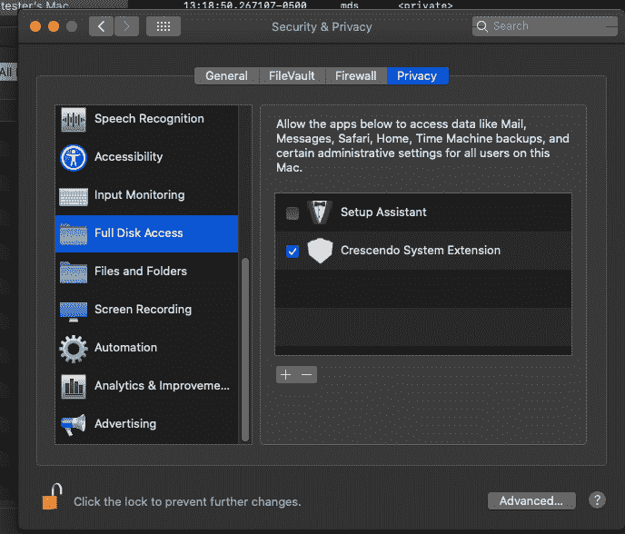

# crescendo:MAC OS 实时事件查看器

> 原文：<https://kalilinuxtutorials.com/crescendo/>

Crescendo 是一个基于 swift 的 macOS 实时事件查看器。它利用了苹果的端点安全框架。

苹果引入了一些新的安全机制，我们需要启用这些机制来运行 Crescendo。

*   请确保您已将应用程序移动到/Applications director，否则系统扩展将无法加载。
*   首次运行时，在单击“开始”按钮后，系统会提示您批准系统扩展。*注意:我注意到有一个问题，系统偏好设置不显示允许按钮。我认为这是苹果需要解决的内部问题。点按“系统偏好设置”并再次向前导航似乎可以解决这个问题。*

*   您需要为系统扩展启用完全磁盘访问。

**要求**

Crescendo 仅兼容> =10.15.X 和至少 Xcode 10。

**也读作-[HTBenum:一个用于黑掉盒子](https://kalilinuxtutorials.com/htbenum/)T3 的 Linux 枚举脚本**

**组件**

该项目由三个主要部分组成:

*   一个系统扩展(CrescendoExtension)
*   围绕端点安全框架的框架包装器(Crescendo)
*   一个在漂亮的小用户界面中查看事件的应用程序

**测试&开发**

强烈建议*在禁用 SIP 的虚拟机中测试该代码，因为该项目需要端点安全授权、TCC 和 SIP 启用时的正确签名。*

*   在 macOS 上引导至恢复模式
*   禁用 SIP 和 AMFI

**csrutil disable
NVRAM boot-args = " amfi _ get _ out _ of _ my _ way = 0x 1"**

*   重新启动
*   启用开发者模式，这样我们的扩展将在每次调用`**OSSystemExtensionManager.shared.submitRequest**`时重新加载

**systemextensionsctl 开发者在**

**签约**

如果你想签署自己的应用程序，强烈推荐阅读苹果公司关于[系统扩展](https://developer.apple.com/documentation/systemextensions)要求和[去噪](https://developer.apple.com/documentation/xcode/notarizing_macos_software_before_distribution)的文档。

签署和授权是一项重要的工作。

**大楼**

我已经把我的。xproj 文件，让人们开始使用。将来我可能会使用新的 xcconfig 文件，因为这似乎比提交 xproj 文件更明智。如果您希望简单地构建示例 cli 应用程序，您可以使用 Xcode 来完成。

为了构建该应用程序并在生产 macOS 系统上运行，您将需要来自 Apple 的端点安全授权和开发者证书。

Crescendo 框架可以轻松地与任何 Swift 应用程序捆绑在一起。我将来可能会搬到 CocoaPods，但我现在对它们还不熟悉。

**问题/缺陷/特性**

如果您希望看到添加的功能或遇到问题，请随时提出问题。如果您希望提交一个 pull 请求，请确保在提交之前对您的代码运行 swiftlint。

我将为编译+签名的应用程序剪切发布，并根据需要将它们包含在发布选项卡中。

**故障排除**

*   如果你在生产 Mac 上运行，你应该*而不是*禁用 SIP 或 AMFI。这些说明是为希望修改代码的开发人员准备的。
*   您是否通过点击`**System Preferences -> Security & Privacy**`中的“允许”按钮来启用系统扩展？否则，您将看不到任何事件。
*   您是否在`**System Preferences -> Security & Privacy -> Privacy Tab**`中启用了全磁盘访问？否则，您将看不到任何事件。
*   如果您遇到任何问题，请打开 Console.app 并搜索 **`crescendo`或`<your_bundle_id>` / `com.suprhackersteve`** 作为过滤器，这将帮助您解决任何潜在的问题。检查 CrashReporter 并查看扩展是否已经崩溃或使用`**fatalError**`退出也是一个好主意。
*   如果您希望强制卸载系统扩展，有一个名为“卸载系统扩展”的菜单项可以卸载它。这个动作可能会导致奇怪的副作用，只有当你知道你在做什么的时候才这样做。
*   如果您已经将一个进程添加到黑名单中，并且它仍然被允许执行，记得检查*真实完整路径*。仅仅使用/Applications/Foo.app 不足以阻止执行。还有，很多 macOS 应用都是通过 xpcproxy 启动的。

[**Download**](https://github.com/SuprHackerSteve/Crescendo)