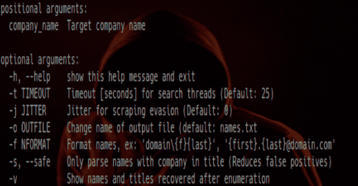

# 交联:LinkedIn 枚举工具，用于从组织中提取有效的员工姓名

> 原文：<https://kalilinuxtutorials.com/crosslinked/>

**交联**简化了搜索 LinkedIn 的过程，以便在对组织执行密码喷洒或其他安全测试时收集有效的员工姓名。

使用类似的搜索引擎抓取功能，如 [subscraper](https://github.com/m8r0wn/subscraper) 和 [pymeta](https://github.com/m8r0wn/pymeta) ，CrossLinked 将找到有效的员工姓名，并根据组织的帐户命名惯例帮助格式化数据。

结果将被写入当前目录中的“names.txt”文件，以供进一步测试。

**也可阅读-[清道夫:爬虫(Bot)在不同的粘贴网站上搜索凭据泄露](https://kalilinuxtutorials.com/scavenger/)**

**设置**

git 克隆 https://github.com/m8r0wn/crosslinked
CD 交联
pip3 安装-r 要求. txt

**例题**

python3 交联的. py-f“{ first }”。{ last } @ domain . com ' company _ name
python 3 交联. py-f ' domain { f } { last } '-t 45-j 0.5 company _ name

**用途**

-h，–help 显示此帮助消息并退出
-t TIMEOUT 搜索线程超时[秒](默认值:25)
-j JITTER 抓取规避抖动(默认值:0)
-o OUTFILE 更改输出文件的名称(默认值:names.txt
-f 格式名称，例如:' domain{f}{last} '，' {first}。{last}@domain.com'
-s，–safe 仅解析标题中带有公司的名称(减少误报)
-v 显示枚举后恢复的名称和标题

**新增内容**

此报告中包括两个附加脚本，用于帮助生成潜在的用户名和密码文件:

*   `**pwd_gen.py**`–使用脚本顶部定义的单词和变量生成自定义密码列表。执行数字/字母替换、追加特殊字符等。配置完成后，运行不带参数的脚本以生成“passwords.txt”输出文件。
*   `**user_gen.py**`–使用命令行提供的 firstname.txt 和 lastname.txt 文件中的输入生成自定义用户名。格式的定义类似于 crossed ed . py，并将被写入“users.txt”。

python 3 user _ gen . py-first top 100 _ first names . txt-last top 100 _ last names . txt-f " domain { f } { last } "

[**Download**](https://github.com/m8r0wn/crosslinked)