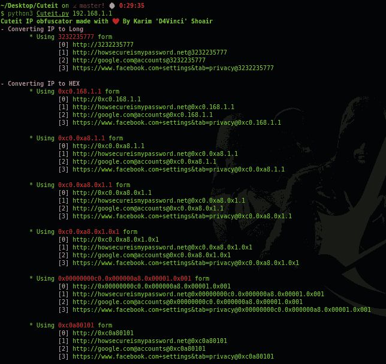
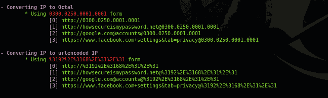
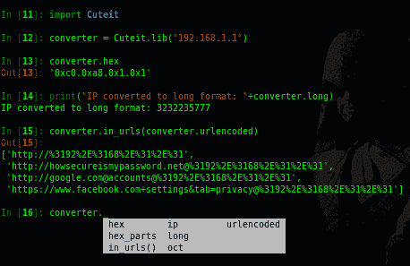

# 可爱-IP 混淆器使恶意 IP 变得更加可爱

> 原文：<https://kalilinuxtutorials.com/cuteit-ip-obfuscator/>

使一个恶意的 IP 变得更加可爱。

一个简单的 python 工具，可以帮助您进行社交工程，绕过白名单防火墙，潜在地破坏命令行日志的 regex 规则，寻找 IP 地址，并将明文字符串混淆到有效载荷中的 C2 位置。

所有这些都是通过将 ip 混淆成多种形式来完成的。

**又读-[Ntopng:网络流量&安全网络流量监控](https://kalilinuxtutorials.com/ntopng-traffic-monitoring/)**

**用途**

**用法:cute it . py[-h][–Disable-coloring]IP
位置参数:
ip 您要转换的 IP
可选参数:
-h，–help 显示此帮助信息并退出
–Disable-coloring 禁用彩色打印**

**截图**

**用它做模块！**

您可以将此脚本用作 python 脚本中的模块，如下所示:

**导入 cute it
convert = cute it . lib(IP)
打印(convert.hex)**

下图显示了实际情况:

[**Download**](https://github.com/D4Vinci/Cuteit)