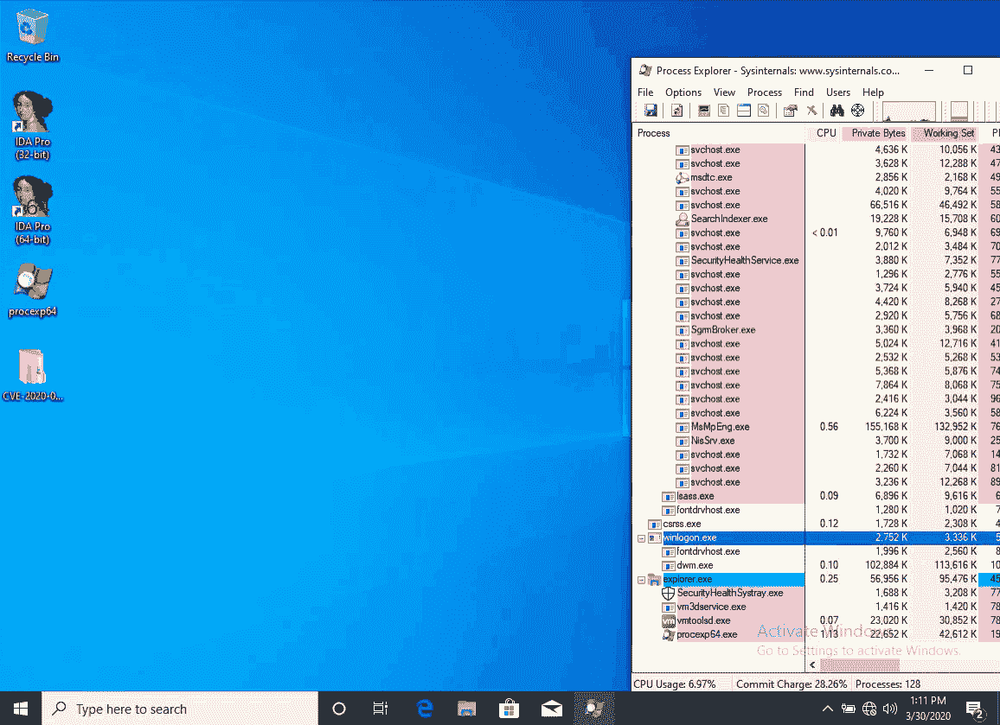

# CVE-2020-0796 : Windows SMBv3 客户端/服务器远程代码执行漏洞

> 原文：<https://kalilinuxtutorials.com/cve-2020-0796/>

**CVE-2020-0796** 微软服务器消息块 3.1.1 (SMBv3)协议处理特定请求的方式中存在一个远程代码执行漏洞。成功利用此漏洞的攻击者能够在目标服务器或客户端上执行代码。

要针对服务器利用该漏洞，未经验证的攻击者可以向目标 SMBv3 服务器发送特制的数据包。要针对客户端利用该漏洞，未经验证的攻击者需要配置恶意的 SMBv3 服务器，并诱使用户连接到该服务器。

此安全更新通过更正 SMBv3 协议处理这些特制请求的方式来解决此漏洞。

**变通办法**

以下[解决方法](https://technet.microsoft.com/library/security/dn848375.aspx)可能对您的情况有所帮助。在所有情况下，Microsoft 强烈建议您尽快安装针对此漏洞的更新，即使您计划保留此变通办法:

**禁用 SMBv3 压缩**

您可以使用下面的 PowerShell 命令禁用压缩，以阻止未经验证的攻击者利用针对 **SMBv3 服务器**的漏洞。

**Set-item property-Path " HKLM:\ SYSTEM \ current control Set \ Services \ lanman server \ Parameters " disable compression-Type DWORD-Value 1-Force**

**备注:**

1.  更改后不需要重新启动。
2.  **此变通办法不能防止利用 SMB 客户端；请参阅常见问题下的第 2 项以保护客户端。**
3.  Windows 或 Windows Server 尚未使用 SMB 压缩，禁用 SMB 压缩不会对性能产生负面影响。

您可以使用下面的 PowerShell 命令禁用该变通方法。

**Set-item property-Path " HKLM:\ SYSTEM \ current control Set \ Services \ lanman server \ Parameters " disable compression-Type DWORD-Value 0-Force**

**注意:**禁用变通办法后不需要重新启动。

**参考文献**

*   [https://portal . msrc . Microsoft . com/en-US/security-guidance/advisory/CVE-2020-0796](https://portal.msrc.microsoft.com/en-US/security-guidance/advisory/CVE-2020-0796)
*   [https://www . synacktiv . com/posts/exploit/im-smbghost-Daba-dee-Daba-da . html](https://www.synacktiv.com/posts/exploit/im-smbghost-daba-dee-daba-da.html)
*   [https://www . fortinet . com/blog/threat-research/CVE-2020-0796-memory-corruption-vulnerability-in-windows-10-SMB-server . html # . xd fn 0 LV 150 . Twitter](https://www.fortinet.com/blog/threat-research/cve-2020-0796-memory-corruption-vulnerability-in-windows-10-smb-server.html#.Xndfn0lv150.twitter)
*   [https://www . McAfee . com/blogs/other-blogs/McAfee-labs/smbghost-analysis-of-CVE-2020-0796/](https://www.mcafee.com/blogs/other-blogs/mcafee-labs/smbghost-analysis-of-cve-2020-0796/)
*   [http://blogs.360.cn/post/CVE-2020-0796.html](http://blogs.360.cn/post/CVE-2020-0796.html)
*   [https://blog . zecops . com/vulnerability/vulnerability-reproduction-CVE-2020-0796-POC/](https://blog.zecops.com/vulnerabilities/vulnerability-reproduction-cve-2020-0796-poc/)

**信用:** Daniel García Gutiérrez &白色 Parajón 手册

[**Download**](https://github.com/danigargu/CVE-2020-0796)