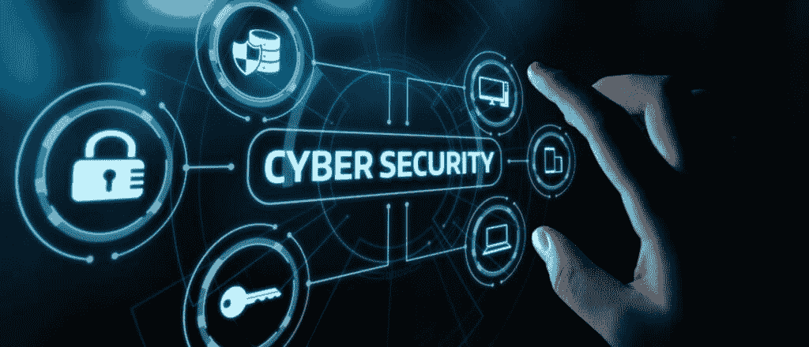

# 网络安全和心理健康

> 原文：<https://kalilinuxtutorials.com/cyber-security-and-mental-health/>

众所周知，互联网可能是一个黑暗而危险的地方。无论你只是在社交媒体上消磨时间，还是在网上赌博，保持警惕都很重要。每天我们都在新闻中读到关于网络攻击和网络欺凌的故事。这些故事通常涉及年轻人，他们是某种网上骚扰的受害者。但许多人没有意识到的是，这些攻击会对相关人员的心理健康产生严重影响。

网络攻击可以采取多种形式。它们可以是任何东西，从有人侵入你的个人账户，发布令人尴尬的信息，到发送威胁或辱骂信息。在某些情况下，网络攻击的影响可能非常严重，以至于受害者会产生自杀的念头。

网络欺凌是最常见的网络攻击形式之一。它通常包括某人向另一个人发送伤害性或恶意的信息。在某些情况下，还可能涉及在网上发布受害者的羞辱性照片或视频。网络欺凌的影响可能是毁灭性的。网络欺凌的受害者通常会感到焦虑、抑郁和自卑。他们也可能与睡眠问题、饮食紊乱和药物滥用作斗争。在极端情况下，网络欺凌会导致自杀的想法。

而且，随着越来越多的人遭受精神健康问题的困扰，互联网可能会引发这些问题。有害的不仅仅是上网这一行为，还有人们接触到的内容。

网络安全和心理健康是经常被忽视的两个非常重要的问题。但它们都有联系。

心理健康和网络安全都是为了保护自己免受伤害。心理健康就是保护你的大脑免受伤害。这可能包括焦虑、抑郁、压力和创伤。网络安全就是保护你的电脑和在线信息不被黑客攻击或窃取。心理健康和网络安全对你的健康都很重要。

这里有一些建议可以帮助你保持对网络安全和心理健康的关注。

1.创建强密码并保证其安全。请确保您的密码很强，很难被猜到。避免使用容易猜到的词，如你的名字、生日或最喜欢的运动队。使用大小写字母、数字和特殊字符的组合。并且不要在多个站点使用同一个密码。

2.警惕网络钓鱼诈骗。网络钓鱼诈骗旨在诱骗您提供个人信息，如您的密码或信用卡号码。对任何要求你点击链接或提供个人信息的电子邮件或短信保持警惕。

3.让您的软件保持最新。这包括您的操作系统、网络浏览器和您安装的任何应用程序。大多数软件更新都包含安全增强功能，因此在它们可用时尽快安装非常重要。

4.使用安全连接。任何时候使用公共 Wi-Fi 网络，请确保使用安全连接。这意味着使用虚拟专用网(VPN )(如果有的话),或者连接到一个安全的 HTTPS 网站。

5.留意你在网上发布的内容。仔细考虑你在社交媒体和其他在线平台上分享的内容。一旦某个东西被发布，通常很难完全删除它。