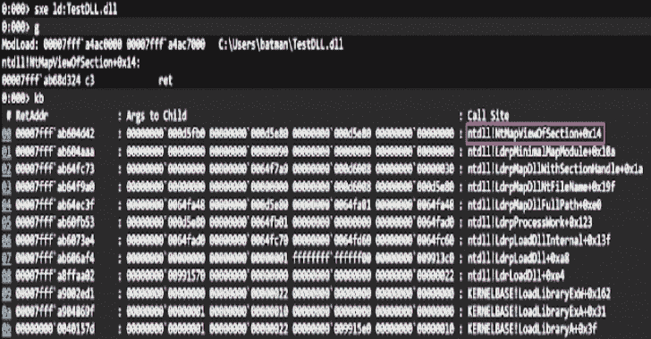

# 黑暗装载库:用于进攻作战的装载库

> 原文：<https://kalilinuxtutorials.com/darkloadlibrary/>

暗载库是`**Load Library**`用于进攻作战的工具。

**用途**

**dark module dark module = dark LOAD library(
LOAD _ LOCAL _ FILE，//控制标志
L"TestDLL.dll "，//本地 DLL 路径，如果从磁盘加载
NULL，// DLL 缓冲区如果从内存加载
0，// dll 大小如果从内存加载
NULL // dll 名称如果从内存加载
)；**

**控制标志**

*   LOAD _ LOCAL _ FILE–从文件系统加载 DLL。
*   LOAD _ MEMORY–从缓冲区加载一个 DLL。
*   NO _ LINK–不要将这个模块链接到 PEB，只需执行它。

**DLL 路径**

这可以是`**CreateFile**`将要打开的任何路径。

**DLL 缓冲器**

仅当设置了`**LOAD_MEMORY**`时，才需要该参数。在这种情况下，该参数应该是包含 DLL 的缓冲区。

**DLL 大小**

仅当设置了`**LOAD_MEMORY**`时，才需要该参数。在这种情况下，该参数应该是包含 DLL 的缓冲区的大小。

**DLL 名称**

仅当设置了`**LOAD_MEMORY**`时，才需要该参数。在这种情况下，该参数应该是 DLL 在 PEB 中设置的名称。

**考量**

windows 加载器非常复杂，可以处理加载 dll 的所有边缘情况和复杂性。将会有一些我没有时间去发现、逆向工程和实现的边缘情况。所以会有这个加载器不能处理的 dll。

也就是说，我计划让这个加载器尽可能的完整，所以请打开没有正确加载的 dll 的问题。

[**Download**](https://github.com/bats3c/DarkLoadLibrary#control-flags)