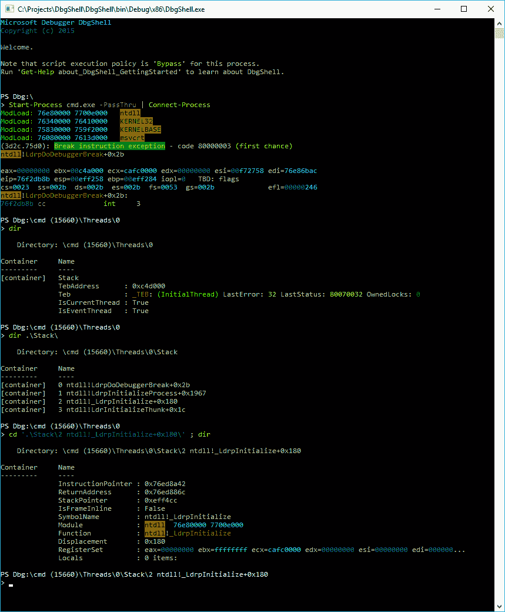
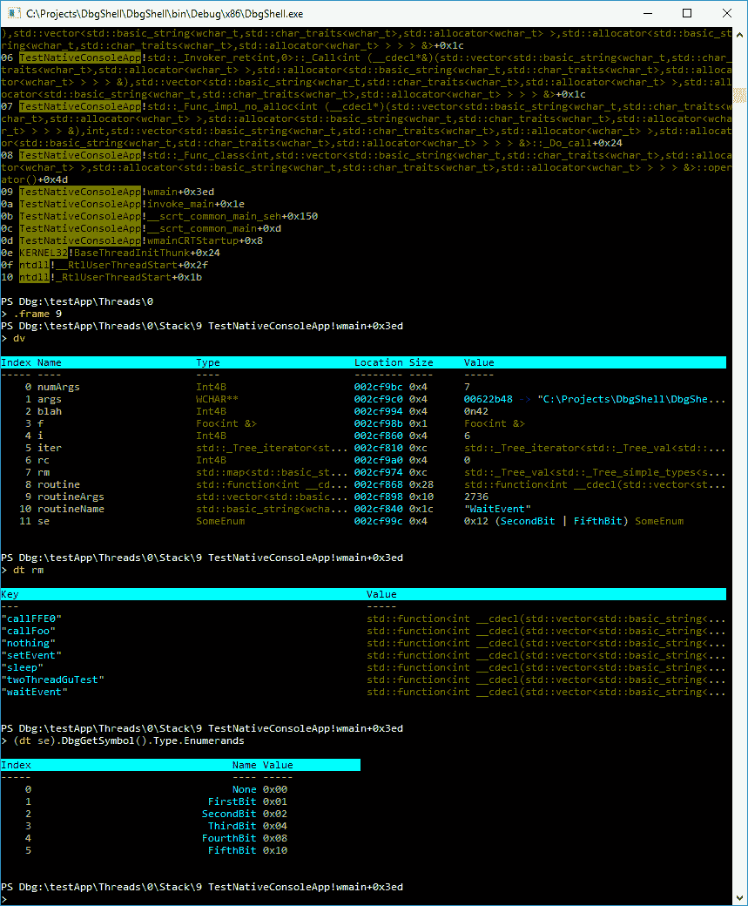

# dbg shell——Windows 调试器引擎的 PowerShell 前端

> 原文：<https://kalilinuxtutorials.com/dbgshell/>

dbg shell Windows 调试器引擎的 PowerShell 前端。

## **DbgShell 诱导**

你曾经尝试过在调试器中自动化任何东西吗？(cdb/ntsd/kd/windbg)你觉得怎么样？

DbgShell 的主要动力是在调试器中实现自动化太难了。当然，今天有*工具来帮助调试器自动化。但在我看来，它们没有满足人们的需求。*

*   使用内置的脚本语言是神秘的、有限的、难以理解的，并且很难获得帮助。
*   DScript 有点简洁，但几乎不为人知，它缺少 REPL，而且太低级了。
*   编写一个成熟的调试器扩展 DLL 是非常强大的，但这是一项重大投资——对于解决快速的“一次性”问题来说，这太昂贵了，因为您调试的是随机的、真实的问题。尽管成本很高，但仍有大量调试器扩展存在。我认为不应该有这么多；我认为有这么多的唯一原因是因为没有可行的替代品。
*   现有的提供更好界面的尝试(如 [PowerDbg](http://powerdbg.codeplex.com/) )都是基于“抓取”和文本解析，这有很大的局限性(更不用说在思想上令人讨厌)，因此无法实现真正更好界面的承诺(它们充其量只是稍微好一点)。
*   现有的提供编写调试器扩展的更简单方法的尝试仅仅是解决开发调试器扩展的痛苦的权宜之计；它们并没有真正解决更大的问题。(例如，两个主要的缺点是:它们仍然太低级(你必须处理 dbgeng COM API)，并且没有 REPL)
*   调试器团队最近引入了 [Javascript 脚本](https://docs.microsoft.com/en-us/windows-hardware/drivers/debugger/javascript-debugger-scripting)。Javascript 是一种比旧的 windbg 脚本语言更好(定义更好)的语言，但我认为 PowerShell 有一些优势，其中最大的优势是没有人真正使用 Javascript shell——PowerShell 作为 shell *和*脚本语言的组合要好得多。

**又读[Kemon——一个基于开源 Pre & Post 回调的框架，用于 macOS 内核监控](https://kalilinuxtutorials.com/kemon-macos-kernel-monitoring/)**

**dbg shell 项目的目标是将基于对象的 PowerShell 世界的美好带给调试世界。**当你做‘dt’转储一个‘object’时，你应该得到一个*实际的*对象。编写脚本应该像编写 PowerShell 脚本一样简单。

DbgShell 项目为 dbgeng.dll 提供了一个 PowerShell 前端，包括:

*   一个托管的“对象模型”(如果你愿意，可以从 C#中使用)，它比 dbgeng COM API 更高级，
*   PowerShell“导航提供程序”，它将调试目标的各个方面公开为一个分层的名称空间(因此您可以“cd”到一个特定的线程，键入“dir”查看堆栈，“cd”到一个框架，再键入“dir”查看局部变量/寄存器/等等。),
*   用于操纵目标的 cmdlets，
*   一个定制的 PowerShell 主机，允许更好地控制调试器 CLI 体验，并提供标准 PowerShell 主机中不可用的功能(即，支持使用 ANSI 转义码的文本着色(a la [ISO/IEC 6429](http://en.wikipedia.org/wiki/ISO/IEC_6429) ))

自定义主机仍然是一个命令行(基于 conhost.exe)程序(类似于 ntsd/cdb/kd)，但是可以从 windbg ( `!DbgShell`)中调用。

除了使自动化变得更加容易和强大之外，它还将解决其他的问题，比如对于那些不需要经常使用调试器的人来说的易用性。(我听到的一个抱怨是“当我最终需要使用 windbg 时，我会把所有的时间都花在。CHM”)

另一方面，对于经验丰富的 windbg 用户来说，另一个目标是尽可能无缝地进行转换。例如，名称空间提供者并不是访问数据的唯一方式；您仍然可以使用传统命令，如“`~3 s`”、“`k`”等。

## “自动化”和“脚本”是什么意思？

我不仅仅是在谈论那种你打开一个文本编辑器，写一些大的脚本来做一些复杂的事情——我也是在谈论能够在命令行上直接写出相对简单的东西的 T2。在许多情况下，您希望能够使用一点点逻辑，但没有大到您甚至想保存它的程度或可重用性。如果打开的文件在用户的桌面上，而函数在堆栈上，那么很容易就能写出像“在 CreateFile 上中断”这样的“一行程序”

## **为什么选择 PowerShell？**

让我澄清一下:我花了大约 4 年时间来“热身”PowerShell。我觉得它有尖锐的边缘，有些方面非常困难，在设计和实现上都有很多错误。有时候真的很让我恼火。*然而，*PowerShell 的优势非常吸引人，让我相信它是这个项目的最佳选择:

*   它既是脚本环境，也是 CLI 环境。事实上，它必须两者都做，这导致了一些负面的东西，比如更陡峭的学习曲线，但最终它是非常方便的，因为您希望既能够在命令行 REPL 中快速地做事情，又能够编写功能齐全、健壮的脚本。
*   这是显而易见的——像`Get-Command`、制表符补全、像文件系统一样暴露分层数据的能力、提供和综合帮助的设施都非常好。
*   制表符结束。我知道我在之前的文章中提到过它，但是它有自己的文章已经足够棒了。
*   对象管道:PowerShell 管道的面向对象特性比过去糟糕的基于字符串解析的脚本更加强大和易于使用，这一点也不好笑。想象做“`dt`”来“转储”一个“对象”，实际得到一个对象。DbgShell 会这么做。
*   人们知道它:我估计知道 PowerShell 和/或 C#的人数至少比知道 windbg 脚本技术的人多几个数量级。这意味着更多的人将能够轻松地“拿起”基于 PowerShell 的调试器；这也意味着当人们需要帮助时，潜在的帮助者会更多(至少对于脚本相关的问题)。
*   PowerShell 仍然是一个通用的 Shell:当使用 DbgShell 时，您不仅可以访问调试器命令，还可以"`cd`"访问文件系统、注册表、AD 等。；可以执行`Send-MailMessage`、`Get-WmiObject`、`Invoke-WebRequest`、`Invoke-RestMethod`，运行任意程序等。

## **当前状态**

DbgShell 已经处于“原型模式”很久了。我已经花了很多时间去思考一件事情可以或者应该怎么做，但是不一定要“完成”所有的事情。当前代码中有大量的 TODOs。因此，尽管它已经开始变得实际有用，这个项目仍然是非常绿色的。然而，它绝对可以充分展示，让你很好地体会它应该是什么样子。

下面是一些截图。需要注意的是，您看到的不是 dbgeng 文本输出。虽然输出中的一些内容看起来很熟悉，但这只是因为我使用了 PowerShell 的格式和输出特性来定制某些对象的显示方式——您看到的所有输出实际上都是真实的、完整的。NET 对象。例如，这些 ModLoad 消息每个都对应于一个`MS.Dbg.ModuleLoadedEventArgs`对象，它比发送到`Out-Default`时显示的属性更多。dbgeng 中没有任何字符串解析。(嗯……差不多。在没有其他方法获取信息的情况下，我做了一些妥协。例如，反汇编的东西，或解析一个调整器的符号名 thunk 函数来找到偏移量。)

这是一种“hello world”场景:连接到 cmd.exe 的一个实例。我首先使用 PowerShell 内置命令`Start-Process`，然后将输出传输到 DbgShell 命令`Connect-Process`，然后查看名称空间:

在这里，我连接了一个测试程序，查看了堆栈，切换到一个特定的堆栈帧，转储局部变量，检查了局部变量`std::map`的值，并检查了局部枚举值的一些类型信息。注意枚举值的显示:DbgShell 不仅处理单个枚举数的符号名查找，还处理多个枚举数的 or 运算。你不能从截图中看出这一点，但所有这些东西都有制表符补全。

 

## **免责声明**

*   Windows 调试器团队不制作、认可或监视此项目。虽然调试器团队欢迎对他们的 API 和前端(windbg、kd 等)的反馈，但他们与这个项目没有关系。不要向调试器团队提交关于该项目的错误或反馈。
*   这不是一个受资助的项目:它没有官方资源分配，只是由志愿者工作。除非你自己愿意完全支持这个项目，否则不要对它产生任何依赖。请随意提出问题和提交拉动请求，但要明白，由于志愿者资源有限，您的提交可能需要一段时间才能得到处理。
*   这是一个实验性的项目:它还没有完全成熟，你应该期待经常会有突破性的变化。

