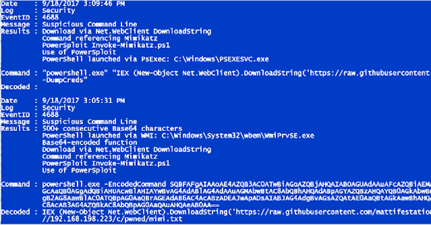

# DeepBlueCLI:一个通过 Windows 事件日志进行威胁搜索的 PowerShell 模块

> 原文：<https://kalilinuxtutorials.com/deepbluecli/>

DeepBlueCLI 是一个 PowerShell 模块，用于通过 Windows 事件日志搜索威胁。

**用途**

`**.\DeepBlue.ps1 <event log name> <evtx filename>**`

如果您收到“此系统禁用运行脚本”错误，请参见 [Set-ExecutionPolicy 自述文件](https://github.com/sans-blue-team/DeepBlueCLI/blob/master/READMEs/Set-ExecutionPolicy.md)。

*   **处理本地 Windows 安全事件日志(PowerShell 必须以管理员身份运行):**

**`.\DeepBlue.ps1`

或者:

`.\DeepBlue.ps1 -log security`**

*   **处理本地 Windows 系统事件日志:**

`**.\DeepBlue.ps1 -log system**`

*   **处理 evtx 文件:**

`**.\DeepBlue.ps1 .\evtx\new-user-security.evtx**`

**已处理的 Windows 事件日志**

*   Windows 安全性
*   视窗系统
*   Windows 应用程序
*   Windows PowerShell
*   Sysmon

**处理的命令行日志**

关于如何配置这些日志，参见下面的[日志设置](https://github.com/sans-blue-team/DeepBlueCLI#logging-setup)部分

*   Windows 安全事件 ID 4688
*   Windows PowerShell 事件 IDs 4103 和 4104
*   Sysmon 事件 ID 1

**检测到的事件**

*   **可疑账户行为**
    *   用户创建
    *   用户已添加到本地/全局/通用组
    *   密码猜测(多次登录失败，一个帐户)
    *   通过失败的登录(多次登录失败，多个帐户)进行密码喷射
    *   通过显式凭证的密码喷射
    *   Bloodhound(管理员权限分配给具有多个安全 id 的同一个帐户)
*   **命令行/Sysmon/PowerShell 审计**
    *   长命令行
    *   正则表达式搜索
    *   混乱的命令
    *   PowerShell 通过 WMIC 或 PsExec 发布
    *   PowerShell Net。WebClient 下载字符串
    *   压缩/Base64 编码命令(自动解压缩/解码)
    *   未签名的 exe 或 dll
*   **服务审计**
    *   可疑服务创建
    *   服务创建错误
    *   停止/启动 Windows 事件日志服务(潜在的事件日志操作)
*   **米米卡兹**
    *   `lsadump::sam`
*   **插槽&应用程序块**

…以及更多

**例题**

| 事件 | 命令 |
| --- | --- |
| 事件日志操作 | `.\DeepBlue.ps1 .\evtx\disablestop-eventlog.evtx` |
| Metasploit 本机目标(安全性) | `.\DeepBlue.ps1 .\evtx\metasploit-psexec-native-target-security.evtx` |
| Metasploit 本机目标(系统) | `.\DeepBlue.ps1 .\evtx\metasploit-psexec-native-target-system.evtx` |
| Metasploit PowerShell 目标(安全性) | `.\DeepBlue.ps1 .\evtx\metasploit-psexec-powershell-target-security.evtx` |
| Metasploit PowerShell 目标(系统) | `.\DeepBlue.ps1 .\evtx\metasploit-psexec-powershell-target-system.evtx` |
| 米米卡兹`lsadump::sam` | `.\DeepBlue.ps1 .\evtx\mimikatz-privesc-hashdump.evtx` |
| 新用户创建 | `.\DeepBlue.ps1 .\evtx\new-user-security.evtx` |
| 混淆(编码) | `.\DeepBlue.ps1 .\evtx\Powershell-Invoke-Obfuscation-encoding-menu.evtx` |
| 混淆(字符串) | `.\DeepBlue.ps1 .\evtx\Powershell-Invoke-Obfuscation-string-menu.evtx` |
| 密码猜测 | `.\DeepBlue.ps1 .\evtx\smb-password-guessing-security.evtx` |
| 口令喷涂 | `.\DeepBlue.ps1 .\evtx\password-spray.evtx` |
| PowerSploit(安全) | `.\DeepBlue.ps1 .\evtx\powersploit-security.evtx` |
| PowerSploit(系统) | `.\DeepBlue.ps1 .\evtx\powersploit-system.evtx` |
| PSAttack | `.\DeepBlue.ps1 .\evtx\psattack-security.evtx` |
| 用户已添加到管理员组 | `.\DeepBlue.ps1 .\evtx\new-user-security.evtx` |

**输出**

DeepBlueCLI 在 PowerShell 对象中输出，允许多种输出方式和类型，包括 JSON、HTML、CSV 等。

例如:

| 输出类型 | 句法 |
| --- | --- |
| 战斗支援车 | `.\DeepBlue.ps1 .\evtx\psattack-security.evtx &#124; ConvertTo-Csv` |
| 格式化列表(默认) | `.\DeepBlue.ps1 .\evtx\psattack-security.evtx &#124; Format-List` |
| 格式化表格 | `.\DeepBlue.ps1 .\evtx\psattack-security.evtx &#124; Format-Table` |
| 显示数据表格（一种控件） | `.\DeepBlue.ps1 .\evtx\psattack-security.evtx &#124; Out-GridView` |
| 超文本标记语言 | `.\DeepBlue.ps1 .\evtx\psattack-security.evtx &#124; ConvertTo-Html` |
| JSON | `.\DeepBlue.ps1 .\evtx\psattack-security.evtx &#124; ConvertTo-Json` |
| 可扩展标记语言 | `.\DeepBlue.ps1 .\evtx\psattack-security.evtx &#124; ConvertTo-Xml` |

**记录设置**

*   **安全事件 4688(命令行审计):**

启用 Windows 命令行审核:[https://support.microsoft.com/en-us/kb/3004375](https://support.microsoft.com/en-us/kb/3004375)

*   **安全事件 4625(登录失败):**

需要审核登录失败:[https://technet.microsoft.com/en-us/library/cc976395.aspx](https://technet.microsoft.com/en-us/library/cc976395.aspx)

*   **PowerShell 审计(PowerShell 5.0):**

DeepBlueCLI 使用模块日志记录(PowerShell 事件 4103)和脚本块日志记录(4104)。它不使用转录。

见:[https://www . fire eye . com/blog/threat-research/2016/02/greater _ visibility t . html](https://www.fireeye.com/blog/threat-research/2016/02/greater_visibilityt.html)

要在 Windows 7 到 Windows 8.1 上获得 PowerShell 命令行(而不仅仅是脚本块)，请将以下内容添加到\ Windows \ System32 \ Windows PowerShell \ v 1.0 \ profile . PS1

$LogCommandHealthEvent = $true
$LogCommandLifecycleEvent = $true

有关更多信息，请参见以下内容:

*   [https://logrhythm.com/blog/powershell-command-line-logging/](https://logrhythm.com/blog/powershell-command-line-logging/)
*   [http://hacker hurricane . blogspot . com/2014/11/I-powershell-logging-what-every one . html](http://hackerhurricane.blogspot.com/2014/11/i-powershell-logging-what-everyone.html)

谢谢: [@heinzarelli](https://twitter.com/heinzarelli) 和 [@HackerHurricane](https://twitter.com/hackerhurricane)

**Sysmon**

*   从 Sysinternals 安装 Sysmon:[https://docs . Microsoft . com/en-us/Sysinternals/downloads/Sysmon](https://docs.microsoft.com/en-us/sysinternals/downloads/sysmon)
*   DeepBlue 和 DeepWhite 目前使用 Sysmon 事件 1、6 和 7。
*   日志 SHA256 哈希。其他还好；DeepBlueCLI 将使用 SHA256。

[**Download**](https://github.com/sans-blue-team/DeepBlueCLI)