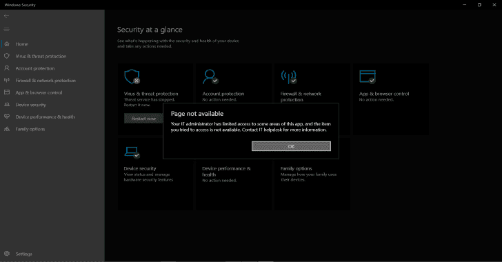
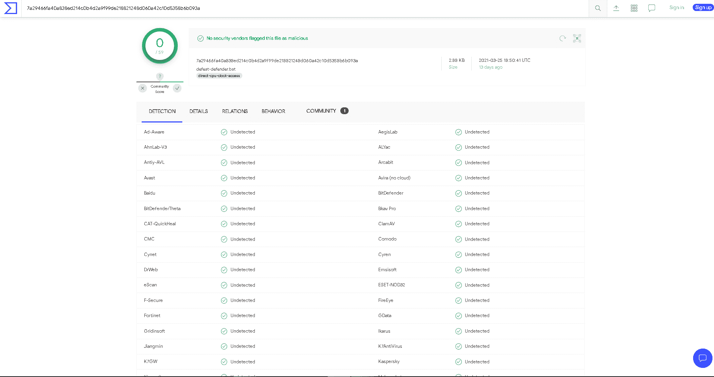
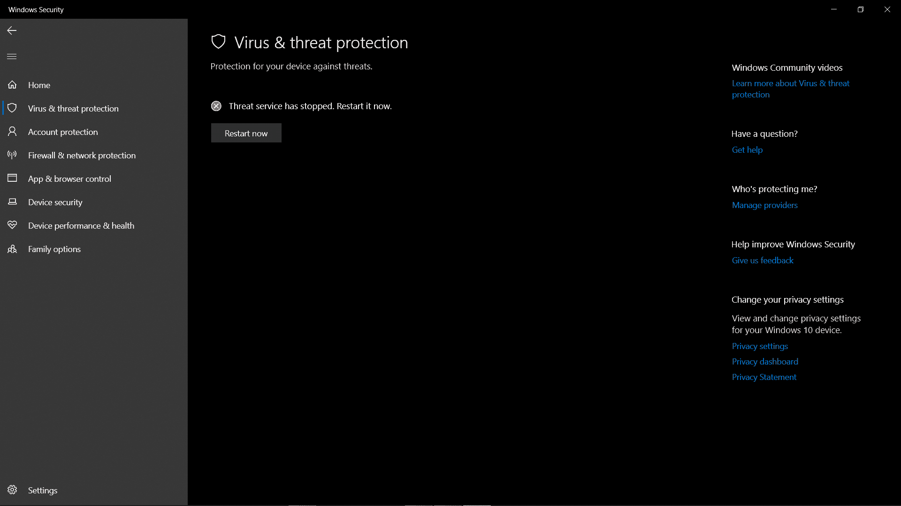

# 击败后卫:强大的批处理脚本，拆除完整的 Windows 后卫保护

> 原文：<https://kalilinuxtutorials.com/defeat-defender/>

**Defeat-Defender** 是一个强大的批处理文件，用于禁用 windows defender、防火墙、smartscreen 并执行有效负载。

**用途**

1.  在这一行编辑 Defeat-Defender . bat[https://github . com/swag karna/Defeat-Defender/blob/93823 ACF fa 270 fa 707970 c0e 0121190 DBC 3 EAE 89/Defeat-Defender . bat # L72](https://github.com/swagkarna/Defeat-Defender/blob/93823acffa270fa707970c0e0121190dbc3eae89/Defeat-Defender.bat#L72)并替换您的有效负载的直接 url
2.  运行脚本“run.vbs”。它将要求管理员许可。如果许可被授予，脚本将在没有控制台窗口的情况下安静地工作…

**获得管理员权限后，它将禁用 Defender**

1.  pua 保护
2.  自动提交样本
3.  Windows 防火墙
4.  Windows 智能屏幕(永久)
5.  禁用快速扫描
6.  将 exe 文件添加到 defender 设置中的排除项
7.  禁用勒索软件防护

**病毒总结果[2021 年 8 月 4 日]**

**绕过 Windows-Defender 技术**

最近，Windows 引入了一个叫做“防篡改”的新功能。这可以防止禁用实时保护和使用 powershell 或 cmd 修改 defender 注册表项…如果您需要禁用实时保护，您需要手动进行…但我们将禁用实时保护使用 NSudo 不触发 Windows Defender

**运行完失败-防御者脚本后**

在 Windows 版本 20H2 上测试

**幕后**

当批处理文件被执行时，它要求管理员许可。获得管理员权限后，它开始禁用 windows defender 实时保护，防火墙，smartscreen，并开始从服务器下载我们的后门，它会放在启动文件夹中。后门将在从服务器下载后被执行..并且将在系统启动时启动..

**查看本文:**[https://secn hack . in/create-fud-fully-detected-payload-for-windows-10/](https://secnhack.in/create-fud-fully-undetectable-payload-for-windows-10/)

**注意:**如果要启用 Defender Smart Screen。使用智能屏幕. bat 文件..

**免责声明**

仅用于教育目的。

[**Download**](https://github.com/swagkarna/Defeat-Defender)