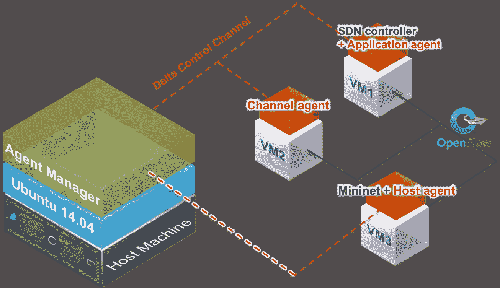
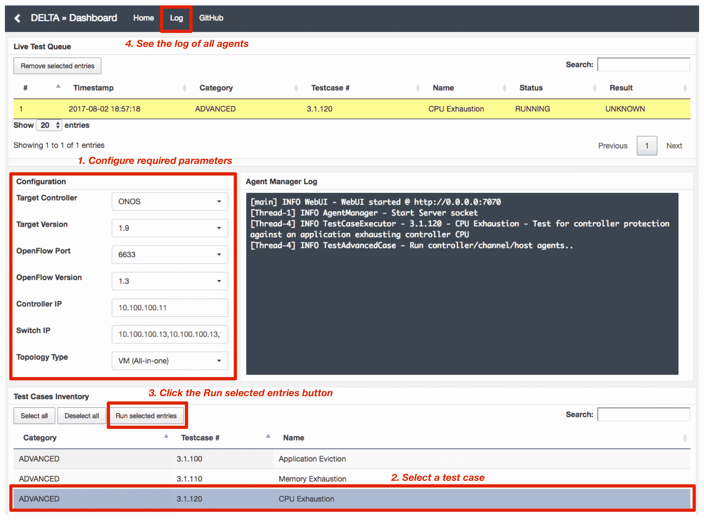

# delta–SDN 安全评估和渗透测试框架

> 原文：<https://kalilinuxtutorials.com/delta-framework/>

**DELTA** 是一个渗透测试框架，为不同的测试用例重新生成已知的攻击场景。该框架还通过采用模糊化技术提供了发现 SDN 中未知安全问题的能力。

1.  代理经理是控制塔。它完全控制部署到目标 SDN 网络的所有代理。
2.  应用程序代理是一个合法的 SDN 应用程序，它执行攻击程序，并且依赖于控制器。已知的恶意功能被实现为应用程序代理功能。
3.  通道代理部署在控制器和支持 OpenFlow 的交换机之间。代理嗅探并修改未加密的控制消息。它与控制器无关。
4.  主机代理的行为就好像它是参与目标 SDN 网络的合法主机一样。代理演示了一种攻击，在这种攻击中，主机试图破坏控制平面。


**也可阅读[what web——用你的 Web 应用发现安全漏洞的工具](https://kalilinuxtutorials.com/whatweb/)**

## **安装 DELTA**

它的安装依赖于 maven 和 ant 构建系统。mvn 命令用于安装代理管理器和代理。它可以通过容器支持一体化单机环境，也可以支持真正的硬件 SDN 环境。

*   第一步。在代理管理器计算机上获取 DELTA 的源代码

```
$ git clone https://github.com/OpenNetworkingFoundation/DELTA.git
```

*   第二步。安装增量依赖项

```
$ cd <DELTA>/tools/dev/delta-setup/
$ ./delta-setup-devenv-ubuntu
```

*   第三步。使用 lxc 安装三个容器

```
$ source ./<DELTA>/tools/dev/delta-setup/bash_profile
$ cd <DELTA>/tools/dev/lxc-setup
$ ./lxc-create**

**$ sudo vi /etc/default/lxc-net
Uncomment "LXC_DHCP_CONFILE=/etc/lxc/dnsmasq.conf"
$ sudo service lxc-net restart
$ sudo lxc-start -n container-cp -d**

**$ sudo vi /etc/apparmor.d/abstractions/lxc/container-base
Uncomment "mount options=(rw, make-rprivate) -> **,"
$ sudo apparmor_parser -r /etc/apparmor.d/lxc-containers**

**$ cd ~
$ ssh-keygen -t rsa
(Press Enter)
$ ssh-copy-id -i ~/.ssh/id_rsa.pub $DELTA_CP
(ID: ubuntu, PW: ubuntu)**

**$ ssh $DELTA_CP
(DELTA_CP) $ sudo visudo
In the bottom of the file, type the follow:
ubuntu ALL=(ALL) NOPASSWD: ALL
(DELTA_CP) $ exit**

**$ cd <DELTA>/tools/dev/lxc-setup
$ ./lxc-setup
$ ssh-copy-id -i ~/.ssh/id_rsa.pub $DELTA_CH
$ ssh-copy-id -i ~/.ssh/id_rsa.pub $DELTA_DP
```

*   在一体机的情况下，测试环境自动设置如下:



## **运行增量**

*   第一步。将可执行文件分发到容器中

```
$ cd <DELTA>
$ source ./tools/dev/delta-setup/bash_profile
$ ./tools/dev/delta-setup/delta-agents-scp
```

*   第二步。首先执行代理管理器

```
$ cd <DELTA>
$ bin/run-delta tools/config/<configuration file> # e.g., manager_vm.cfg**

 DELTA: A Penetration Testing Framework for Software-Defined Networks

 **[pP]	- Show all known attacks
 [cC]	- Show configuration info
 [kK]	- Replaying known attack(s)
 [uU]	- Finding an unknown attack
 [qQ]	- Quit**

**Command>_
```

*   第三步。连接基于 Web 的用户界面(端口号为 7070)



## **主要贡献者**

*   Seungsoo Lee (KAIST)
*   金镇宇(KAIST)
*   胜元佑
*   尹昌勋(韩国)
*   桑德拉·斯科特-海沃德(贝尔法斯特女王大学)
*   申成元(KAIST)

[](https://github.com/OpenNetworkingFoundation/DELTA)