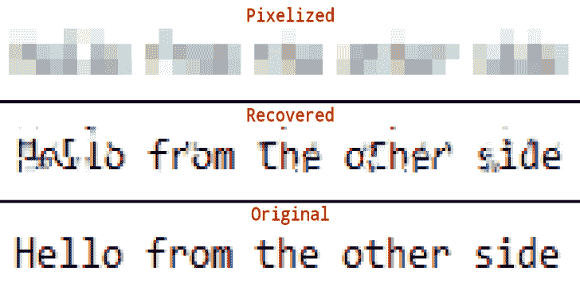

# 从像素化的截图中恢复密码

> 原文：<https://kalilinuxtutorials.com/depix/>

**Depix** 是一款从像素化的截图中恢复密码的工具。这种实现适用于使用线性方框滤镜创建的像素化图像。

在这篇文章中，我介绍了像素化和类似研究的背景信息。

**例子**

**python depix . py-p images/testimages/testimages 3 _ pixels . png-s images/search images/debruinseq _ notepad _ windows 10 _ closeandspace . png-o output.png**

**用途**

*   从截图中剪下像素块作为一个矩形。
*   在具有相同字体设置(文本大小、字体、颜色、hsl)的编辑器中粘贴具有预期字符的 [De Bruijn 序列](https://damip.net/article-de-bruijn-sequence)。
*   做一个序列的截图。如果可能的话，使用与创建像素化图像相同的截图工具。
*   运行`**python depix.py -p [pixelated rectangle image] -s [search sequence image] -o output.png**`

**算法**

该算法利用了线性盒滤波器分别处理每个块的事实。对于每个块，它像素化搜索图像中的所有块，以检查直接匹配。

对于大多数像素化的图像，Depix 设法找到单一匹配的结果。它假设这些都是正确的。然后将周围多匹配块的匹配进行比较，以在几何上与像素化图像中的距离相同。匹配也被视为正确。这个过程重复几次。

当正确的块不再有几何匹配时，它将直接输出所有正确的块。对于多匹配块，它输出所有匹配的平均值。

[**Download**](https://github.com/beurtschipper/Depix)