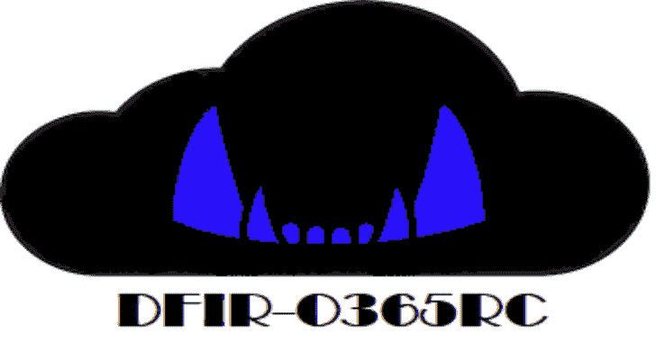

# DFIR-O365RC:用于 Office 365 和 Azure 广告日志收集的 PowerShell 模块

> 原文：<https://kalilinuxtutorials.com/dfir-o365rc-power/>

DFIR-O365RC PowerShell 模块是一组功能，允许 DFIR 分析师收集与 Office 365 业务电子邮件危害调查相关的日志。

日志以 JSON 格式生成，并从两个主要数据源中检索:

*   Office 365 [统一审计日志](https://docs.microsoft.com/en-us/microsoft-365/compliance/search-the-audit-log-in-security-and-compliance?view=o365-worldwide#search-the-audit-log)。
*   Azure AD [登录日志](https://docs.microsoft.com/en-us/azure/active-directory/reports-monitoring/concept-sign-ins)和[审计日志](https://docs.microsoft.com/en-us/azure/active-directory/reports-monitoring/concept-audit-logs)。

可以从不同的端点查询这两个数据源:

| 先决条件(操作系统或 Azure) |
| --- |
| 统一审核日志/[Exchange Online PowerShell](https://docs.microsoft.com/en-us/powershell/module/exchange/search-unifiedauditlog?view=exchange-ps) | 90 天 | 贫穷的；贫困的 | 所有 Office 365 日志(包括 Azure 广告) | 没有人 |
| 统一审计日志/ [Office 365 管理 API](https://docs.microsoft.com/en-us/office/office-365-management-api/office-365-management-apis-overview) | 7 天 | 好的 | 所有 Office 365 日志(包括 Azure 广告) | Azure 应用程序注册 |
| Azure 广告日志/ [Azure 广告 PowerShell 预览](https://docs.microsoft.com/en-us/azure/active-directory/reports-monitoring/reference-powershell-reporting) | 30 天 | 好的 | 仅 Azure 广告登录和审核事件 | 仅限 Windows 操作系统 |
| Azure 广告日志/ [MS Graph API](https://docs.microsoft.com/en-us/graph/api/overview?view=graph-rest-1.0) | 30 天 | 好的 | 仅 Azure 广告登录和审核事件 | 没有人 |

DFIR-O365RC 是一个取证工具，其目的不是实时监控您的 Office 365 基础架构:如果您想使用 SIEM 实时分析数据，请使用 *Office 365 管理 API* 。

DFIR-O365RC 将从以下位置获取数据:

*   Azure 广告日志使用 *MS Graph API* 因为性能好，历史是 30 天，它在 *PowerShell 核心*上工作。
*   使用 *Exchange online PowerShell* 的统一审计日志尽管性能不佳，但历史记录为 90 天，并且它在 *PowerShell 核心*上工作。

如果你也在调查其他 Azure 资源(IaaS，PaaS…)，DFIR-O365RC 也可以使用*[Azure Monitor RESTAPI](https://docs.microsoft.com/en-us/rest/api/monitor/)*从 Azure [活动日志](https://docs.microsoft.com/en-us/azure/azure-monitor/essentials/activity-log)中获取数据。历史是 90 天，它在 *PowerShell 核心*上工作。

因此，DFIR-O365RC 也可以在 Linux 或 Mac 上工作，只要你有 *PowerShell Core* 和一个浏览器来使用设备登录。

**安装和先决条件**

克隆 DFIR-O365RC 存储库。该工具在 *PowerShell 桌面*和 *PowerShell 内核*上运行。

DFIR-O365 使用贾森·汤普森的 [MSAL。PS](https://github.com/AzureAD/MSAL.PS) 和 Boe Prox 的 [PoshRSJob](https://github.com/proxb/PoshRSJob) 模块。要安装它们，请运行以下命令:

安装模块名 MSAL。PS-要求版本' 4.21.0.1'
安装-模块名 PoshRSJob-要求版本' 1.7.4.4'

如果 MSAL。PS 模块安装失败，出现以下消息:

**警告:指定的模块‘MSAL。PowerShellGet 的当前版本不支持 PowerShellGetFormatVersion 为“2.0”的“PS”。获取最新版本的 PowerShellGet 模块来安装此模块，' MSAL。PS’。**

使用以下命令更新 PowerShellGet:

**Install-package provider nu get-Force
Install-Module-Name powershell get-Force**

安装完这两个模块后，使用以下命令启动 Powershell 提示符并找到您的 PowerShell 模块路径:

**PS >**

将 DFIR-O365RC 目录复制到您的一个模块路径中，例如在 Windows 上:

*   *% user profile % \ Documents \ windows powershell \ Modules*
*   *% program files % \ windows powershell \ Modules*
*   *% SYSTEMROOT % \ system32 \ windows power shell \ v 1.0 \ Modules*

Linux 上的模块路径示例:

*   */home/%USERNAME%/。本地/共享/powershell/模块*
*   */usr/local/share/powershell/模块*
*   */opt/Microsoft/powershell/7/Modules*

DFIR-O365RC 模块已安装，重新启动 PowerShell 提示符并加载模块:

**PS >进口模块 DFIR-O365RC**

**角色和许可要求**

启动该工具的用户应具有以下角色:

*   微软 365 角色(portal.microsoft.com): **全局读者**
*   Exchange Online 角色(outlook.office365.com/ecp): **仅查看审核日志**

为了用 *MS Graph API* 检索 Azure AD [登录日志](https://docs.microsoft.com/en-us/azure/active-directory/reports-monitoring/concept-sign-ins)，你需要至少一个拥有 [Azure AD Premium P1](https://azure.microsoft.com/en-us/pricing/details/active-directory/) 许可证的用户。单个用户可以额外付费购买该许可证，有时会包含在一些许可证计划中，如面向中小型企业的*Microsoft 365 Business Premium*。

如果您还需要检索 Azure 活动日志，那么您需要从其转储日志的 Azure 订阅的**日志分析阅读器**角色。

**模块**中包含的功能

该模块有 6 个功能:

| 函数名 | 数据源/历史 | 表演 | 完全 | 细节 |
| --- | --- | --- | --- | --- |
| get-o365 满 | 统一审计日志/90 天 | 贫穷的；贫困的 | 所有统一审核日志 | 可以检索每个*记录类型*的日志子集。仅在小租户或短期内使用 |
| get-o365 灯 | 统一审计日志/90 天 | 好的 | 仅统一审核日志的子集 | 仅检索感兴趣的*操作*的子集。 |
| get-defender for 365 | 统一审计日志/90 天 | 好的 | 仅统一审核日志的子集 | 检索 Defender for Office 365 相关日志。至少需要一个 [E5 许可证](https://www.microsoft.com/en-us/microsoft-365/enterprise/office-365-e5?activetab=pivot:overviewtab)或许可证计划，如[微软 Office 365 Defender 计划](https://docs.microsoft.com/en-us/microsoft-365/security/office-365-security/office-365-atp?view=o365-worldwide#microsoft-defender-for-office-365-plan-1-and-plan-2)或[云应用安全](https://www.microsoft.com/en-us/microsoft-365/enterprise-mobility-security/cloud-app-security) |
| Get-AADLogs | Azure 广告日志/30 天 | 好的 | 所有 Azure 广告日志 | 获取租户一般信息、所有 Azure 登录和审计日志。Azure AD 登录日志比通过统一审核日志检索的 Azure AD 日志拥有更多的信息。 |
| Get-AADApps | Azure 广告日志/30 天 | 好的 | 仅 Azure 广告日志的子集 | 仅获取与 Azure 应用程序和服务主体相关的 Azure 审核日志。日志中包含了应用程序或服务主体对象信息。 |
| 获取辅助设备 | Azure 广告日志/30 天 | 好的 | 仅 Azure 广告日志的子集 | 仅获取与 Azure AD 加入或注册的设备相关的 Azure 审核日志。设备对象信息丰富了日志。 |
| 搜索-O365 | 统一审计日志/90 天 | 取决于查询 | 仅统一审核日志的子集 | 搜索与特定用户、IP 地址相关的活动或使用 *freetext* 查询。 |
| Get-AzRMActivityLogs | Azure 活动日志/90 天 | 好的 | 所有 Azure 活动日志 | 获取给定订阅或运行该功能的帐户有权访问的每个订阅的所有 Azure 活动日志 |

当查询*统一审计日志*时，您被限制为 3 个并发 *Exchange Online Powershell* 会话。DFIR-O365RC 将尝试使用所有可用会话，请在启动日志收集之前关闭任何现有会话。

每个函数都是基于注释的帮助，您可以使用 *get-help* cmdlet 调用它。

**显示基于注释的帮助
PS >获取帮助获取完整示例
显示基于注释的帮助示例
PS >获取帮助获取完整示例**

每个函数都将开始日期和结束日期作为参数。

为了检索 Azure AD 审核日志、过去 30 天的登录日志和租户信息，启动以下命令:

【t0:$ end date = get date】$ start date = $ end date . add days(-30)
gt-目标-目标-起始日期$起始日期$ end date $

为了检索过去 30 天内与 Azure 应用程序和服务主体相关的丰富的 Azure AD 审核日志，请启动以下命令:

【t0:$ end date = get date】$ start date = $ end date . add days(-30)
get-aadaps-start date $ start date $ end date $ end date { T3 }开始日期和结束日期

为了检索过去 30 天内与 Azure AD 加入或注册的设备相关的丰富的 Azure AD 审核日志，请启动以下命令:

【t0:$ end date = get date】$ start date = $ end date . add days(-30)
get-aaddevice-start date $ start date =开始日期$ end date $

为了检索过去 30 天内所有相关的统一审核日志(与 Azure AD 相关的日志除外，这些日志已经由第一个命令检索到),请启动:

【t0:$ end date = get date】$ start date = $ end date . add days(-30)
get-o365 light start date $ start date $ end date $ end date 操作集“全部禁用”

为了检索从现在起-90 天和-30 天之间的时间窗口内的所有相关统一审核日志，请启动以下命令:

**$enddate =(获取日期)。adddays(-30)
$ start date =(get-date)。add days(-90)
Get-o365 light-start date＄start date-end date＄end date-operations set All**

如果启用了邮箱审计，并且您还希望检索 *Mailboxlogin* 操作，您可以使用专用开关，在大型租户上，请注意每天 50.000 个事件的检索限制。

**Get-o365 light-start date $ start date-end date $ end date-operations set All-mailbox log in $ true**

如果有拥有 Enterprise 5 许可证的用户或者有 Microsoft Defender for Office 365 计划，您可以使用以下命令检索 Microsoft Defender 相关日志:

【t0:$ end date = get date】$ start date = $ end date . add days(-90)
get defender efore 365 开始日期$ start date $ end date $ end date { T3 }开始日期

要从圣诞夜和节礼日之间的统一审核日志中检索所有 Exchange Online 相关记录，请注意大型租户的性能可能会很差:

**$ start date = Get-date " 12/24/2020 "
$ end date = Get-date " 12/26/2020 "
Get-o365 full-start date $ start date-end date $ end date-RecordSet exchange only**

您可以使用搜索功能来查找 IP 地址、与特定用户相关的活动，或者在统一审核日志中执行自由文本搜索:

**$ end date = get-date
$ start date = $ end date . adddays(-90)
#使用 Exchange online Powershell AppId 检索事件
Search-O365-start date $ start date-end date $ end date-free text " a0c73c 16-a7e 3-4564-9a 95-2 BDF 47383716 "
#搜索与 X.X.X 和 Y.Y.Y.Y IP 地址相关的事件
Search-O365-start date $ start date-end date $ end date-IP addresses " X . X . X . X，Y.Y.Y.Y"
#检索与用户 user1@contoso.com 和 user2@constoso.com 相关的事件，参数是 system.array 对象
Search-O365-start date $ start date-end date $ end date-UserIds " user 1 @ contoso . com "，" user2@contoso.com"**

要检索所有 Azure 活动日志，帐户有权启动以下命令，将显示可用的订阅:

【t0:$ end date = get date】$ start date = $ end date . add days(-90)
get-azrmativitylgs-start date $ start date $ end date $ end date { T3 }的开始日期

使用 *PowerShell Core* 时，认证过程将需要一个*设备代码*，您将需要使用*设备代码*参数并启动您的浏览器，打开*[https://microsoft.com/devicelogin](https://microsoft.com/devicelogin)*URL 并输入以下消息提供的代码:

**PS>Get-o365 light-start date $ start date-end date $ end date-device code:$ true
要登录，使用网页浏览器打开 https://microsoft.com/devicelogin 页面，输入代码 XXXXXXXX 进行身份验证。**

**生成的文件**

所有生成的文件都是 JSON 格式的。

*   Get-AADApps 创建一个名为 *AADApps_%FQDN%的文件。json* 在 *azure_ad_apps* 文件夹中，其中 *FQDN* 是用于收集日志的帐户的域名部分。
*   Get-AADDevices 创建一个名为 *AADDevices_%FQDN%的文件。json* 在 *azure_ad_devices* 文件夹中。
*   Get-AADLogs 在 *azure_ad_signin* 文件夹中使用 *YYYY-MM-DD* 格式创建以当前日期命名的文件夹，在每个目录中为 Azure AD 登录日志创建一个名为*AADSigninLog _ % FQDN % _ YYYY-MM-DD _ HH-00-00 . JSON*的文件。文件夹 *azure_ad_audit* 也被创建，结果被转储到名为*AADAuditLog _ % FQDN % _ YYYY-MM-DD . JSON*的文件中，用于 Azure AD 审计日志。最后，创建一个名为 *azure_ad_tenant* 的文件夹，并将一般租户信息写入名为 *AADTenant_%FQDN%的文件中。json* 。
*   Get-AzRMActivityLogs 在 *azure_rm_activity* 文件夹中使用 *YYYY-MM-DD* 格式创建以当前日期命名的文件夹，在每个目录中创建一个名为*AzRM _ % FQDN % _ %SubscriptionID% _ YYYY-MM-DD _ HH-00-00 . JSON*的文件，其中% subscription ID %是 azure 订阅 ID。创建一个名为 *azure_rm_subscriptions* 的文件夹，并将每个订阅信息写入名为 *AzRMsubscriptions_%FQDN%的文件中。json* 。
*   Get-O365Full 在 *O365_unified_audit_logs* 中使用 *YYYY-MM-DD* 格式创建以当前日期命名的文件夹，在每个目录下创建一个名为*unified audit log _ % FQDN % _ YYYY-MM-DD _ HH-00-00 . JSON*的文件。
*   Get-O365Light 在 *O365_unified_audit_logs* 中使用 *YYYY-MM-DD* 格式创建以当前日期命名的文件夹，在每个目录下创建一个名为*unified audit log _ % FQDN % _ YYYY-MM-DD . JSON*的文件。
*   Get-DefenderforO365 在 *O365_unified_audit_logs* 中使用 *YYYY-MM-DD* 格式创建以当前日期命名的文件夹，在每个目录下创建一个名为*unified audit log _ % FQDN % _ YYYY-MM-DD _ defender foro 365 . JSON*的文件。
*   Search-O365 在 *O365_unified_audit_logs* 中使用 *YYYY-MM-DD* 格式创建以当前日期命名的文件夹，在每个目录下都有一个名为*unified audit log _ % FQDN % YYYY-MM-DD % search type %的文件。json* 被创建，其中 *searchtype* 可以有值“ *Freetext* ”、“ *IPAddresses* ”或“ *UserIds* ”。

启动各种功能将生成类似的目录结构:

**dfir-o 365 _ logs
【get-aadapps . log】
【get-aadd vices . log】
【get-aadlogs . log】| get-azrmactivitylogs
【get-defensor forum 365 . log】
get-get-getJSON

──aadaouditlog _ % FQDN %*【yyyy-mm-DD .【JSON】──aad vices*% FQDN %。JSON

─

──aadsi NLG _ % FQDN %*【yyyy-mm-DD _ hh-00-00 .【JSON】──aadtant*% FQDN %。JSON

【azrm _ % FQDN %*%订阅 id % _ yyyy-mm-DD _ hh-00-00 .【JSON】【azrmis 订阅】【25】 % fqdn %。JSON

──unifiedauditlog _ % fdqn %*【yyyy-mm-DD . JSON】【unifiedauditlog】【t31 %*【yyyy-mm-DD _ free text . JSON】*****

[**Download**](https://github.com/ANSSI-FR/DFIR-O365RC)