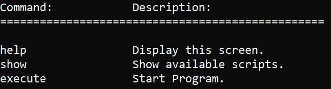
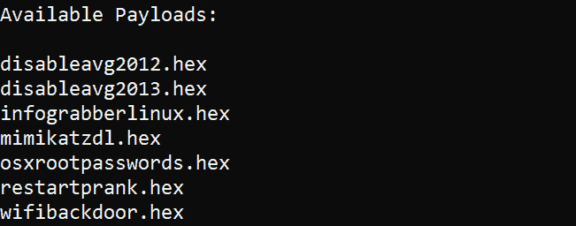
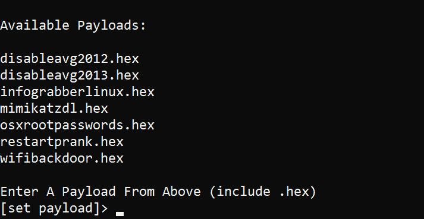
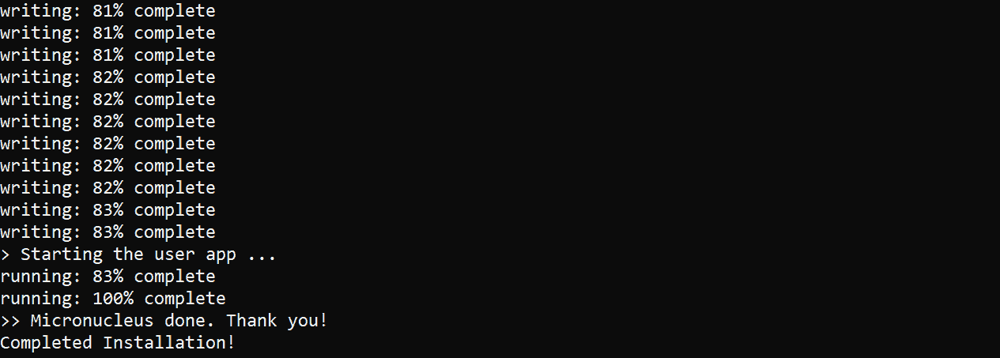
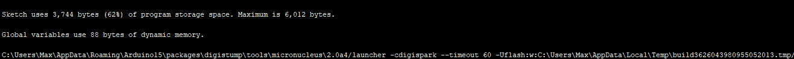

# DigiDuck——运行在 85 处理器和微核引导程序上的 digi duck 开发板框架

> 原文：<https://kalilinuxtutorials.com/digiduck-framework/>

运行 ATTiny85 处理器和微核引导程序的 Digiduck 开发板框架！

## **DigiDuck 安装**

DigiDuck 框架(简称 DDF)启动和设置非常简单！DDF 不需要第三方模块！你需要做的就是确保你有 Python 3.6+(我用它来开发它，但它应该是向后兼容的，希望如此)。克隆此存储库，并从命令行输入目录。进入目录后，只需运行:

```
python start.py
```

这将启动程序并显示如上所示的欢迎屏幕。

**也读作[Sandsifter——x86 处理器 Fuzzer For Hidden Instructions &硬件 bug](https://kalilinuxtutorials.com/sandsifter-x86-processor/)**

## **帮助菜单**

这个框架中有三个命令！我想让它尽可能的轻便，这样它只需要一个命令就可以把有效载荷装载到你的主板上。

#### **命令:帮助**

`**help**`命令显示该菜单:



#### **命令:显示**

**`show`** 命令显示该菜单:



您所有可用的有效载荷都会显示在这里。但是，如果您运行`execute`命令，它们会再次显示。

## **执行**

DDF 的第三个也是最后一个命令是`execute`。`execute`命令将显示与`show`命令相同的菜单，但是从该菜单中您将输入有效载荷名称。**你必须包括。十六进制，否则它不会正确加载，并要求您再次输入。**



**`execute`** *命令显示。*

一旦你选择了你的有效载荷，系统会提示你将你想要的电路板插入电脑。从那里，它将安装所需的有效负载，并在完成时显示:



就是这样！现在，您可以将 badUSB DigiSpark 板插入电脑，运行所需的有效负载！

## **有效载荷**

有效载荷是 DigiSpark。使用 micronucleus bootloader 安装到 ATTiny85 或其他主板上的 ino 十六进制文件。

### **当前有效载荷**

所有当前的有效载荷都来自 Hak5 的 RubberDucky 脚本，可从这里[获得](https://github.com/hak5darren/USB-Rubber-Ducky/wiki/Payloads)。如果你不确定一个有效载荷能做什么，这是一个阅读它的地方。我会尽量保持有效载荷接近相同的名称，但我不希望你在 Windows 上输入太多，因为 rlcompleter 不工作。

### **创建有效载荷**

前往 Duckyspark GitHub 页面查看如何创建您的翻译。来自 RubberDucky 脚本的 ino 文件。之后加载您的。将 ino 文件导入 Arduino IDE。确保在内部首选项中启用了 Verbose，并编译您的代码。打开下面的终端输出并查找。十六进制文件位置。它应该位于 AppData 的 temp 目录中，或者位于 MacOS 上的等效目录中。这里有一个例子:



它就在上面，告诉你要插上你的主板！

从该文件夹中提取 payloadname.cpp.hex 文件，并将其拖到 DDF 框架内的有效负载中。运行该程序，您的有效载荷将被加载到可用的有效载荷！

请随意从上面的橡皮鸭脚本中添加自定义或更多的有效负载！用新的有效载荷做一个 PR。

[ ](https://github.com/M4cs/DigiDuck-Framework) **信用:Duckyspark** ，**微核& Hak5 橡胶垃圾有效载荷**