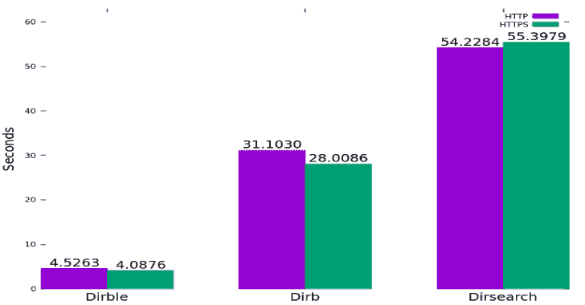
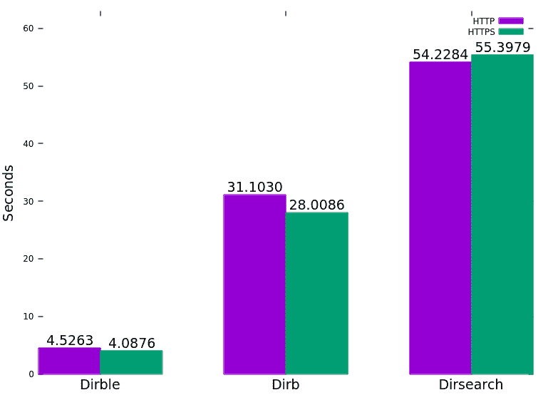

# Dirble:快速目录扫描和抓取工具

> 原文：<https://kalilinuxtutorials.com/dirble/>

**Dirble** 是一款针对 Windows 和 Linux 的网站目录扫描工具。它被设计成运行速度快且易于使用。

**怎么用？**

 **下载一个针对 Linux、Windows 或 Mac 的预编译二进制文件，或者使用 Cargo 编译源代码，然后从终端运行它。Dirble 使用的默认 wordlist 是 dirble_wordlist.txt，与可执行文件在同一个目录中。

它可以使用`**sudo pacman -S dirble**`安装在 BlackArch 中

还有一个 docker 镜像，可以运行为:`**docker run --rm -t isona/dirble [dirble arguments]**`

帮助文本可以使用`**dirble --help**`显示，或者可以在 github wiki 上找到:[https://github.com/nccgroup/dirble/wiki/Help-Text](https://github.com/nccgroup/dirble/wiki/Help-Text)

**例子使用**

*   使用当前目录中的默认 dirble_wordlist.txt 对网站运行:`**dirble [address]**`
*   使用不同的单词表运行，包括。php 和。html 扩展:`**dirble [address] -w example_wordlist.txt -x .php,.html**`
*   启用可列表目录抓取:`**dirble [address] --scrape-listable**`
*   提供扩展名列表和主机列表:`**dirble [address] -X wordlists/web.lst -U hostlist.txt**`
*   通过命令行提供多台主机进行扫描:`**dirble [address] -u [address] -u [address]**`
*   以 Gobuster 的默认方式运行线程，禁用递归并让 10 个线程扫描主目录:`**dirble [address] --max-threads 10 --wordlist-split 10 -r**`

**也可阅读-[邪恶的 SSDP:制造假冒的 UPnP 设备到费西合唱团进行认证](https://kalilinuxtutorials.com/evil-ssdp/)**

**建筑来源**

要在您当前的平台上构建，请确保安装了 cargo，然后运行`**cargo build --release**`。或者，运行`**make**`将在发布模式下构建二进制文件(内部运行`**cargo build --release**`)。

要针对 32 位和 64 位 Linux 和 Windows 目标进行交叉编译，有一个方便的 makefile。`**make release**`将使用`cross`为所有四个目标构建。这取决于是否安装了 cross 和 docker(`**cargo install cross**`)。

**特色**

*   饼干
*   自定义标题
*   扩展名和前缀
*   HTTP 基本身份验证
*   可列表目录检测和抓取
*   将输出保存到文件
*   以 XML 和 JSON 格式保存输出
*   代理支持
*   递归
*   状态代码黑名单和白名单
*   穿线
*   请求节流
*   根据响应代码和长度检测每个目录的未找到代码
*   能够提供要扫描的 URL 列表
*   用户代理
*   使用 GET、POST 或 HEAD 请求进行扫描
*   从输出中排除响应长度范围

**表现**

下图是通过对一台测试服务器运行每个具有 Hyperfine 的工具生成的，该测试服务器具有 5 毫秒的延迟和 1%的数据包丢失。(由于缺少递归，省略了 Gobuster)。

它是如何工作的？

**目录检测**

Dirble 根据服务器发送的响应代码检测文件。行为可以根据响应代码类型大致分类。

*   `**200**`:路径存在且有效
*   `**301, 302**`:重定向；报告代码、尺寸和位置标题
*   `**404**`:未找到；默认情况下，不会报告这些响应
*   所有其他响应代码都以`**+ [url] (CODE:[code]|SIZE:[size])**`的目录格式报告

如果对`**[url]**`(没有结尾斜线的`**[url]**`)的请求返回 301 或 302 重定向到`**[url]/**` ( *带有*结尾斜线)，则路径被分类为*目录*。

这将使用前缀`D`进行报告，如果启用了递归，则将被添加到扫描队列中。

该方法不依赖于现有的或可访问的重定向目标，因此将发出一个单独的请求来确定响应代码和目录的大小。

通过检查`**url/**`的内容来检测可列表目录:如果它返回 200 响应代码，并且正文包含“父目录”、“最多”或“目录列表”(不区分大小写)，那么它很可能是一个可列表目录。如果启用了`**--scrape-listable**`, URL 将从列表中解析出来(忽略排序链接或超出范围的链接),如果它们有尾随斜杠，将被添加到扫描队列中。可列表目录在输出中有一个`L`前缀。

**穿线**

*   Dirble 的线程行为基于单词表和作业的概念。
*   作业是可以独立于其他任务运行的任何任务，例如请求一系列 URL。
*   单词列表是具有定义的转换的单词列表，例如，列表`**{admin, config, shop**}`和转换`append **".php"**`一起形成单个单词列表实例。
*   为了进一步提高性能，我们引入了单词表拆分的概念。
*   这是将单个单词列表实例(即具有转换的单词)分解成多个作业的过程，每个作业负责列表的一部分。
*   每个单词表被分成的交错部分的数量由`**--wordlist-split**`选项定义(默认为 3)。
*   每当检测到一个目录时(并且启用了递归),就会为每个拆分单词表(带有转换)创建新的作业，并将其添加到中央作业队列中。
*   并发任务的最大数量由`--max-threads`参数定义，Dirble 将在任务被添加到队列时启动任务，直到达到这个限制。
*   每当一个作业完成时(即一个拆分的单词表被用完)，Dirble 将从队列中取出下一个作业并启动它。

[**Download**](https://github.com/nccgroup/dirble)**