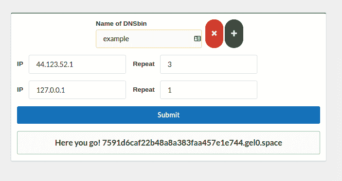
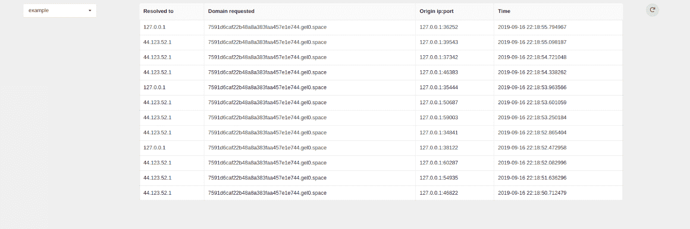

# DNS bookup:DNS 重新绑定工具包

> 原文：<https://kalilinuxtutorials.com/dnsfookup/>

**DnsFookup** 是一个 DNS 重新绑定框架，包含:

*   显然是 dns 服务器
*   web api 来创建新的子域，控制 dns 服务器，查看日志，诸如此类的东西
*   低劣的反应应用程序，使它更加舒适

它是做什么的？

它让你像一个打嗝合作者一样创建 dns 箱，但它增加了更多的功能…(至少它试图这样做)

您可以指定它应该解析到什么 IP 以及解析多少次，因为现在它*只支持一条记录*🙁

然后，您可以在日志中看到它是从哪里被请求的，它被解析为什么

**怎么跑？**

首先，检查中的配置。py 文件，通常用

**"""
***配置***
"""**

您也不应该忘记更改 docker 和 redis 密码

*   坞站-组合. yml
*   app.py
*   dns _ 资源

**#设置 postgres 和 redis**
sudo docker-组合起来

**#in。/BE**
pip 3 install-r requirements . txt
python 3 dns . py #启动 DNS 服务器

**#用于测试目的开发服务器就够了我认为**
FLASK _ APP = APP . py
FLASK _ ENV = development
FLASK run

**#然后在。/FE**NPM 安装
npm 启动

**API 文档**

要使 api 工作，您需要登录——API 使用不记名令牌进行身份验证，并且`**Content-Type**`必须设置为`**application/json**`

**注册`/auth/signup`**

**发布/授权/注册 JSON 正文:**

**{
“用户名”:“马雷克”，
“密码”:“ffffffff”
}**

*   **响应:**

**{
“name”: “marek”,
“access_token”: “eyJuYW1lIjoiMTMzMzMzMzMzMzMzMzMzMzMzMzMzMzMzMzMzMzMzMzMzMzMzMzMzMzMzMzMzMzMzMzMzMzMzMzMzMzMzMzMzMzMzMzMzMzMzMzMzMzMzMzMzMzMzMzMzNyBTZUtyM1QgVDBLM24ifQo=”
}**

**登录`/auth/login`(同注册)**

**POST /auth/login JSON body:**

**{
“用户名”:“马雷克”，
“密码”:“ffffffff”
}**

*   **响应:**

**{
“name”: “marek”,
“access_token”: “eyJuYW1lIjoiMTMzMzMzMzMzMzMzMzMzMzMzMzMzMzMzMzMzMzMzMzMzMzMzMzMzMzMzMzMzMzMzMzMzMzMzMzMzMzMzMzMzMzMzMzMzMzMzMzMzMzMzMzMzMzMzMzMzNyBTZUtyM1QgVDBLM24ifQo=”
}**

**登出`/auth/logout`**

**发布/授权/注销**

**Json 主体可以留空**

*   **响应:**

**{
“消息”:“访问令牌已被撤销”
}**

**获取用户名**

**获取/API/用户**

*   **响应:**

**{
“姓名”:“马雷克”
}**

**创建新令牌`/api/fookup/new`**

**POST/API/fookup/new JSON body:**

{
"name":"dsads "，
" IP _ props ":
{
" 1 ":{
" IP ":" 123 . 0 . 0 . 1 "
" repeat ":13
}，
" 2 ":{
" IP ":" 3 . 2 . 1 . 1 ",
" repeat ":" 4ever "
}
}
}

**直说了吧**

*   `**"name"**`是 dns bin 的名称——它在前端应用程序中很方便
*   是魔法发生的地方
    *   `**"somenumber"**`–这些数字必须按照从 1 到你想要多少(最大 32)的顺序排列，所以没有随机数 dns 服务器将从“1”开始并重复提供的一个又一个 ip，当到达最后一个 ip 时，它将重置计数器并再次从“1”开始，如果在`repeat`字段中提供了`"4ever"`，此循环将不会继续，域名仍停留在第 4 个 IP 上
        *   `**"ip"**`–这是要解析的 ip
        *   `**"repeat"**`–该 ip 应该被解析多少次–这可以被设置为任何正整数或“4ever ”,以在程序到达后永不停止解析该 ip

*   **回应** *:*

**{
"子域":" 0 dd4d 9083d 7647 E1 a5 FD 5 f 1444 e 655 ce . gel 0 . space "
}**

这是一个充满魔力的领域

**例子**

假设我们提供了这个

{
"name":"dsads "，
" IP _ props ":
{
" 1 ":{
" IP ":" 1 . 1 . 1 . 1 "
" repeat ":2
}，
" 2 ":{
" IP ":" 2 . 2 . 2 . 2 ",
" repeat ":1
}
}
}

我们正在对此域运行`host`命令

$host {domain}
{domain}具有地址 1.1.1.1

$ host { domain }
{ domain }具有地址 1.1.1.1

$ host { domain }
{ domain }具有地址 2.2.2.2

$ host { domain }
{ domain }具有地址 1.1.1.1

$ host { domain }
{ domain }具有地址 1.1.1.1

$ host { domain }
{ domain }具有地址 2.2.2.2
…并且这将继续

**例 2 用“4ever”**

{
"name":"dsads "，
" IP _ props ":
{
" 1 ":{
" IP ":" 1 . 1 . 1 . 1 "
" repeat ":2
}，
" 2 ":{
" IP ":" 2 . 2 . 2 . 2 ",
" repeat ":" 4ever "
}
}
}

*   **`host`**的输出

$host {domain}
{domain}有地址 1.1.1.1

$ host { domain }
{ domain }有地址 1.1.1.1

$ host { domain }
{ domain }有地址 2.2.2.2

$ host { domain }
{ domain }有地址 2.2.2.2

$ host { domain }
{ domain }有地址 2.2.2.2

$ host { domain }
{ domain }有地址 2.2.2.2

$ host

但是这个 4ever 循环有一个例外，关于解决了什么和接下来应该解决什么的信息存储在 redis 中，到期时间设置为 1 小时，因此域将在创建后 1 小时内再次解析到 1.1.1.1。您可以在`dns.py`和`dns_resources.py`中的 REDIS_EXP 变量中更改该设置

**列出所有垃圾箱`/api/fookup/listAll`**

**GET /api/fookup/listAll**

*   **回应** *:*

[
{
" uuid ":" 0 dd4d 9083d 7647 E1 a5 FD 5 f 1444 e 655 ce "，
"name": "dsads"
}，
{
" uuid ":" ffffffffffffffffffffffffffffffffff "，
" name ":" some other name "
}
]

这将用 uuids 和您曾经创建的所有 bin 的名称来响应

**获取关于特定 bin 的属性`/api/fookup/props`**

**POST /api/fookup/props**

*   JSON 正文:

{
" uuid ":" 0 dd4d 9083d 7647 E1 a5 FD 5 f 1444 e 655 ce "
}

*   **响应:**

{
" IP _ props ":{
" 1 ":{
" IP ":" 123 . 0 . 0 . 0 "，
"repeat": 13
}，
"2": {
"ip": "0.0.1.77 "，
"repeat": 3
}
}，
"ip_to_resolve": "1 "，
"turn": 5，
"name

这将返回关于 dnsbin 的所有信息，你已经熟悉了`**ip_props**`和`**name**`部分，所以我将解释其他的东西

*   `**"ip_to_resolve"**`:程序现在应该解析的 ip 号
*   `**"turn"**`–已经解决的次数`**"ip_to_resolve"**`，因此当 turn == repeat 时，ip_to_resolve 将变为“2 ”,这将重置

**所有日志`/api/fookup/logs/all`**

这将从用户拥有的所有箱中返回所有日志。如果您请求域 12321312 次，这可能会有点慢

**GET /api/fookup/logs/all**

*   **响应:**

[
{
" uuid ":" 0 dd4d 9083d 7647 E1 a5 FD 5 f 1444 e 655 ce "，
"resolved_to": "123.0.0.0 "，
" domain ":" 0 dd4d 9083d 7647 E1 a5 FD 5 f 1444 e 655 ce . gel 0 . space "，
"origin_ip": "127.0.0.1 "，
"port ":" "

**某些 uuid /api/fookup/logs/uuid 的日志**

**POST/API/fookup/logs/uuid**

**JSON 正文:**

**{
【uuid】:【0dd 4d9083 d 7647 e1a 5 FD 5f 1444 e 655 ce】
}**

*   **响应:**

[
{
" uuid ":" 0 dd4d 9083d 7647 E1 a5 FD 5 f 1444 e 655 ce "，
"resolved_to": "123.0.0.0 "，
" domain ":" 0 dd4d 9083d 7647 E1 a5 FD 5 f 1444 e 655 ce . gel 0 . space "，
"origin_ip": "127.0.0.1 "，
"port ":" "

**统计`/api/statistics`**

这只是获得前端应用程序的统计数据

**GET /api/statistics**

*   **响应:**

**{
"请求 _ 计数":420，
"创建 _ 垃圾箱":69
}**

[**Download**](https://github.com/makuga01/dnsFookup)