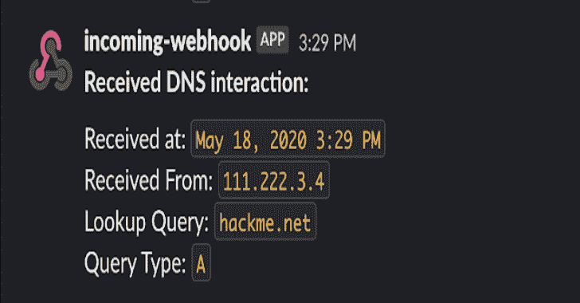
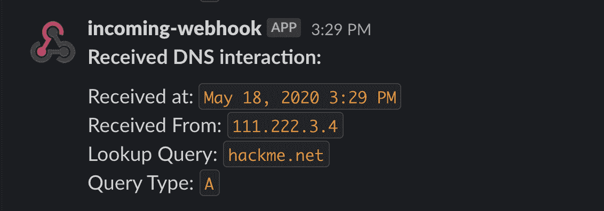

# DNSObserver:一个用 Go 编写的方便的 DNS 服务，用于帮助检测

> 原文：<https://kalilinuxtutorials.com/dnsobserver/>

DNSObserver 是一个用 Go 编写的方便的 DNS 服务，用于帮助检测几种类型的隐蔽漏洞。它监控 pentester 服务器的带外 DNS 交互，并通过 Slack 发送通知以及收到的请求的详细信息。DNSObserver 可以帮助您找到错误，如盲目的操作系统命令注入，盲目的 SQLi，盲目的 XXE，等等！

**设置**

你需要什么:

*   你自己注册的域名
*   运行脚本的虚拟专用服务器(VPS )(我使用的是 Ubuntu——我还没有在其他系统上测试过这个工具)
*   *【可选】*你自己的闲置工作空间和一个网钩

**域和 DNS 配置**

如果您还没有可以使用的 VPS，请使用您首选的提供商创建一个新的 Linux VPS。记下它的公共 IP 地址。

向你喜欢的注册商注册一个新域名——任何注册商都可以，只要他们允许设置自定义域名服务器和粘合记录。

进入你的新域的 DNS 设置，并找到'胶水记录'部分。在这里添加两个条目，每个条目对应一个新的名称服务器，并为这两个条目提供您的 VPS 的公共 IP 地址。

接下来，将默认名称服务器更改为:

**ns1。< YOUR-DOMAIN >
ns2。< YOUR-DOMAIN >**

**服务器设置**

SSH 进入您的 VPS，并执行以下步骤:

*   如果您还没有 Go，请安装它。安装说明可在[这里](https://golang.org/doc/install)找到
*   确保默认 DNS 端口是打开的–53/UDP 和 53/TCP。运行:

**sudo ufw 允许 53/udp
sudo ufw 允许 53/tcp**

获取 DNSObserver 及其依赖项:

去找 github.com/allyomalley/dnsobserver/…

**DNSObserver 配置**

有两个必需参数和两个可选参数:

*   **域** ***【必选】***
    *   你的新域名。
*   **IP***T3【必选】*
    *   你的 VPS 的公共 IP 地址。
*   **webhook** *【可选】*
    *   如果您想要接收通知，请提供您的 Slack webhook URL。您的域名或您的域的任何子域的任何查找都会通知您(我已经排除了任何其他 apex 域和您的自定义名称服务器的查询通知，以避免过多或随机的通知)。如果不提供 webhook，交互将被记录到标准输出中。Webhook 设置说明可以在[这里](https://api.slack.com/messaging/webhooks)找到。
*   **记录文件** *【可选】*
    *   默认情况下，DNSObserver 将只对您的域名或其任何一个名称服务器的查询作出响应。对于任何其他主机，它仍然会通知您交互(只要是您的域或子域)，但会发回一个空响应。如果您希望 DNSObserver 使用某个地址来响应特定主机的查找，您可以编辑此项目中包含的 config.yml 文件，也可以基于此模板创建自己的文件:

**a _ 记录:
–主机名:“
IP:“
–主机名:“
IP:“**

目前，该工具只使用一个记录-在未来，我可能会添加在 CNAME，AAAA 等)。以下是一个完整的自定义记录文件的示例:

**a _ records:
–主机名:“Google . com”
IP:“1 . 2 . 3 . 4”
–主机名:“git hub . com”
IP:“5 . 6 . 7 . 8”**

这些设置意味着我想用“1.2.3.4”响应对“google.com”的查询，用“5.6.7.8”响应对“github.com”的查询。

**用途**

现在，我们准备开始听了！如果您希望能够在 DNSObserver 运行时在 VPS 上执行其他工作，首先启动一个新的 tmux 会话。

对于标准设置，传入必需的参数和 webhook:

**域名服务器–域名 example.com–IP 11.22.33.44–网络钩子 https://hooks.slack.com/services/XXX/XXX/XXX**

为了实现上述目的，而且还包括一些自定义的查找响应，请为您的记录文件添加参数:

**dnsobserver–域名 example.com–IP 11.22.33.44–web hook https://hooks.slack.com/services/XXX/XXX/XXX–records file my _ records . yml**

假设您已经正确设置了一切，DNSObserver 现在应该正在运行。要确认它正在工作，请在桌面上打开一个终端，并查找您的新域(在本演示中为“example.com”):

**挖 example.com**

现在，您应该会收到一个包含请求详细信息的延期通知！

[**Download**](https://github.com/allyomalley/dnsobserver)