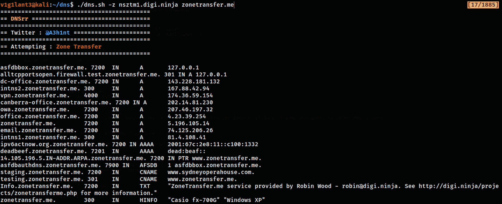

# DNSrr:一个用 Bash 编写的工具，用来枚举 DNS 中所有有趣的东西

> 原文：<https://kalilinuxtutorials.com/dnsrr/>

DNSrr 是一个用 bash 编写的工具，用来列举 DNS 记录中所有有趣的东西，它使用了不同的技术，比如

*   DNS 转发暴力
*   DNS 反向暴力
*   DNS 缓存窥探
*   DNS 区域转移

从 DNS 服务器上获取你能得到的所有信息。

**安装**

使用 git 安装它

**git 克隆 https://github.com/A3h1nt/Dnsrr**

开始

**。/dnsrr . sh–help**

**用途**

**-z:尝试区域转移
语法:。/DNS . sh-z[名称服务器][域名]
-fb:正向查找 Bruteforce
语法:。/dns.sh【域名】
语法:。/DNS . sh[域名][单词列表]
-rb:反向查找 Bruteforce
语法:。/dns . sh[域名]
-cs:执行 DNS 缓存窥探
语法:。/DNS . sh[名称服务器][单词列表]
-x:解释特定选项
语法:。/DNS . sh-x[选项名称]**

DNSrr 支持五个不同的选项，包括解释其他四个选项的选项。所以万一你不知道一个特定的选项在做什么，你可以简单地使用`**-x**`选项，来理解它背后的技术。

示例:

# **解释区域转移
。/dnsrr -x z**

**样本执行**

**区域转移**

**正向查找强制**

[**Download**](https://github.com/A3h1nt/Dnsrr)