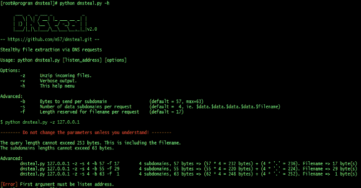
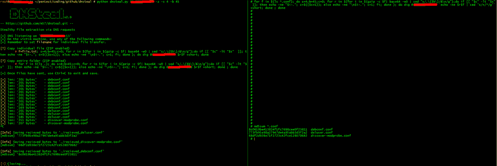

# DNSteal:通过 DNS 请求秘密发送文件的 DNS 过滤工具

> 原文：<https://kalilinuxtutorials.com/dnsteal/>

**DNSteal** 是一个假的 DNS 服务器，允许你通过 DNS 请求从受害机器上秘密提取文件。下面是一些不同的图像，显示了多个文件传输和单个详细文件传输的示例:

*   支持多个文件
*   支持 Gzip 压缩
*   现在支持自定义子域和每个子域的字节数以及文件名的长度

请参见下面的帮助:

**也可以理解为-[AWS px:一个基于图形的可视化有效访问工具](https://kalilinuxtutorials.com/awspx/)**

如果你不明白的帮助，然后只需使用程序的默认选项！

**python dnsteal . py 127 . 0 . 0 . 1-z-v**

这个将发送每个子域 45 个字节，其中有 4 个在查询中。最后为文件名保留了 15 个字节。

**python dnsteal . py 127 . 0 . 0 . 1-z-v-b45-S4-f15**

这个不会给文件名留下空间。

**python dnsteal . py 127 . 0 . 0 . 1-z-v-b 63-s 4-f 0**

[**Download**](https://github.com/m57/dnsteal)