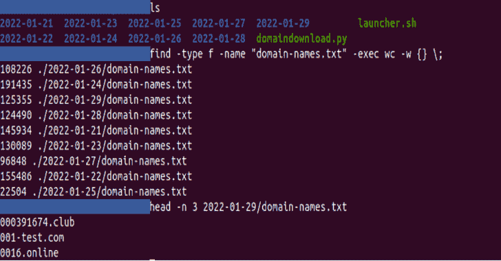
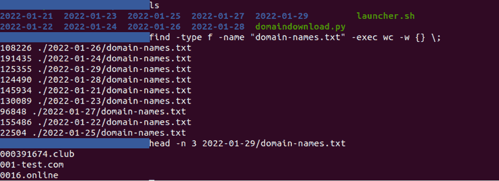

# 域名提醒:每天提醒当一个新的域名注册，并包含您的关键字

> 原文：<https://kalilinuxtutorials.com/domain-alerting/>

.png)

**域名提醒**是当新域名注册并包含您的关键字时的每日提醒。

域警报工具允许您执行两个主要操作(仅用于教育目的):

*   下载新注册的域名

*   发送自动电子邮件提醒

# 先决条件

**apt 安装邮件程序
pip 3 install-r requirements . txt**

## 配置

在文件“launcher.sh”中，完成:

*   您的关键字(需要完成的关键字数量)
*   您的收件人(需要填写的电子邮件数量)

然后，创建一个每日 crontab 作业:

**crontab-e #编辑用户的 crontab
0 8 * * */path/launcher . sh #设置每日 crontab(这里以早上 8 点为例)**

[**Download**](https://github.com/pixelbubble/DomainAlerting)