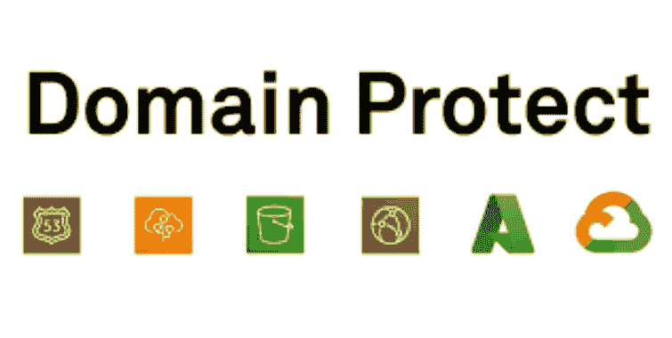
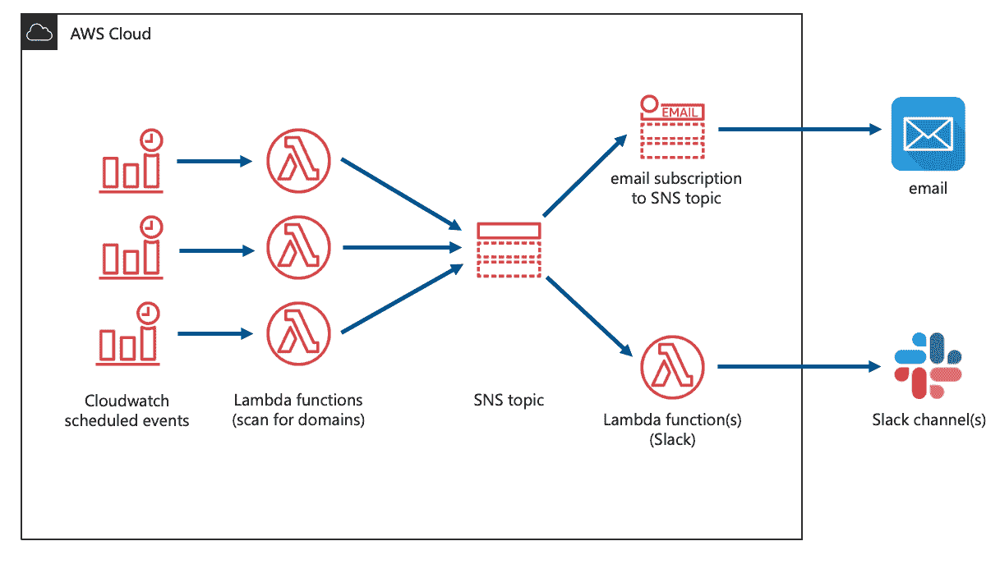
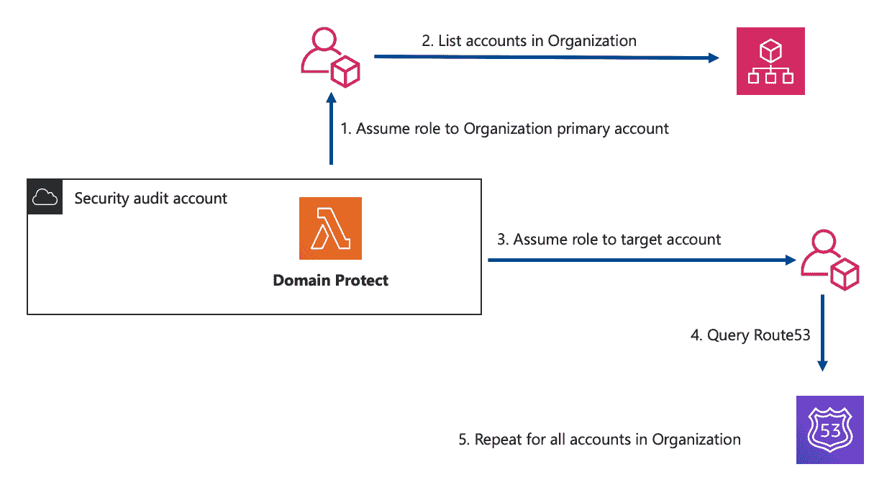
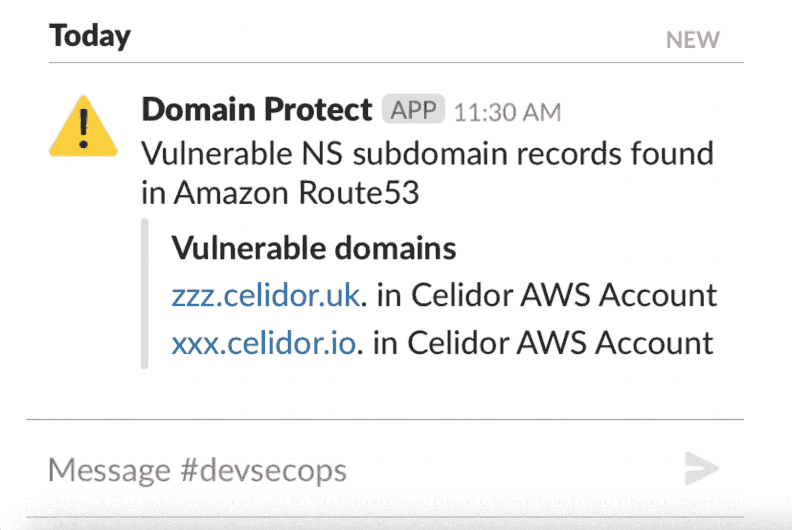
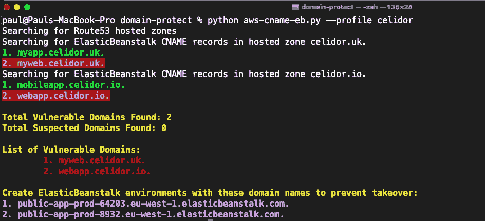

# 域保护:防止子域接管

> 原文：<https://kalilinuxtutorials.com/domain-protect/>

*   **Domain-Protect** 在整个 AWS 组织中扫描 Amazon Route53，查找容易被接管的域记录
*   GCP 域保护可以检测到 Google Cloud DNS 中易受攻击的域

**部署到安全审计账户**

**扫描您的整个 AWS 组织**

**通过 Slack 或电子邮件接收提醒**

**或从您的笔记本电脑手动扫描**

**子域检测功能**

扫描亚马逊路线 53 以识别:

*   缺少 S3 原点的 CloudFront 分布的别名记录
*   缺少 S3 起源的云锋分布的 CNAME 记录
*   易被接管的 ElasticBeanstalk 别名记录
*   ElasticBeanstalk 容易被收购
*   缺少托管区域的注册域
*   子域 NS 授权易被接管
*   S3 别名记录易被收购
*   S3 容易被收购
*   Azure resources 的脆弱 CNAME 记录
*   CNAME 记录丢失谷歌云存储桶

**可选附加检查**

默认情况下关闭，因为这可能会导致大型组织的 Lambda 超时

*   a .缺少存储桶的记录，例如缺少后端存储的 Google 云负载平衡器

要启用，请在 tfvars 文件或 CI/CD 管道中创建此 Terraform 变量:

**lambdas =[" alias-cloudfront-S3 "、" alias-eb "、" alias-s3 "、" cname-cloudfront-s3 "、" cname-eb "、" cname-s3 "、" ns-domain "、" ns-subdomain "、" cname-azure "、" cname-google "、" a-storage"]**

**选项**

1.  在整个 AWS 组织中，使用 Terraform 部署带有电子邮件和松弛警报的预定 lambda 功能
2.  在单个 AWS 帐户中，从您的笔记本电脑或 CloudShell 运行手动扫描

**通知**

*   每个漏洞类型的松弛通道通知，列出帐户名称和易受攻击的域
*   通过订阅 SNS 主题，以 JSON 格式发送包含帐户名称、帐户 id 和易受攻击的域的电子邮件通知

**要求**

*   AWS 组织内的安全审计帐户
*   组织的每个 AWS 帐户中具有相同名称的安全审核只读角色
*   地形状态文件存储桶
*   Terraform 1.0.x

**用途**

*   根据需要替换以下命令中的地形州 S3 存储桶字段
*   对于本地测试，请复制 terraform.tfvars.example，重命名时不带。后缀示例
*   输入适合您组织的详细信息并保存
*   或者，在 CI/CD 管道中输入 Terraform 变量

**terra form init-back end-config = BUCKET = terra form _ STATE _ BUCKET-back end-config = KEY = terra form _ STATE _ KEY-back end-config = REGION = terra form _ STATE _ REGION
terra form 工作区新开发
terraform 计划
terraform 应用**

**AWS IAM 政策**

对于最低权限访问控制，提供了示例 AWS IAM 策略:

*   域保护审计策略–附加到每个 AWS 帐户中的域保护审计角色
*   每个 AWS 帐户中域保护审核角色的域保护审核信任关系
*   每个 AWS 帐户中域保护审核角色与外部 ID 的域保护审核信任关系
*   域保护部署策略–附加到由 CI/CD 管道承担的 IAM 组或角色

**添加新支票**

*   在 terraform-modules/lambda/code 目录下创建一个新的子目录
*   添加与子目录同名的 Python 代码文件
*   将不带扩展名的文件名添加到 variables.tf 中的`**var.lambdas**`
*   按照现有的命名模式，在 terraform-modules/lambda/build 目录中添加一个子目录
*   将. gitkeep 文件添加到新目录中
*   更新。gitignore 文件遵循现有目录的模式
*   应用地形

**向额外空闲信道添加通知**

*   向 slack_channels 变量列表添加一个额外的通道
*   向 slack_webhook_urls 变量列表中添加一个额外的 webhook URL 或重复相同的 webhook URL
*   应用地形

**测试**

*   使用多种平台工作环境，例如开发、prd
*   在您的开发环境中使用`**slack_channels_dev**`变量来通知测试松弛通道
*   对于新子域名接管类别，在 Route53 中创建正确配置的易受攻击的域名
*   通过使用带有难以列举的域名的测试域来最小化恶意接管的风险
*   尽快删除任何易受攻击的域

**ci/cd**

*   已经使用 CircleCI 部署了基础设施
*   要在 CircleCI 项目设置中输入的环境变量:

| 环境变量 | 示例值/注释 |
| --- | --- |
| AWS_ACCESS_KEY_ID | 使用域保护部署策略 |
| AWS_SECRET_ACCESS_KEY | – |
| 地形 _ 状态 _ 铲斗 | tfstate48903 |
| 地形 _ 状态 _ 关键字 | 域保护 |
| 地形 _ 状态 _ 区域 | 美国东部-1 |
| TF _ VAR _ org _ 主帐户 | 012345678901 |
| TF _ VAR _ security _ audit _ 角色名称 | 如果使用了“域保护审计”,则不需要 |
| TF _ VAR _ 外部标识 | 仅当配置了外部 ID 时才需要 |
| TF_VAR_slack_channels | ["安全警报"] |
| TF_VAR_slack_channels_dev | ["安全-警报-开发"] |
| TF_VAR_slack_webhook_urls | [" https://hooks . slack . com/services/XXX/XXX/XXX "] |

*   要验证更新的 CircleCI 配置:

docker run-v`pwd`:/whatever circle ci/circle ci-CLI circle ci config validate/whatever/。circleci/config.yml

[**Download**](https://github.com/ovotech/domain-protect)