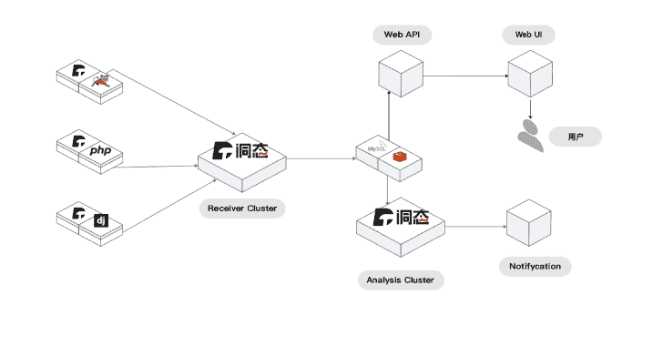

# 东泰:开源被动交互安全测试(IAST)产品

> 原文：<https://kalilinuxtutorials.com/dongtai-2/>

.png)

`**DongTai IAST**`是一款开源的被动交互式安全测试(IAST)产品。它使用动态钩子和污点跟踪算法实现**通用漏洞检测**和**多次请求关联漏洞检测(包括但不限于未授权漏洞、越权漏洞)**、**第三方组件漏洞检测**等。目前，Java 和 Python 中的应用程序支持漏洞检测。

## 项目结构

**。
├──部署
├──东泰 _common 每个服务要调用的通用函数和类
├──东泰 _conf 配置文件
├──东泰 _ 引擎漏洞检测和漏洞处理部分
├──东泰 _ 协议东泰-服务器和代理交互协议
├──东泰 _web api 与 web 交互
├──静态静态文件
└──测试测试用例**

## 体系结构

`**DongTai IAST**`有多个基本服务，包括**`DongTai-web``DongTai-webapi``DongTai-openapi``DongTai-engine``agent``DongTai-deploy``DongTai-Base-Image``DongTai-Plugin-IDEA`:**

*   `**DongTai-web**`是东泰的产品页面，用来处理用户和洞穴状态的交互。
*   `**DongTai-webapi**`负责处理用户相关的操作。
*   `**DongTai-openapi**`用于处理`**agent**`上报的注册/心跳/调用方法/第三方组件/错误日志数据，发布钩子策略，发布探针控制命令等。
*   `**DongTai-engine**`根据调用方法数据和污点跟踪算法分析 HTTP/HTTPS/RPC 请求是否存在漏洞，同时还负责其他相关的计时任务。
*   `**agent**`是东泰的一个探针模块，包括不同编程语言的数据采集终端，用于在应用运行时采集数据，并报告给`**DongTai-OpenAPI**`服务。
*   `**DongTai-deploy**`用于东台 IAST 的部署，包括 docker-compose 单节点部署、Kubernetes 集群部署等。如果您需要一个部署计划，您可以添加功能或对部署计划做出贡献。
*   `**DongTai-Base-Image**`包含东泰运行时所依赖的基础服务，包括 MySql，Redis。
*   `**DongTai-Plugin-IDEA**`是 Java 探针对应的 IDEA 插件。可以直接通过插件运行 Java 探针，直接在 IDEA 中检测漏洞。

## 场景

“东泰 IAST”的使用场景包括但不限于:

*   嵌入`**DevSecOps**`进程，实现应用漏洞自动检测/第三方组件梳理/第三方组件漏洞检测。
*   开源软件/开源组件的常见漏洞挖掘。
*   发布前的安全测试等。

## 快速启动

`**DongTai IAST**`支持 **SaaS 服务**和**本地化部署**。本地化部署请参考**部署文件**。

*   SaaS 版本

*   填写在线表格注册帐户。
*   登录【东台 IAST】(https://last . io)。
*   快速了解在线指南。

*   本地化部署版本

`**DongTai IAST**`支持多种参照调配单据的调配方案:

*   独立部署
    *   坞站-合成
    *   docker–等待升级
*   集群部署
    *   库伯内特斯

#### 对接器-化合物

**git 克隆 git @ github . com:hx security/DongTai . git
CD DongTai
chmod u+x build _ with _ docker _ compose . sh
。/build _ with _ docker _ compose . sh**

[**Download**](https://github.com/HXSecurity/DongTai#quick-start)