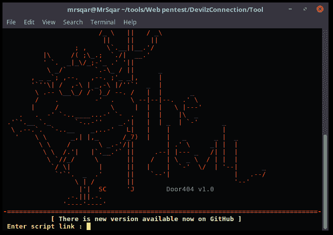
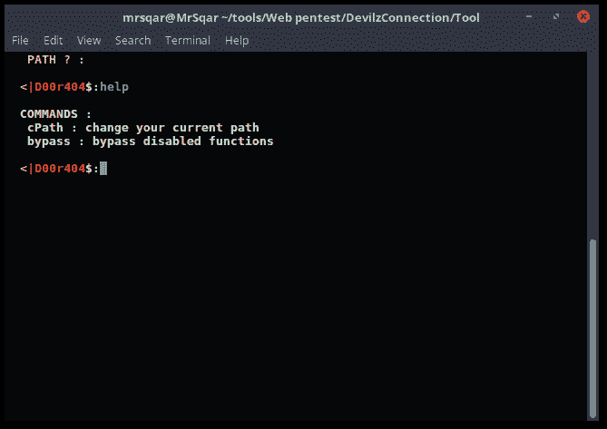

# door 404——door 404 是开源项目

> 原文：<https://kalilinuxtutorials.com/door404/>

**Door404** 是开源项目，开发原因有二:

*   帮助初学者学习编码。
*   帮助新手服务器管理员学习新的保护技巧。

它在 Linux 操作系统中受支持。

## **门 404 要求**

*   服务器端编程语言（Professional Hypertext Preprocessor 的缩写）
*   PHP CUrl

**又读[cyber chef——一款用于加密、编码、压缩的 web App&数据分析](https://kalilinuxtutorials.com/cyberchef-encryption-encoding-compression-data-analysis/)**

## **截图**

 **贷方:MrSqar &里泽**