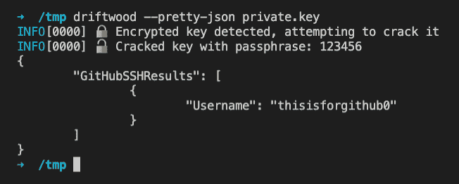

# 漂流木:私钥使用验证

> 原文：<https://kalilinuxtutorials.com/driftwood/>

**Driftwood** 是一个工具，可以让你查找一个私钥是用于 TLS 之类的东西，还是作为一个用户的 GitHub SSH 密钥。

Driftwood 使用计算出的公钥执行查找，因此私钥永远不会离开您运行工具的地方。此外，它支持一些加密密钥的基本密码破解。

**安装**

三种简单的开始方式。

**跟着码头工人**跑

**cat private . key | docker run–RM-I truffle security/drift wood–pretty-JSON-**

**运行预建的二进制文件**

从发布页面下载二进制文件并运行它。

打造你自己

**去安装 github.com/trufflesecurity/driftwood@latest**

**用途**

最小使用量是

**$浮木小路/to/private** key.pem

使用`**--help**`运行以查看更多选项。

[**Download**](https://github.com/trufflesecurity/driftwood)