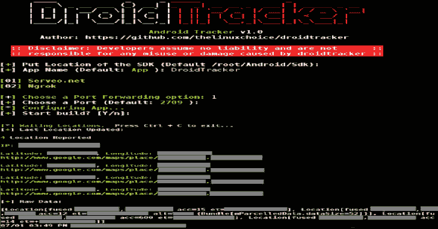

# droid tracker–生成 Android 应用程序以实时跟踪位置的脚本

> 原文：<https://kalilinuxtutorials.com/droidtracker/>

**DroidTracker** 是一个脚本，用于生成一个 [Android 应用](https://www.kitploit.com/search/label/Android%20App)来实时跟踪位置。

**特性**

*   自定义应用名称
*   2 个端口转发选项(Ngrok 或通过 Serveo.net 使用 SSH 隧道)
*   Tinyurl 混淆的 URL
*   完全无法察觉

**自动安装**

**bash install.sh**

**也可以读作-[KatroLogger:Linux 系统键盘记录器](https://kalilinuxtutorials.com/katrologger/)**

**在 Kali Linux 上安装**

**安装依赖:**
$apt-get 更新
$apt-get 安装默认-jdk apksigner

**对于 x86:**
$-get 安装 libc 6-dev-i386 lib 32 z 1

**对于 AMD64:**
$apt-get 安装 lib 32 z 1 lib 32 ncurses 6 lib 32 stdc++ 6

**下载 SDK-Tools:**Sdk man/bin/Sdk man-init . sh "
$ echo " Y " | Sdk 安装 java 8.0.191-oracle
$sdk 使用 java 8.0.191-oracle
$sdk 安装 gradle 2.14.1
$sdk 使用 gradle 2 . 14 . 1

$ echo " Y " | $ HOME/Android/Sdk/tools/bin/Sdk manager "平台；android-25 " "构建工具；25.0.1 " "额外费用；谷歌；m2repository " " extras 安卓；m2repository"

$git 克隆 https://github.com/thelinuxchoice/droidtracker
$ CD droid tracker
$ bash droid tracker . sh****

**信用:****[【https://github.com/thelinuxchoice/DroidTracker】](https://github.com/thelinuxchoice/DroidTracker)**

[**Download**](https://github.com/thelinuxchoice/DroidTracker)