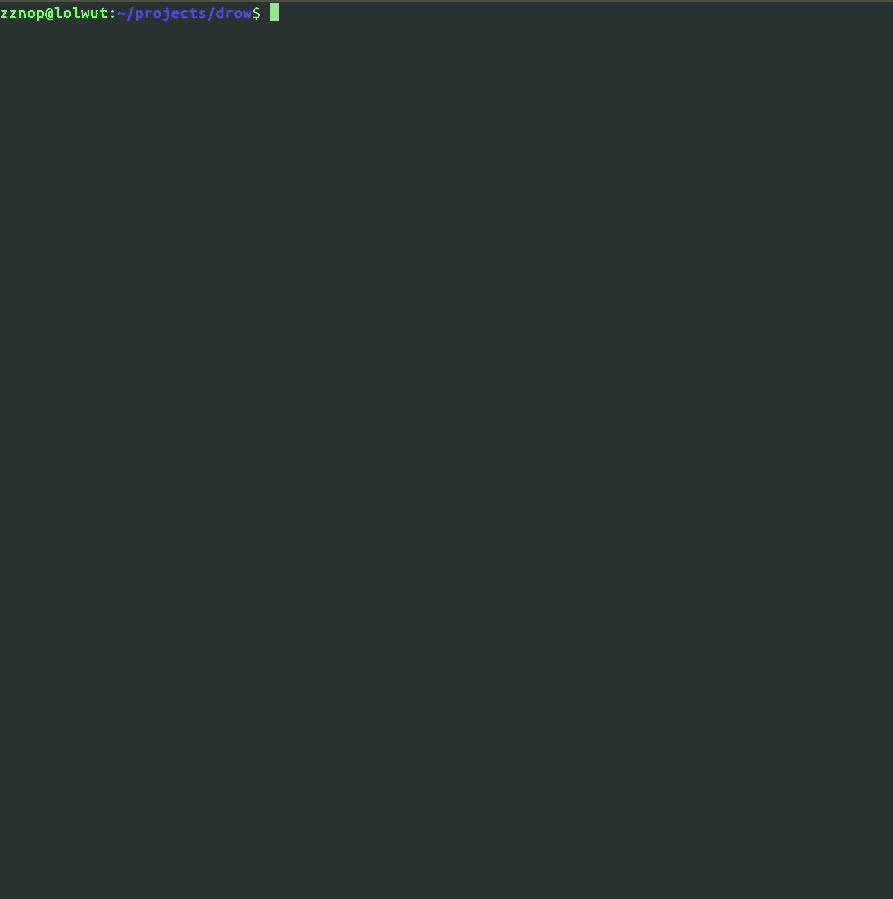

# Drow:在构建后将代码注入 ELF 可执行文件

> 原文：<https://kalilinuxtutorials.com/drow/>

**Drow** 是一个命令行实用程序，用于注入代码和挂钩 ELF 可执行文件的入口点(后期构建)。它将未修改的 ELF 可执行文件作为输入，并导出包含嵌入式用户提供的有效负载的修改后的 ELF，该有效负载在运行时执行。

*   卓尔采取以下步骤来创造新的补丁精灵:
    *   映射到未修改的目标 ELF 可执行文件和用户提供的有效负载中，这是一个与位置无关的 blob
    *   通过解析程序头定位第一个可执行段
    *   通过解析节头来定位可执行段中的最后一节
    *   根据用户提供的有效载荷的大小，扩展最后一段(在段中)段头的`sh_size`和程序头的`p_memsz` / `p_filesz`
    *   修正节头'`sh_offset`'和程序头'`p_offset`'的位置(下移节和段，为有效载荷和一个小的“stager stub”腾出空间)
    *   修正 ELF 标题中的偏移量(`e_shoff`、`e_phoff`等)..)
    *   修改 ELF 头`e_entry` (ELF 入口点偏移量)以指向注入的代码
    *   创建一个新的 ELF，包含注入的代码和修改后的 ELF 头

除了注入用户提供的有效载荷之外，drow 还注入了一个小的代码存根，它被附加到有效载荷的开头。这个存根被设计成调用有效负载。如果有效载荷被写为返回给调用者，那么在有效载荷返回 stager 之后，tailcalls 进入`_start`，恢复执行，以便程序可以按预期运行。

**大楼**

安装`gcc`和`scons`。然后从根目录运行`scons`。

**其他信息**

除了构建 drow 之外，这个项目还构建了一个名为`rappers_delight.bin`的 Linux x86-64 有效负载，它只是打印到`stdout`。这可以用来测试。目前，drow 只能处理针对 x86-64 的 ELF64 文件。

**其他工作**

在这个领域已经做了很多开源工作。我鼓励您也查看以下项目和相关出版物:

*   地狱犬精灵接口:[http://phrack.org/issues/61/8.html](http://phrack.org/issues/61/8.html)
*   借壳工厂:[https://github.com/secretsquirrel/the-backdoor-factory](https://github.com/secretsquirrel/the-backdoor-factory)
*   埃尔夫什:[http://www.eresi-project.org/](http://www.eresi-project.org/)

[**Download**](https://github.com/zznop/drow)