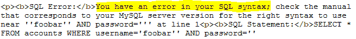

# DSSS——该死的小型 SQLi 扫描仪

> 原文：<https://kalilinuxtutorials.com/dsss-sql-injection/>

**DSSS** ( **该死的小 SQLi 扫描器**)是一个功能齐全的 [SQL 注入](https://en.wikipedia.org/wiki/SQL_injection)漏洞扫描器(支持 GET 和 POST 参数)用不到 100 行代码编写而成。

作为可选设置，它支持 HTTP 代理以及 HTTP 头值`**User-Agent**` **、** `**Referer**` **和** `**Cookie**` **。**

**也读作——[SQLMap:自动 SQL 注入&数据库接管工具](https://kalilinuxtutorials.com/sqlmap-2/)**

**要求**

运行该程序需要 Python 版本 **2.6.x** 或 **2.7.x** 。

**样品运行**

$ python dsss.py -h
该死的小 SQLi 扫描仪(DSSS) < 100 LoC(代码行)#v0.2o
**作者:Miroslav Stampar(@ Stampar)**

**用法:dsss.py【选项】**

**选项:**

–版本显示程序的版本号并退出
-h，–帮助显示此帮助消息并退出
id = 1”)
–DATA = DATA POST DATA(如“query = test”)
–COOKIE = COOKIE HTTP COOKIE 头值
–User-Agent = UA HTTP User-Agent 头值
–REFERER = REFERER HTTP REFERER 头值
–PROXY = PROXY HTTP 代理地址(如“HTTP://127 . 0 . 0 . 1:8080”)

$ python DSSS . py-u "http://testphp.vulnweb.com/artists.php？artist=1"
该死的小 SQLi 扫描器(DSSS) < 100 LoC(代码行)#v0.2o
作者:Miroslav Stampar(@ Stampar)

*扫描获取参数' artist'
(i)获取参数' artist '可能是错误的 SQLi 漏洞(MySQL)
(i)获取参数' artist '似乎是盲目的 SQLi 漏洞(例如:' http://t
estphp.vulnweb.com/artists.php?artist=1%20AND%2061%3E60′)【t

[**Download**](https://github.com/stamparm/DSSS)