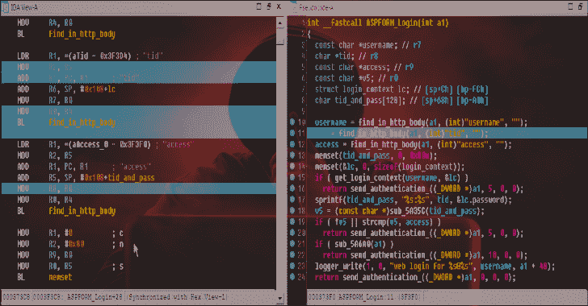
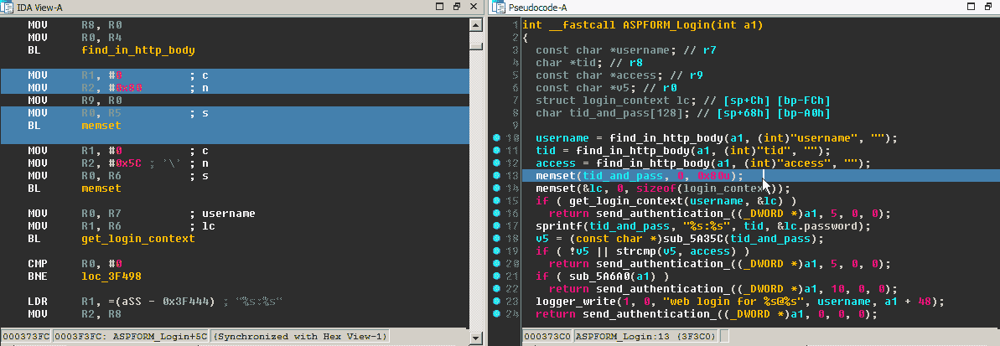
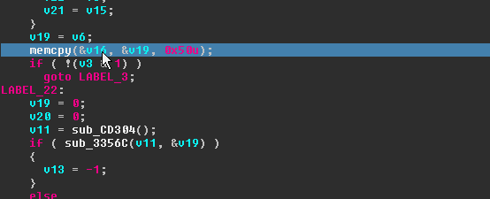

# Dsync : IDAPython 插件，同步反汇编器和反编译器视图

> 原文：<https://kalilinuxtutorials.com/dsync-idapython-plugin/>

**Dsync** 是一个 IDAPython 插件，可以同步反编译和反汇编的代码视图。更多细节请参考源代码中的注释。

**也可阅读-[AWS 报告-分析亚马逊资源的工具](https://kalilinuxtutorials.com/aws-report/)**

**演示**

[**Download**](https://github.com/patois/dsync)