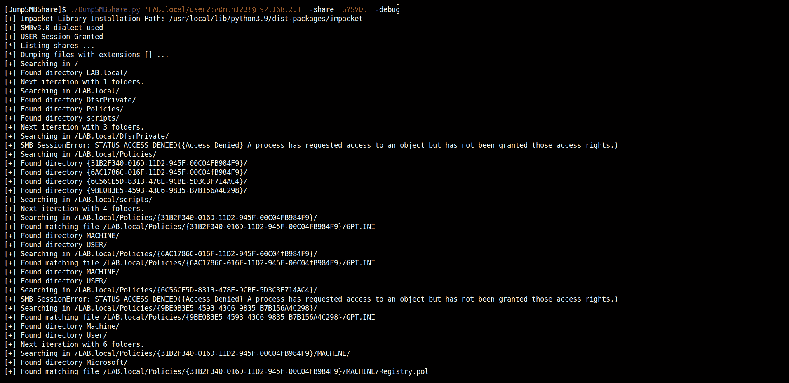
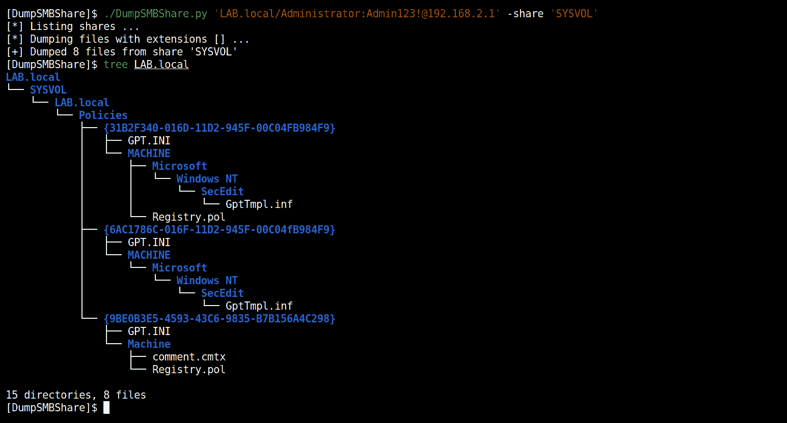

# DumpSMBShare:从 Windows SMB 共享远程转储文件和文件夹的脚本

> 原文：<https://kalilinuxtutorials.com/dumpsmbshare/>

.png)

**DumpSMBShare** 是一个脚本，用于从 Windows SMB 共享远程转储文件和文件夹。

## 特征

*   仅列出带有`**--list-shares**`的股票。
*   仅选择具有给定扩展名的文件(带 **`--extensions` )** 或所有文件。
*   用`**--dump-dir**`选择要转储到的本地文件夹。
*   在与`**--base-dir**`的共享中选择要搜索的基本文件夹。

## 用法

**$。/DumpSMBShare . py-H
DumpSMBShare v 1.2–by @ podalirius _
用法:DUMP . py[-H](-s SHARE |-l)[-e EXTENSIONS][-D DUMP _ DIR][-B BASE _ DIR][–debug][-q][-H lm hash:n hash][–no-pass][-k][-A hex key]
[–DC-IP IP IP 地址] [-I ip 地址][-P[目的地
-e 扩展名、–扩展名扩展名
扩展名
-D 转储目录、–转储目录转储目录
-f 文件、–文件文件要转储的 SMB 文件
-B 基本目录、–基本目录基本目录
要搜索的目录(默认:/)
–调试打开调试输出。(默认:False)
-q，–静音开启调试输出
认证:
-H lm hash:n hash，–hashes lm hash:n hash
NTLM 哈希，格式为 lm hash:n hash
–no-pass 不要询问密码(对-k 有用)
-k，–kerberos 使用 Kerberos 认证。根据目标参数从 ccache 文件(KRB5CCNAME)中获取凭据。如果找不到有效凭证
，它将使用命令行中指定的凭证
-十六进制密钥，–AES key 十六进制密钥
AES 密钥用于 Kerberos 身份验证(128 或 256 位)连接:
–域控制器的 dc-ip ip 地址 ip 地址。如果省略，它将使用目标参数
-I ip 地址，–目标 ip ip 地址
中指定的域部分(FQDN)目标机器的 ip 地址。如果省略，它将使用指定为目标的任何内容。当目标是 NetBIOS
名称并且您无法解析它时，这很有用
-P[目标端口]，–port[目标端口]
连接到 SMB 服务器的目标端口**

## 例子

*   转储`SYSVOL`共享中的所有文件:
*   **。/dumpsmbshare . py ' lab . local/user 2:admin 123 @ 192 . 168 . 2 . 1 '–debug**

[**Download**](https://github.com/p0dalirius/DumpSMBShare)