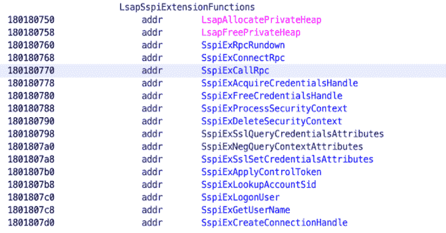

# DuplicateDump:从自定义 LSA 插件转储带有重复句柄的 LSASS

> 原文：<https://kalilinuxtutorials.com/duplicatedump/>

**duplicated dump**是 MirrorDump 的一个分支，修改如下:

*   dinove 实现
*   用 C++写的 LSA 插件 DLL，可以在转储 LSASS 后清理。镜像转储编译 LSA 插件为。LSASS 进程不会卸载的. NET 程序集。这就是 MirrorDump 未能删除插件的原因。
*   转储进程的 PID(即 DuplicateDump)通过命名管道共享给 LSA 插件
*   将值“0”而不是 LSASS PID 传递给 MiniDumpWriteDump。这可以防止 MiniDumpWriteDump 向 LSASS 打开自己句柄

添加自定义 LSA 插件，将 LSASS 进程句柄从 LSASS 进程复制到 duplicated dump。所以 DuplicateDump 有了一个现成的进程句柄来处理 LSASS，而不需要调用 OpenProcess。

## 测试

通过在内存中加载 DuplicateDump，它能够在没有检测的情况下转储 LSASS 内存

*   赛门铁克 14.3
*   卡巴斯基企业
*   Windows Defender

由 Cortex XDR、Crowdstrike 检测。未能在 SentinalOne 上进行检测的情况下转储 lsass。

## 用法

编译 LSA 插件(导出 SpLsaModeInitialize 或 dllMain 函数),并提供 DLL 的完整路径以复制 Dump

**。\ duplicated dump . exe–help
-f，–filename = VALUE 将转储文件写入到
的路径-p，–plugin = VALUE LSA 插件的完整文件路径
-c，–压缩 GZip 并删除磁盘上的转储文件
-d，–debug priv 获取 SeDebugPrivilege
-h，–help 显示此帮助**

## 例子

**。\ duplicated dump . exe-f test-C-p C:\ LSA plugin . dll
[+]加载 LSA 安全包
[+]命名管道连接并回复当前 PID 6492
[+]发现重复的 LSASS 进程句柄 0x3d0
[+]保存到 test.gz 的压缩转储文件**

[**Download**](https://github.com/Hagrid29/DuplicateDump)