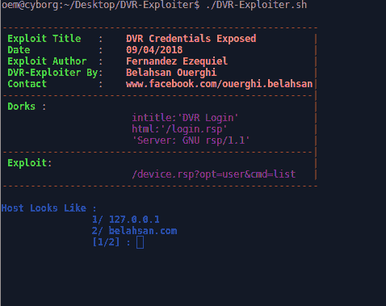
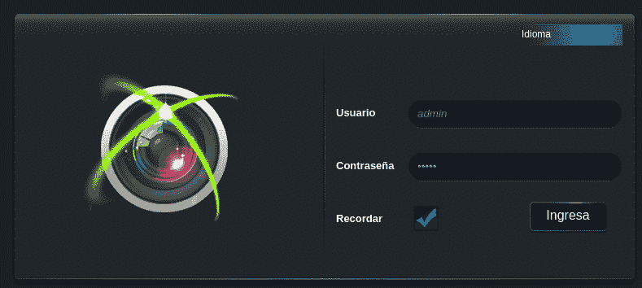
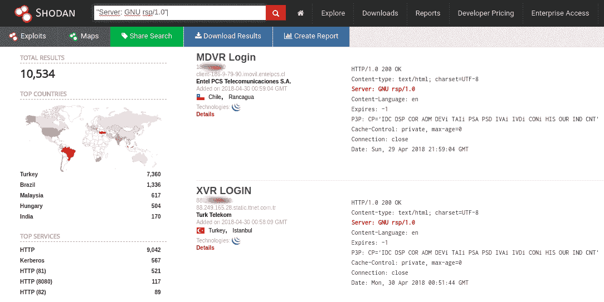

# 一个 Bash 脚本程序利用 DVR 的

> 原文：<https://kalilinuxtutorials.com/dvr-exploiter-script-program-exploit/>

基于 CVE-2018-999 的一个 Bash 脚本程序利用 DVR。

```
[*] Exploit Title:       DVR Credentials Exposed 
[*] Date:                09/04/2018
[*] Exploit Author:      Fernandez Ezequiel
[*] DVR-Exploiter By:    Belahsan Ouerghi  
[*] Contact:             www.facebook.com/ouerghi.belahsan
[*] Youtube Tutorial:	 https://www.youtube.com/watch?v=vdnATjE_4II
[*] Dorks:               		       intitle:"DVR Login"
	                                       html:"/login.rsp"
	                                      "Server: GNU rsp/1.1"
```



## **在 DVR 中测试**

```
Novo
CeNova
QSee
Pulnix
XVR 5 in 1 (title: "XVR Login")
Securus,  - Security. Never Compromise !! - 
Night OWL
DVR Login
HVR Login
MDVR Login
```

## **DVR-剥削者安装**

```
$ git clone https://github.com/TunisianEagles/DVR-Exploiter.git
$ cd DVR-Exploiter
$ ./DVR-Exploiter.s
```

**也读作 [Nmap-Bootstrap-XSL:一个带有 Bootstrap](https://kalilinuxtutorials.com/nmap-bootstrap-xsl/)的 Nmap XSL 实现**

## **详情**

[运行后选择主机示例:1 = 127.0.0.1 {IP }，/2 =[www.xxxxxxxx.com](http://www.xxxxxxxx.com)]

*   不要忘记安装 DVR 的插件

## **截图**



[](https://github.com/TunisianEagles/DVR-Exploiter/)