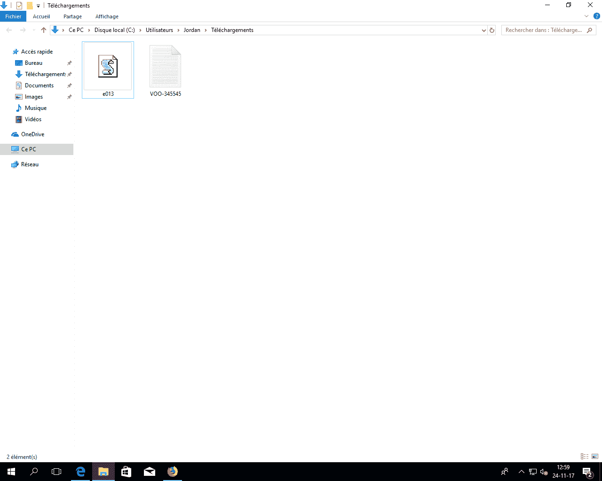

# e013–用于 Microsoft Windows 的 WiFi 密码窃取器

> 原文：<https://kalilinuxtutorials.com/e013-wifi-password-stealer/>

一个小 VBScript E013，从 Windows 中窃取 Wifi 密码。在 WifiName.txt 文件中，您可以看到每台支持 VBscript 的 windows 计算机上可用的每个已保存 wifi 的密码

**也读作 [WiFi 暴力破解——安卓应用暴力破解 WiFi 密码](http://kalilinuxtutorials.com/wifi-bruteforcer/)**

