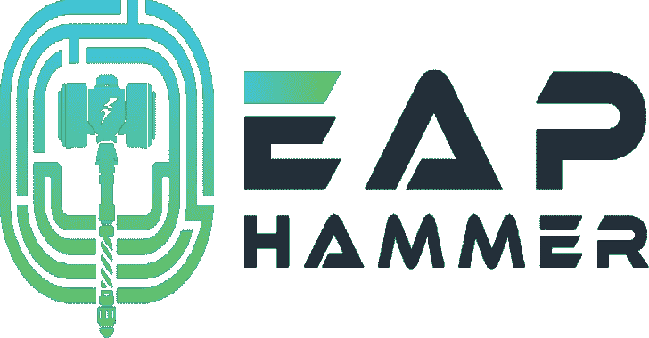

# Eaphammer:针对 wpa 2-企业网络的定向邪恶双胞胎攻击

> 原文：<https://kalilinuxtutorials.com/eaphammer-targeted-evil-twin-attacks-against-wpa2-enterprise-networks/>

EAPHammer 是一个工具包，用于针对 WPA2 企业网络执行有针对性的邪恶双胞胎攻击。它旨在用于全面的无线评估和红队项目。

因此，重点是提供一个易于使用的界面，可以利用它来执行强大的无线攻击，只需最少的手动配置。

为了说明这个工具有多快，我们的快速入门部分提供了一个例子，展示了如何用简单的命令对 WPA/2-EAP 网络执行凭证窃取恶意 twin 攻击。

**快速入门指南(卡利语)**

首先，使用以下命令克隆 eaphammer repo:

**git 克隆 https://github . com/s0 lst 1c 3/EAP hammer . git**

接下来运行 kali-setup 文件，如下所示，以完成 eaphammer 设置过程。这将安装依赖项并编译项目:

**。/kali-setup**

**也读-**[脱咖啡因:](https://kalilinuxtutorials.com/decaf-dynamic-executable-code-analysis-framework/)**动态可执行代码分析框架**

要针对 WPA/2-EAP 网络设置和执行凭证窃取 evil twin 攻击，请执行以下操作:

**生成证书
。/EAP hammer–cert-wizard
发起攻击
。/EAP hammer-I WLAN 0–信道 4–auth wpa-EAP–essid corp wifi–creds**

**特性**

*   从 WPA-EAP 和 WPA2-EAP 网络窃取 RADIUS 凭据。
*   执行恶意门户攻击以窃取广告信用并执行间接无线枢纽
*   执行强制门户攻击
*   内置响应器集成
*   支持开放网络和 WPA-EAP/WPA2-EAP
*   大多数攻击不需要手动配置。
*   安装和设置过程不需要手动配置
*   利用最新版本的 hostapd (2.8)
*   支持邪恶双胞胎和因果报应攻击
*   为间接无线枢纽生成定时 Powershell 有效负载
*   针对恶意门户攻击的集成 HTTP 服务器
*   支持 SSID 伪装
*   使用 hcxtools 对 PSK 网络进行快速自动 PMKID 攻击
*   针对单个 ESSID 跨多个用户名喷洒密码

**新(从版本 1.7.0 开始)(最新):**

EAPHammer 现在支持 WPA/2-PSK 以及 WPA 握手捕获。

**欠费(1.5.0 版本新增):**

EAPHammer 现在支持针对 OWE 和 OWE-Transition 模式网络的流氓 AP 攻击。

**PMF(从版本 1.4.0 开始添加)**

EAPHammer 现在支持 802.11w(受保护的管理帧)、大声 Karma 攻击和已知信标攻击(文档即将发布)。

**GTC 降级袭击事件**

EAPHammer 现在将自动尝试对连接的客户端进行 GTC 降级攻击，以试图捕获明文凭据。

[https://www.youtube.com/embed/-uqTqJwTFyU?start=1354&feature=oembed&enablejsapi=1](https://www.youtube.com/embed/-uqTqJwTFyU?start=1354&feature=oembed&enablejsapi=1)

**改进的证书处理**

EAPHammer 的 Cert Wizard 已经扩展为用户提供以高度灵活的方式创建、导入和管理 SSL 证书的能力。

Cert Wizard 以前的功能被保留为 Cert Wizard 的交互模式，它使用与以前版本相同的语法。更多详细信息，请参见 XIII–证书向导。

**TLS / SSL 向后兼容性**

EAPHammer 现在使用独立于系统范围安装的 libssl 本地版本。该本地版本编译时支持 SSLv3，允许针对传统客户端使用 EAPHammer，而不会损害攻击者操作系统的完整性。

**支持的 EAP 方法**

EAPHammer 支持以下 EAP 方法:

*   EAP-PEAP/MSCHAPv2
*   EAP-PEAP/GTC
*   EAP-PEAP/MD5
*   EAP-TTLS/PAP
*   EAP-TTLS/MSCHAP
*   EAP-TTLS/MSCHAPv2
*   EAP-TTLS/MSCHAPv2(无 EAP)
*   EAP-TTLS/CHAP
*   EAP-TTLS/MD5
*   EAP-TTLS/GTC
*   EAP-MD5

**802.11a 和 802.11n 支持**

EAPHammer 现在支持针对 802.11a 和 802.11n 网络的攻击。这包括创建支持以下功能的接入点的能力:

*   2.4 GHz 和 5 GHz 通道支持
*   完全 MIMO 支持(多输入多输出)
*   帧聚合
*   使用通道绑定支持 40 MHz 通道宽度
*   高通量模式
*   短保护间隔(短 GI)
*   调制和编码方案(MCS)
*   RIFS
*   超线程电源管理
*   即将推出的功能
*   利用部分 HSTS 旁路执行无缝 MITM 攻击
*   定向流氓 AP 攻击(deauth 然后来自 PNL 的 evil twin，deauth 然后 karma + ACL)
*   用于克隆强制网络门户登录页面的集成网站克隆程序
*   用于强制网络门户的集成 HTTP 服务器

**学分**:

*   布拉德·安东尼维奇
*   约书亚·赖特
*   罗宾汉
*   Dino Dai Zovi
*   沙恩·麦考利
*   多米尼克·怀特
*   伊恩·德·维利耶
*   迈克尔·克鲁格
*   莫邪·马林斯派克
*   大卫·希尔顿
*   乔希·胡佛
*   詹姆斯·斯诺德格拉斯
*   亚当·杜尔
*   乔治·查齐索夫罗尼乌
*   Mathy 老头

[Download](https://github.com/s0lst1c3/eaphammer)