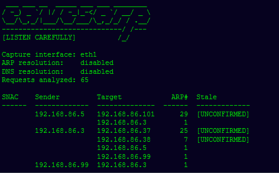

# 分析 arp 请求以识别互通的主机

> 原文：<https://kalilinuxtutorials.com/eavesarp/>

[](https://1.bp.blogspot.com/-07GhQYOWGYk/XpNNHB5XpeI/AAAAAAAAF5I/a9ITOKp_4hAYQxyMPeObO17ysvvweqWpgCLcBGAsYHQ/s1600/Eavesarp%25281%2529.png)

**Eavesarp** 一种侦察工具，它分析 arp 请求以识别可能相互通信的主机，这在 LLMNR/NBNS 不用于名称解析的可怕情况下非常有用。

**要求/安装**

*这只是 gon 在 Kali 或其他基于 Debian 的 Linux 发行版上的工作*

`**eavesarp**`需要 Python3.7 和 Scapy。安装 Python 后，运行以下命令来安装 Scapy:

**python 3.7-m pip install-r requirements . txt**

**用途**

**捕获 ARP 请求**

**注意事项**:

*   它需要超级用户权限才能从接口嗅探并手工创建 ARP 数据包。
*   捕获的输出以名称`**eavesarp.db**`自动写入磁盘，以避免必须重新捕获 ARP 请求。

**被动执行**

最基本的执行形式是:

**须藤。/eavesarp.py capture -i eth1**

这将初始化`**eavesarp**`,以便 ARP 请求将被捕获、分析，并且相关的输出将以表格的形式呈现给用户。使用`**--help**`获取关于非标准参数的更多信息。请注意，当在此模式下运行时，尚未观察到来自目标(作为发送方)的 ARP 请求时，陈旧列会指示`**[UNCONFIRMED]**`。通过`**-ar**`标志启用 ARP 解析，以确定给定的目标地址是否过期。



**也读作-[TweetShell:Shell 脚本中的多线程 Twitter brute forcer](https://kalilinuxtutorials.com/tweetshell/)**

**主动执行(ARP 解析，DNS 解析)**

通过包含`-ar`和`-dr`标志来启用 ARP 和 DNS 解析。请记住，这使得该工具是非被动的，但好处是返回 DNS 记录、MAC 地址和 SNACs 状态的确认。

**须藤。/eaves ARP . py capture-I et h1-ar-dr–黑名单 192.168.86.5**

从下面的输出中，我们可以清楚地看到哪些发件人受到一个或多个 SNACs 的影响以及受影响的地址。最后一列表示是否存在潜在的 MITM 机会。`**eavesarp**`检查为给定发送者解析的 PTR 的转发地址是否不同。

如果是，这可能是预期目标已经移动到新的 FWD 地址的指示。将别名应用到攻击主机的接口，可能会让我们将流量转发到预定目标，并捕获传输中的信息。

**分析 PCAP 文件和 SQLite 数据库(由`eavesarp`生成)**

`It`可以接受 SQLite 数据库和 PCAP 文件进行分析。它会将提取的值输出到一个新的数据库文件中，以供进一步分析。有关此过程的更多信息，请参见`**--help**`标志，不过下面演示了基本执行。

**须藤。/eaves ARP . py analyze-SFS eaves ARP . d b-CP disable–黑名单 192 . 168 . 86 . 5–CSV-output-file eaves ARP _ analysis . db**

```
SNAC    Sender         Target            ARP#  Stale    Sender PTR      Target PTR        MITM
------  -------------  --------------  ------  -------  --------------  ----------------  ---------------------------------------------
True    192.168.86.2   192.168.86.101      21  True     iron.aa.local.  syslog.aa.local.  T-IP:192.168.86.101 != PTR-FWD:192.168.86.102
True    192.168.86.3   192.168.86.38       17  True     crux.aa.local.
                       192.168.86.37       15  True
                       192.168.86.99        1                           w10.aa.local.
        192.168.86.99  192.168.86.3         1           w10.aa.local.   crux.aa.local.
- Writing csv output to eavesarp_analysis.db
```

CSV 输出看起来像…

arp_count，sender，sender_mac，target，target_mac，stale，sender_ptr，target_ptr，target_forward，mitm_op，snac
21，192.168.86.2，74:d4:35:1a:b5:fb，192.168.86.101，[STALE TARGET]，True，iron.aa.local，syslog.aa.local，192.168.86.102，T-IP:11= PTR-FWD:192.168.86.102，True
17，192.168.86.3，b8:27:eb:a9:5c:8f，192.168.86.38，[陈旧目标]，True，crux.aa.local .，，，False，True
15，192.168.86.3，b8:27:eb:a9:5c:8f，192

[**Download**](https://github.com/arch4ngel/eavesarp)