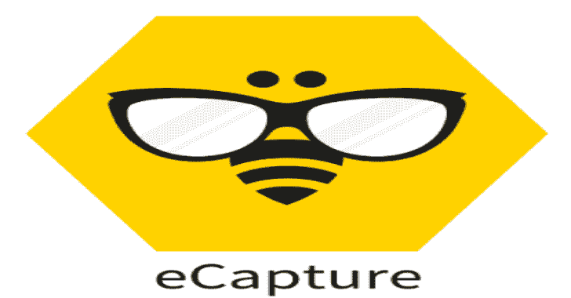
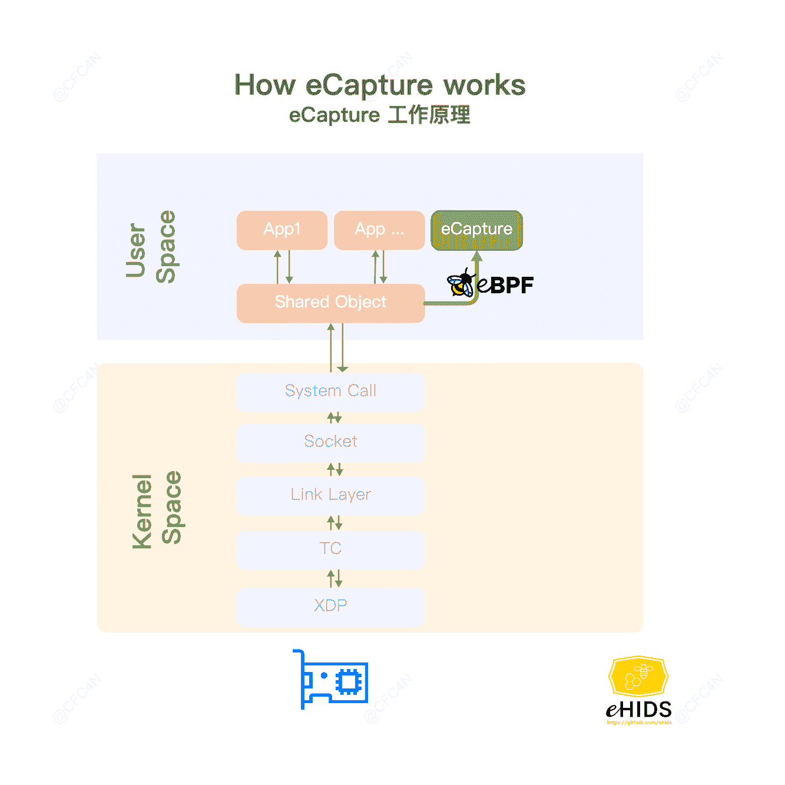
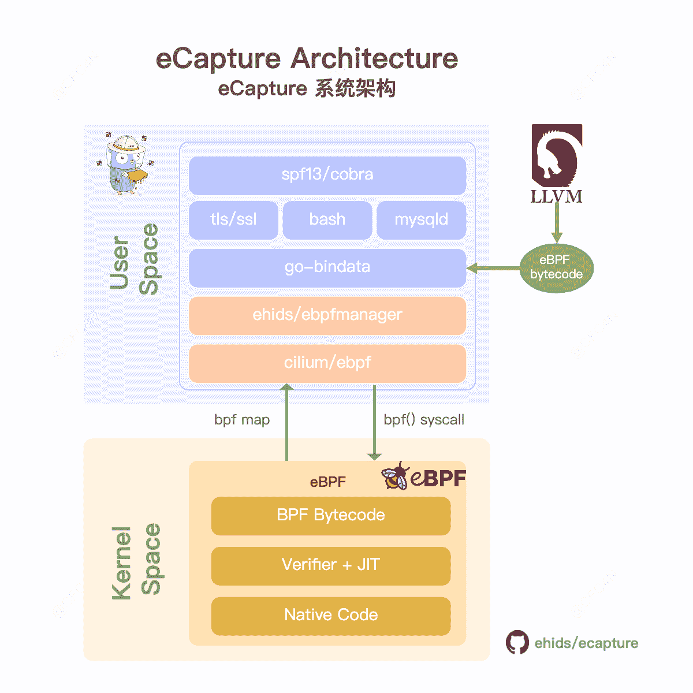

# 电子捕获:eBPF 捕获没有 CA 证书的 SSL/TLS 文本内容

> 原文：<https://kalilinuxtutorials.com/ecapture/>

.png)

### eCapture **是一个使用 eBPF** 在没有 CA 证书的情况下捕获 SSL/TLS 文本内容的工具。

## 电子捕获的工作原理

*   SSL/TLS 文本上下文捕获，支持 OpenSSL \ libres sl \ boring SSL \ gnutls \ nspr(NSS)库。
*   bash 审计，捕获主机安全审计的 bash 命令。
*   mysql 查询 sql 审计，支持 mysqld 5.6\5.7\8.0，和 mariadDB。

# 建筑艺术

# 入门指南

## 使用 ELF 二进制文件

下载 ELF zip 文件发布，通过命令`**./ecapture --help**`解压使用。

*   Linux 内核版本> = 4.18
*   启用 BTF BPF 类型格式(BTF)(可选，2022-04-17)

### 检查您的服务器 BTF 配置

**cfc4n @ VM-server:~ $ # uname-r
4 . 18 . 0-305 . 3 . 1 . el8 . x86 _ 64
cfc4n @ VM-server:~ $ # cat/boot/CONFIG-`uname -r`| grep CONFIG _ DEBUG _ INFO _ BTF
CONFIG _ DEBUG _ INFO _ BTF = y**

### tls 命令

捕获 tls 文本上下文。第一步:

**。/e 捕获 TLS–十六进制**

第二步:

**卷曲的 https://github.com**

## libressl 和 boringssl

**对于已安装的 libressl，libssl.so.52 是动态 SSL lib
VM @ VM-server:~ $ ldd/usr/local/bin/OpenSSL
Linux-vdso . so . 1(0x 00007 ffc 82985000)
libssl . so . 52 =>/usr/local/lib/libssl . so . 52(0x 0007 f 1730 f 9 f 000)
lib/ecapture TLS–libssl = "/usr/local/lib/libssl . so . 52"–hex
在另一个终端中，使用该命令，然后键入一些字符串，观察 e capture 的输出
VM @ VM-server:~ $/usr/local/bin/OpenSSL s _ client-connect github.com:443
对于已安装的 boringssl，用法相同
/path/to/bin/bssl s _ client-connect github.com:443**

### bash 命令

捕获 bash 命令。

**ps -ef | grep foo**

## 上弯钩

### openssl\libressl\boringssl 钩子

共享库`**/lib/x86_64-linux-gnu/libssl.so.1.1**`的 eCapture hook **`SSL_write` \ `SSL_read`** 功能。获取文本上下文，并通过 eBPF maps 向用户空间发送消息。

**探测器:【】*管理器。probe { { Section:" up robe/SSL _ write "，EbpfFuncName:" probe _ entry _ SSL _ write "，AttachToFuncName: "SSL_write "，//UprobeOffset: 0x386B0，binary path:"/lib/x86 _ 64-Linux-GNU/libssl . so . 1.1 "，}，{ Section:" ureprobe/SSL _ write "，EbpfFuncName:" probe _ ret _ SSL _ write "，AttachToFuncName:" SSL _ write " ,//up robe offset:0x 30***

### bash readline.so hook

挂钩`**/bin/bash**`符号名称`**readline**`。

# 如何编译

Linux 内核:> = 4.18。

## 工具

*   golang 1.16
*   铿锵 9.0.0
*   cmake 3.18.4
*   clang 后端:llvm 9.0.0
*   kernel config:CONFIG_DEBUG_INFO_BTF=y (Optional, 2022-04-17)

## 命令

**git clone git @ github . com:ehids/e capture . git
CD e capture
make
bin/e capture–help**

## 不使用 BTF 编译

eCapture 不支持 BTF，命令`**make nocore**`于 2022/04/17 编译。

制造 no core
bin/e capture–help

[**Download**](https://github.com/ehids/ecapture)