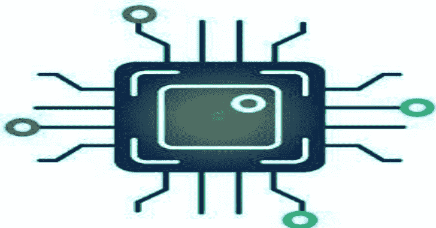
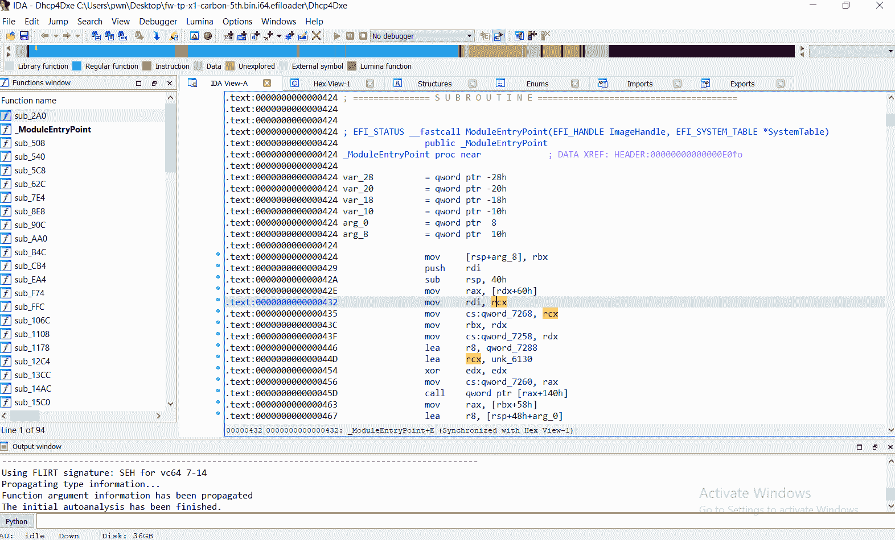
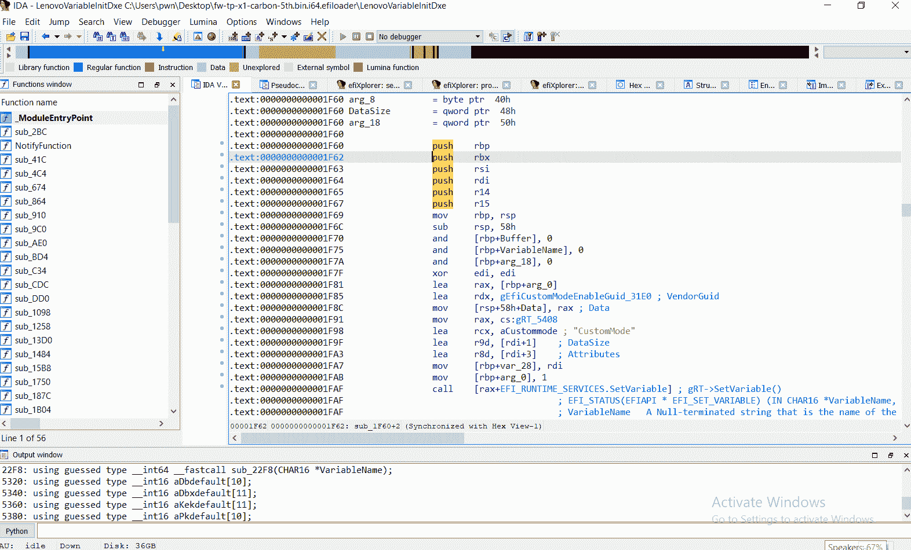
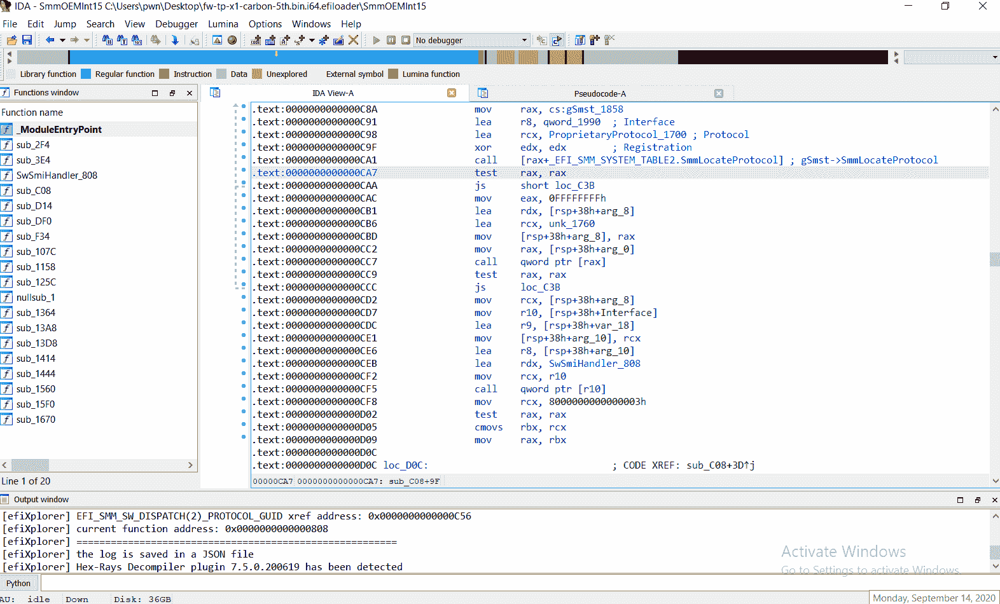
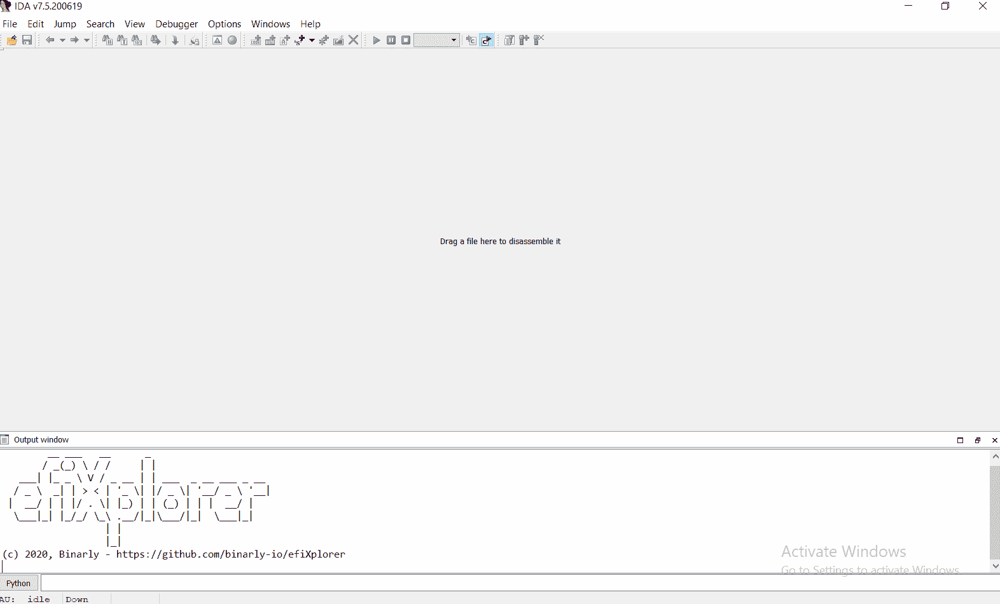
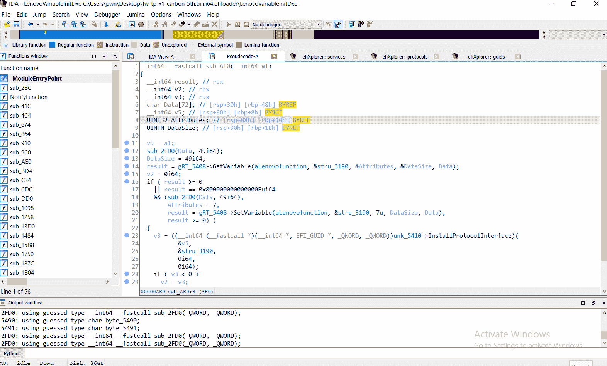
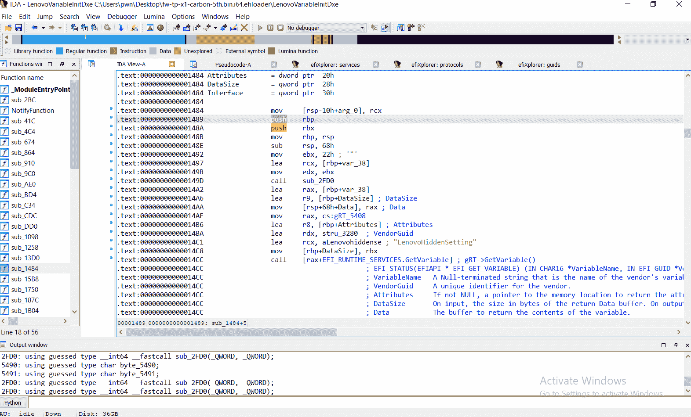

# efiXplorer:用于 UEFI 固件分析和逆向工程自动化的 IDA 插件

> 原文：<https://kalilinuxtutorials.com/efixplorer/>

**EFI explorer**–用于 UEFI 固件分析和逆向工程自动化的 IDA 插件

**Hex-Rays 产品的支持版本:**每次我们都关注 IDA 和 Decompiler 的最新版本，因为我们试图使用新 SDK 版本的最新功能。这意味着我们只对 Hex-ray 产品的最新版本进行测试，并不保证在前几代产品上的稳定工作。

**为什么不是 IDApython:** 所有代码都用 C++开发，因为这是一种更稳定、更高效的方式来支持复杂的插件，并获得最新 SDK 特性的全部功能。

**支持的平台:** Windows、Linux、OSX。

**e explorer 核心特性**

**特性汇总表**

| 功能名称 | 32 位 | 64 位 |
| --- | --- | --- |
| 引导服务 | + | + |
| 运行时服务 | + | + |
| SMM 服务 | – | + |
| PEI 服务 | + | – |
| 协议 | + | + |
| 向导 | + | + |
| 为局部变量应用类型 | + | + |
| 漏洞扫描器 | + | + |
| JSON 格式的报告 | + | + |
| 装货设备 | – | + |
| 依赖图 | – | + |

**自动识别可用的引导服务**

自动注释汇编代码中的引导服务调用:

**自动识别可用的运行时服务**

自动注释汇编代码中的运行时服务调用:

**自动识别可用的 SMM 服务**

自动注释汇编代码中的 SMM 服务调用:

**自动识别可用的 PEI 服务**

在汇编代码中自动注释 PEI 服务调用:

**自动识别可用的 EFI 协议**

建立固件使用和安装的 EFI 协议列表:

**识别已知的 EFI guid**

构建已识别的 EFI GUIDs 列表(包括已知 guid 的协议名称):

**应用协议接口类型**

这个特性只能和 HexRays 反编译器一起使用。如果你没有 HexRays 反编译程序，构建`efiXplorer`时不要使用`**hexrays_sdk**`。

**漏洞扫描器**

`**efiXplorer**`扫描驱动程序是否存在以下类型的漏洞:

*   SMM 标注
*   写经错`**GetVariable**`用法(在裴、、司机中)

分析结束时，会显示一个选择器，其中包含可疑的漏洞。

**JSON 格式的报告**

分析后`**efiXplorer**`以 JSON 格式保存报告。

[**Download**](https://github.com/binarly-io/efiXplorer/wiki/efiXplorer-features)