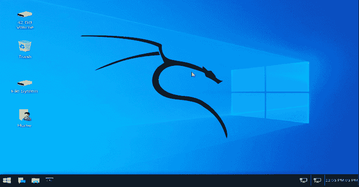
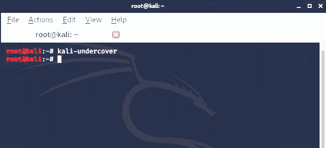

# 如何在 Kali Linux 中启用卧底模式？

> 原文：<https://kalilinuxtutorials.com/enable-the-undercover-mode-kali-linux/>

上周， [Kali Linux 2019.4](https://www.kali.org/news/kali-linux-2019-4-release/) 推出了一个**卧底模式**，可以用来让 Kali 桌面快速变成 Windows 10 的样子。

正如我们所知，Kali 是为道德黑客和渗透测试而设计的 Linux 发行版，被调查人员和 red 团队广泛用于针对企业进行安全检查。

所以，如果你在公共场所工作，不停地乱砍，也许你不想看到，也不想知道你用独特的卡利龙为每个人做了什么。因此，一个小脚本把你的 Kali 主题变成一个 Windows 默认安装。

这种模式不是 Windows 10 的完美翻版，但为了欺骗路过的用户，它做得足够好了。

所以我们来看看 Kali Linux 中的卧底模式是如何启用的；

*   打开**端子**
*   键入**卡利-卧底**并按下**进入**。

*   卧底模式将被允许，你的屏幕将看起来像现在的**窗口**。现在你可以关闭**航站楼**的窗口。

注意:当使用卧底模式时，您可以再次运行 kali-卧底切换回您的正常桌面。你也可以直接从桌面搜索运行 kali-卧底命令。

**又读——[Kali Linux 2019.4 发布——新版渗透测试&道德黑客 Linux 发行](https://kalilinuxtutorials.com/kali-linux-2019-4/)**