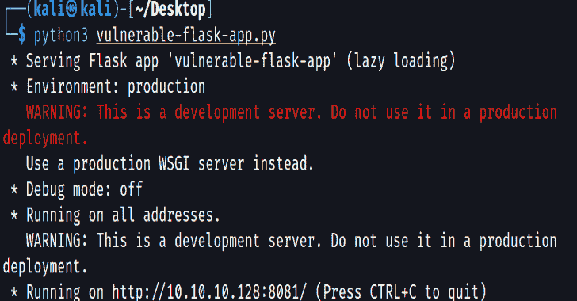

# Erlik 2:易受攻击的烧瓶应用程序

> 原文：<https://kalilinuxtutorials.com/erlik-2/>

Erlik 2 是一个易受攻击的 Flask Web 应用程序。这是一个为那些想在 web 渗透测试领域提高自己的人创建的实验室环境。

## 特征

它包含以下漏洞。

-HTML 注入
-XSS
-SSTI
-SQL 注入
-信息泄露
-命令注入
-暴力破解
-反序列化
-断认证
-DOS
-文件上传

## 安装

git clone[https://github.com/anil-yelken/Vulnerable-Flask-App](https://github.com/anil-yelken/Vulnerable-Flask-App)CD Vulnerable-Flask-App
sudo pip 3 install-r requirements . txt

## 用法

**python 3 vulnerable-flask-app . py**

[Click Here To Download](https://github.com/anil-yelken/Vulnerable-Flask-App)