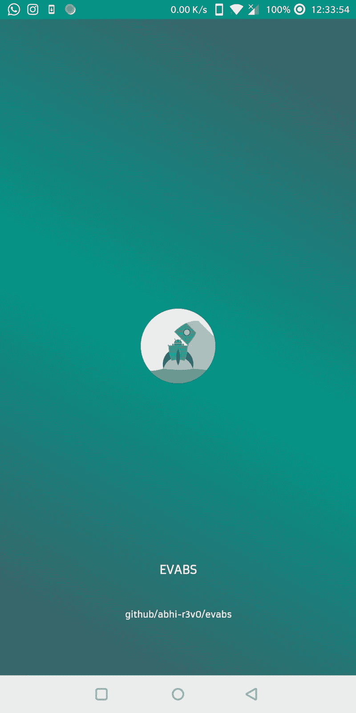
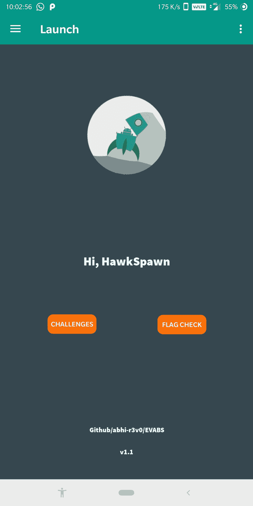
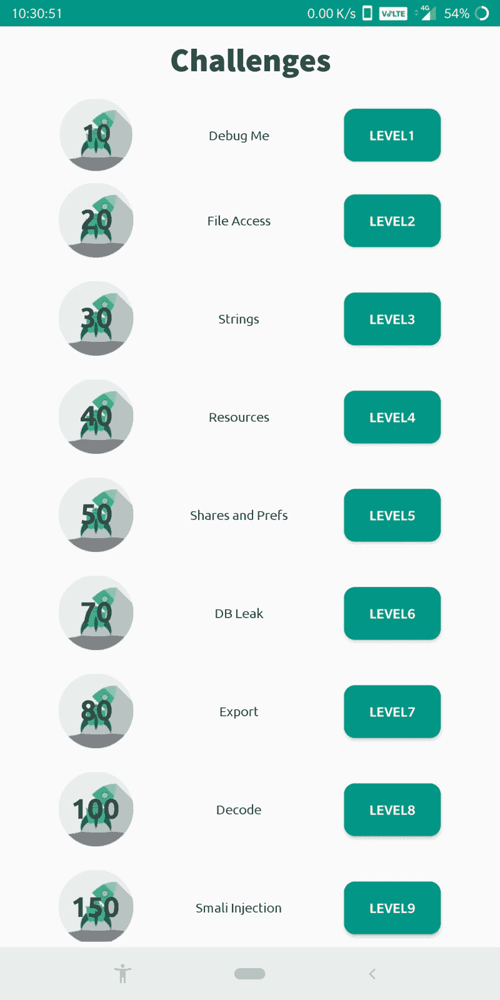
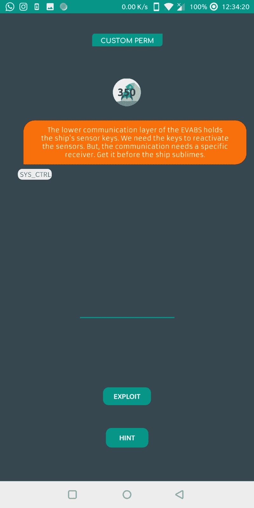
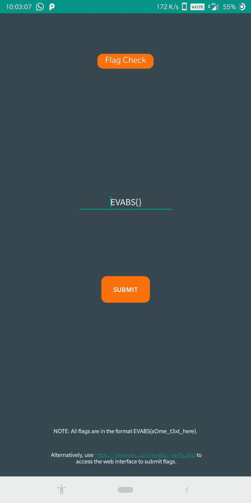

# EVABS:一个开放源代码的 Android 应用程序，它是一个故意易受攻击的应用程序

> 原文：<https://kalilinuxtutorials.com/evabs-open-source-android-application-vulnerable/>

**EVABS** 是一个开源的 Android 应用程序，它被故意设置为易受攻击，以便作为 Android 应用程序安全初学者的学习平台。

我们的工作是通过一个基于故事的交互式模型，向知识非常有限或为零的初学者介绍一些主要的和常见的基于现实世界的 Android 应用程序漏洞。

EVABS 遵循逐级难度的方法，在每一级中，玩家都会学到一个新概念。该项目仍在进行中，旨在纳入尽可能多的级别。

**也可阅读-[IPRotate:Burp Suite 的扩展，它使用 AWS API Gateway 在每个请求上轮换您的 IP](https://kalilinuxtutorials.com/iprotate-burp-suite-aws-api-gateway/)**

**安装**

*   下载应用文件( [apk](https://github.com/abhi-r3v0/EVABS/blob/master/EVABSv1.1.apk) )。
*   将它安装在 Android 设备(推荐 rooted)或模拟器中。

**要求**

*   Android 模拟器(默认/Genymotion)或根 Android 设备。
*   [芙烈达](https://frida.re/)
*   [亚行](https://www.xda-developers.com/install-adb-windows-macos-linux/)
*   [apktool](https://ibotpeaches.github.io/Apktool/)
*   [dex2jar](https://github.com/pxb1988/dex2jar)

或者使用 [ADHRIT](https://github.com/abhi-r3v0/Adhrit) (多功能工具)

迷茫？阅读关于设置环境的[文档](https://github.com/abhi-r3v0/EVABS/wiki/Getting-Started-With-EVABS)。

**更改日志**

*   在 EVABS 中添加了标志检查模块。
*   或者，您可以使用这个[链接](https://www.neoonsec.com/evabs/verify.php)从您的浏览器提交标志。
*   UI 改进

**当地建筑**

*   克隆存储库`**git clone https://github.com/abhi-r3v0/EVABS.git**`或下载 zip 文件。
*   在您的“AndroidStudioProjects”目录中创建一个新文件夹`**EVABS**`，并将内容移动到新目录中。
*   启动 Android Studio，`**File**`**->-**-`**open**`并选择项目。
*   转到`**Build**` **- >** `**Generate Signed APK**`。
*   如果签名不存在，请创建一个新签名。签署 APK。
*   使用`**adb install EVABS.apk**`安装 APK

**截图**

[**Download**](https://github.com/abhi-r3v0/EVABS)