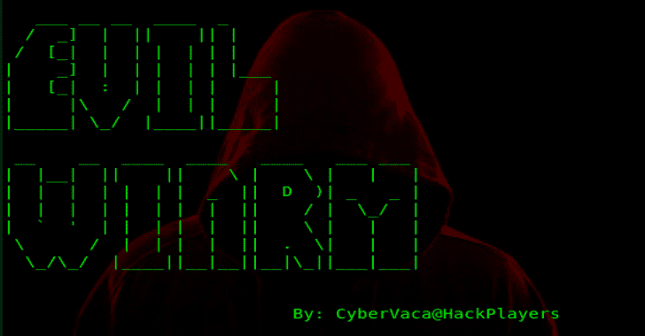
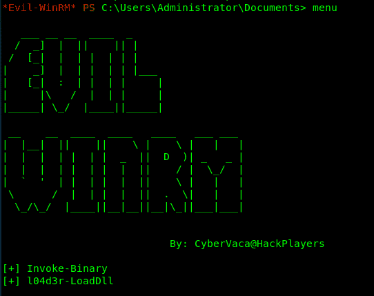
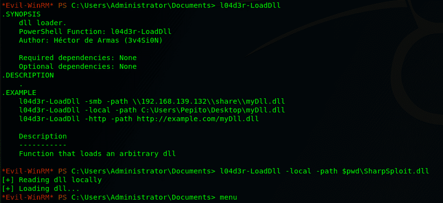

# Evil WinRM:用于黑客攻击/测试的终极 WinRM 外壳

> 原文：<https://kalilinuxtutorials.com/evil-winrm-hacking-pentesting/>

**Evil WinRM** 是用于黑客攻击/测试的终极 WinRM 外壳。WinRM (Windows 远程管理)是 WS-Management 协议的 Microsoft 实现。

一种基于 SOAP 的标准协议，允许不同供应商的硬件和操作系统进行互操作。微软将它包含在他们的操作系统中，以使系统管理员的工作更容易。

这个程序可以在任何启用了此功能的 Microsoft Windows 服务器上使用(通常在 5985 端口)，当然前提是您有使用它的凭证和权限。

因此，我们可以说，它可以用在开发后的黑客攻击/测试阶段。这个程序的目的是为黑客提供漂亮易用的特性。

系统管理员也可以出于合法目的使用它，但它的大多数功能都集中在黑客/测试方面。

**特色**

*   命令历史
*   WinRM 命令完成
*   本地文件完成
*   上传和下载文件
*   列出远程机器服务
*   FullLanguage Powershell 语言模式
*   加载 Powershell 脚本
*   绕过一些 AVs 在内存中加载 dll 文件
*   绕过一些 AVs，在内存中加载 C# (C Sharp)编译的 exe 文件
*   输出消息的彩色化(可以选择禁用)

**也可阅读-[git got:半自动、反馈驱动的工具，用于快速搜索 GitHub 上的公共数据，寻找敏感机密](https://kalilinuxtutorials.com/gitgot-semi-automated-feedback-driven-tool/)**

**要求**

需要 Ruby 2.3 或更高版本。还需要一些红宝石宝石:`**winrm >=2.3.2**`**`**winrm-fs >=1.3.2**`**`**stringio >=0.0.2**`**`**colorize >=0.8.1**`。******

 ******~$ sudo gem 安装 winrm winrm-fs colorize stringio**

**安装&快速启动**

*   第一步。克隆回购:

**git 克隆 https://github.com/Hackplayers/evil-winrm.git**

*   第二步。准备好了。启动它！

**~ $ CD evil-winrm&ruby evil-winrm . r b-I 192 . 168 . 1 . 100-u Administrator-p ' mysupersecr 3 tpass 123！'-s '/home/foo/PS1 _ scripts/'-e '/home/foo/exe _ files/'**

如果您不想以明文形式输入密码，您可以选择避免设置`-p`参数，密码将被提示阻止显示。

要使用 IPv6，必须将地址添加到/etc/hosts 中。

##### 替代安装方法如红宝石宝石

*   第一步。安装它:

**gem 安装 evil-winrm**

*   第二步。准备好了。启动它！

**~ $ evil-winrm-I 192 . 168 . 1 . 100-u Administrator-p ' mysupersecr 3 tpass 123！'-s '/home/foo/PS1 _ scripts/'-e '/home/foo/exe _ files/'**

**文档**

**基本命令**

*   **上传**:本地文件可以使用 tab 键自动完成。如果本地文件与 evil-winrm.rb 文件在同一个目录中，则不需要放置 remote_path。
    *   用法:`**upload local_path remote_path**`
*   **下载**:如果远程文件在当前目录下，则不需要设置 local_path。
    *   用法:`**download remote_path local_path**`
*   **服务**:列出所有服务。不需要管理员权限。
*   **菜单**:加载`Invoke-Binary`和`l04d3r-LoadDll`功能，我们将在下面解释。ps1 加载后，其所有功能都会显示出来。

**加载 powershell 脚本**

*   要加载 ps1 文件，您只需输入名称(允许自动完成 usnig 制表符)。脚本必须位于在`-s`参数处设置的路径中。再次键入 menu 并查看加载的函数。

**高级命令**

*   Invoke-Binary:允许从 c#编译的 exe 在内存中执行。该名称可以使用 tab 键自动完成，最多允许 3 个参数。可执行文件必须位于在`-e`参数处设置的路径中。

l04d3r-LoadDll:允许在内存中加载 Dll 库，它相当于:`**[Reflection.Assembly]::Load([IO.File]::ReadAllBytes("pwn.dll"))**`

dll 文件可以由 smb、http 或本地托管。一旦加载了 type `menu`，就可以自动完成所有功能。

**额外功能**

*   要禁用颜色只需在代码上修改这个变量`**$colors_enabled**`。将其设置为假:`**$colors_enabled = false**`

**免责声明**

Evil-WinRM 只能用于授权渗透测试和/或非盈利性教育目的。对该软件的任何误用都不是作者或任何其他合作者的责任。在您自己的服务器上和/或在服务器所有者的许可下使用它。

[**Download**](https://github.com/Hackplayers/evil-winrm)****